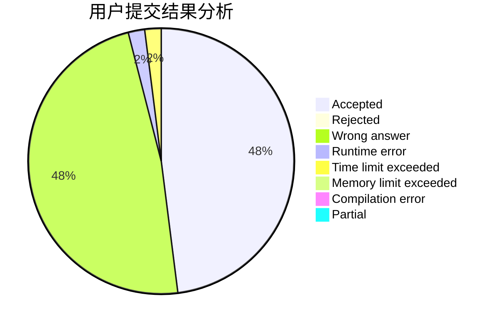
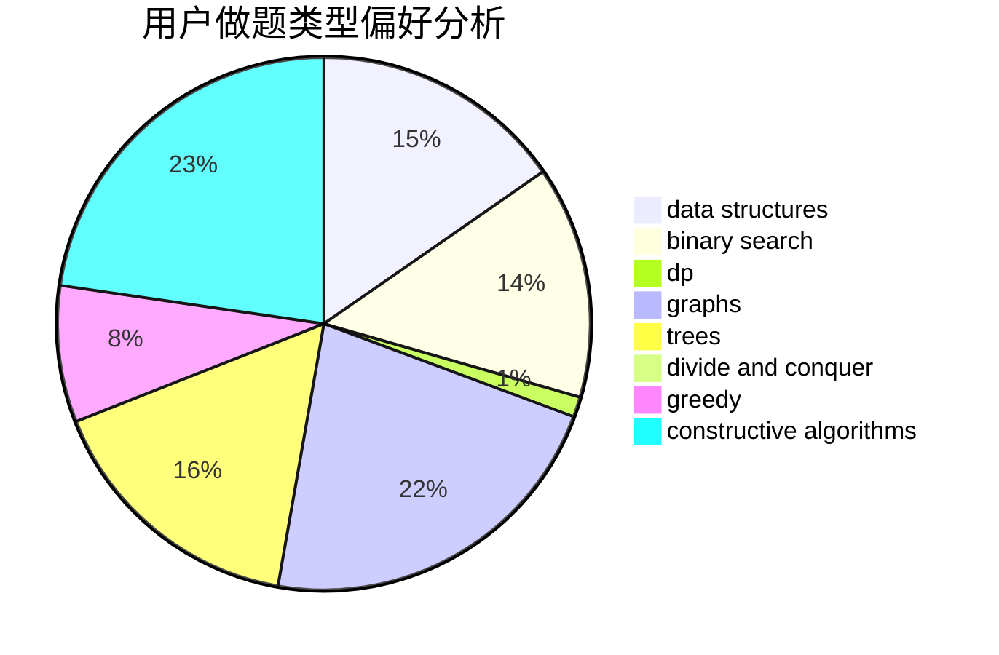

# DW_Zhouyu

<!-- tabs:start -->

#### **用户提交结果分析**

#### **用户做题类型偏好分析**

#### **用户错题知识点分析**

<!-- tabs:end -->
# 推荐题目
[75D](https://codeforces.com/contest/75/problem/D)		data structures,
                        dp,
                        greedy,
                        implementation,
                        math,
                        trees		  
[761A](https://codeforces.com/contest/761/problem/A)		brute force,
                        constructive algorithms,
                        implementation,
                        math		  
[1511E](https://codeforces.com/contest/1511/problem/E)		combinatorics,
                        dp,
                        greedy,
                        math		  
[760A](https://codeforces.com/contest/760/problem/A)		implementation,
                        math		  
[761E](https://codeforces.com/contest/761/problem/E)		constructive algorithms,
                        dfs and similar,
                        graphs,
                        greedy,
                        trees		  
[75C](https://codeforces.com/contest/75/problem/C)		binary search,
                        number theory		  
[761F](https://codeforces.com/contest/761/problem/F)		brute force,
                        data structures,
                        dp,
                        implementation		  
[500E](https://codeforces.com/contest/500/problem/E)		data structures,
                        dp,
                        dsu		  
[734C](https://codeforces.com/contest/734/problem/C)		binary search,
                        dp,
                        greedy,
                        two pointers		  
[760B](https://codeforces.com/contest/760/problem/B)		binary search,
                        greedy		  
