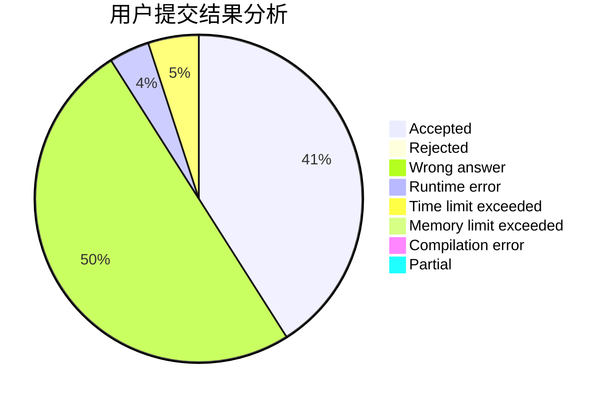
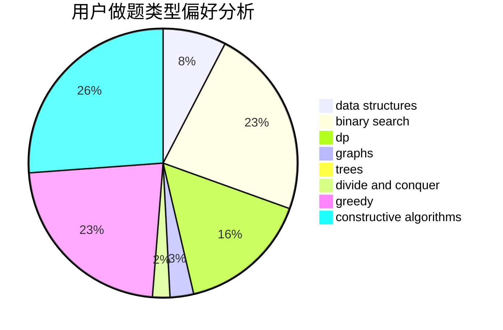
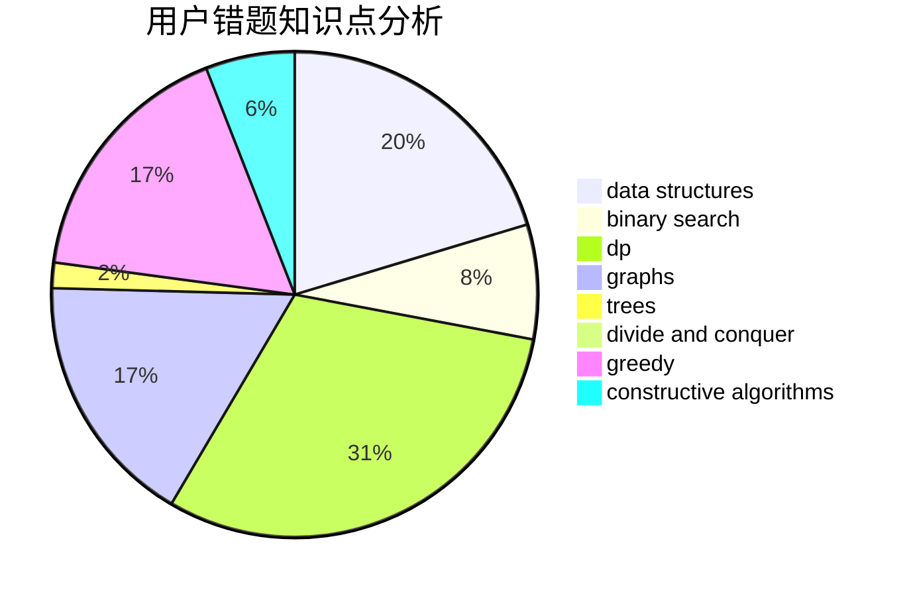

# DXTsT

<!-- tabs:start -->

#### **用户提交结果分析**

#### **用户做题类型偏好分析**

#### **用户错题知识点分析**

<!-- tabs:end -->
# 推荐题目
[1292C](https://codeforces.com/contest/1292/problem/C)		combinatorics,
                        dfs and similar,
                        dp,
                        greedy,
                        trees		  
[1313B](https://codeforces.com/contest/1313/problem/B)		constructive algorithms,
                        greedy,
                        implementation,
                        math		  
[762A](https://codeforces.com/contest/762/problem/A)		math,
                        number theory		  
[62E](https://codeforces.com/contest/62/problem/E)		dp,
                        flows		  
[264E](https://codeforces.com/contest/264/problem/E)		data structures,
                        dp		  
[762E](https://codeforces.com/contest/762/problem/E)		binary search,
                        data structures		  
[1033B](https://codeforces.com/contest/1033/problem/B)		math,
                        number theory		  
[1119G](https://codeforces.com/contest/1119/problem/G)		constructive algorithms,
                        implementation		  
[1054G](https://codeforces.com/contest/1054/problem/G)		constructive algorithms,
                        greedy,
                        math		  
[681B](https://codeforces.com/contest/681/problem/B)		brute force		  
