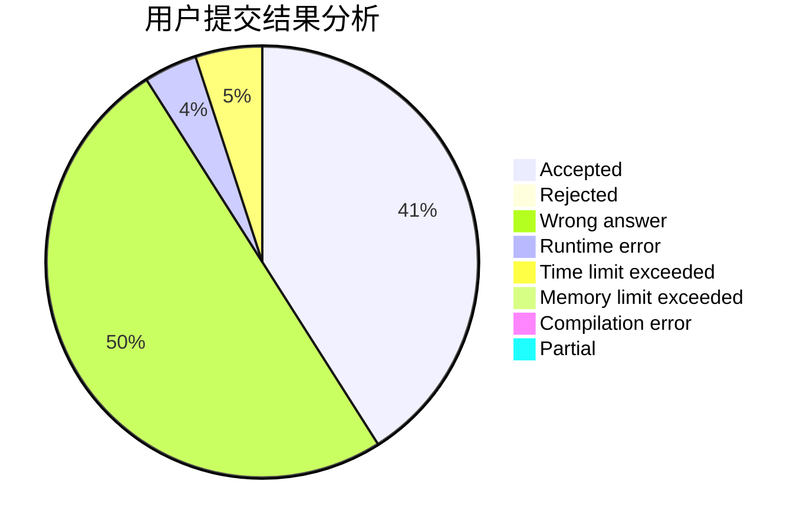
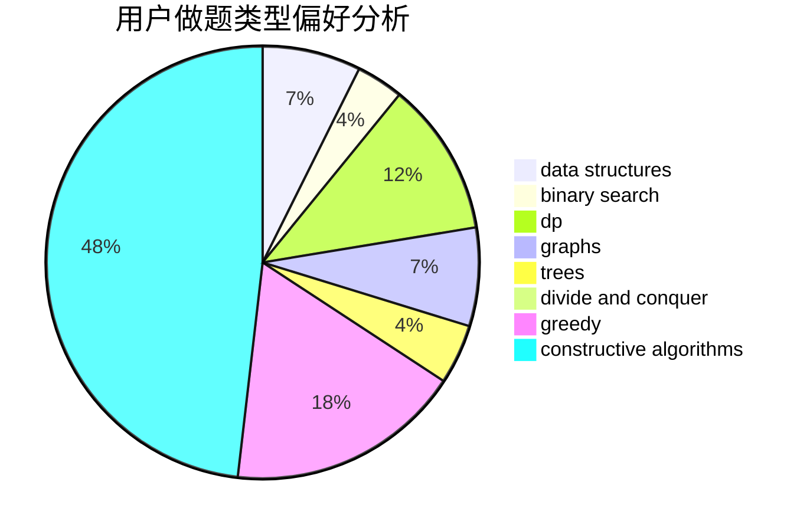
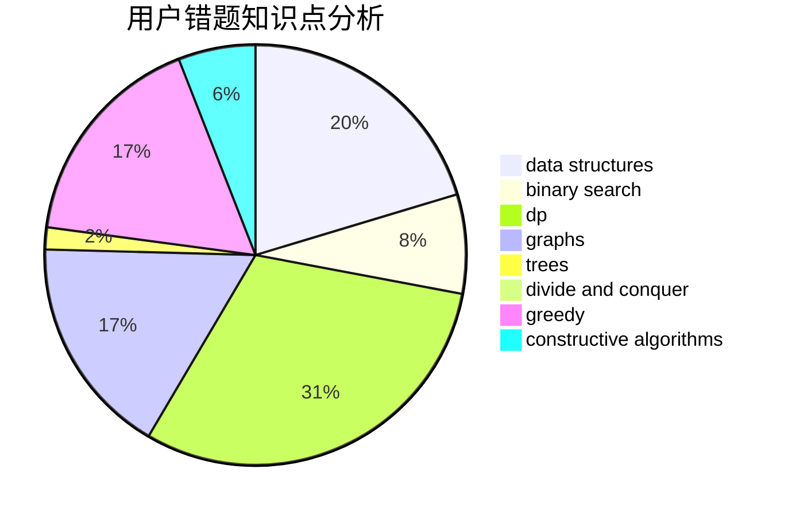

# DXTsT

<!-- tabs:start -->

#### **用户提交结果分析**

#### **用户做题类型偏好分析**

#### **用户错题知识点分析**

<!-- tabs:end -->
# 推荐题目
[1299C](https://codeforces.com/contest/1299/problem/C)		data structures,
                        geometry,
                        greedy		  
[1322E](https://codeforces.com/contest/1322/problem/E)		data structures		  
[780E](https://codeforces.com/contest/780/problem/E)		constructive algorithms,
                        dfs and similar,
                        graphs		  
[659G](https://codeforces.com/contest/659/problem/G)		combinatorics,
                        dp,
                        number theory		  
[280E](https://codeforces.com/contest/280/problem/E)		data structures,
                        dp,
                        implementation,
                        math		  
[781C](https://codeforces.com/contest/781/problem/C)		dsu,graphs,sortings,trees		  
[1033E](https://codeforces.com/contest/1033/problem/E)		binary search,
                        constructive algorithms,
                        dfs and similar,
                        graphs,
                        interactive		  
[1129C](https://codeforces.com/contest/1129/problem/C)		binary search,
                        data structures,
                        dp,
                        hashing,
                        sortings,
                        string suffix structures,
                        strings		  
[1055B](https://codeforces.com/contest/1055/problem/B)		dsu,
                        implementation		  
[705A](https://codeforces.com/contest/705/problem/A)		implementation		  
