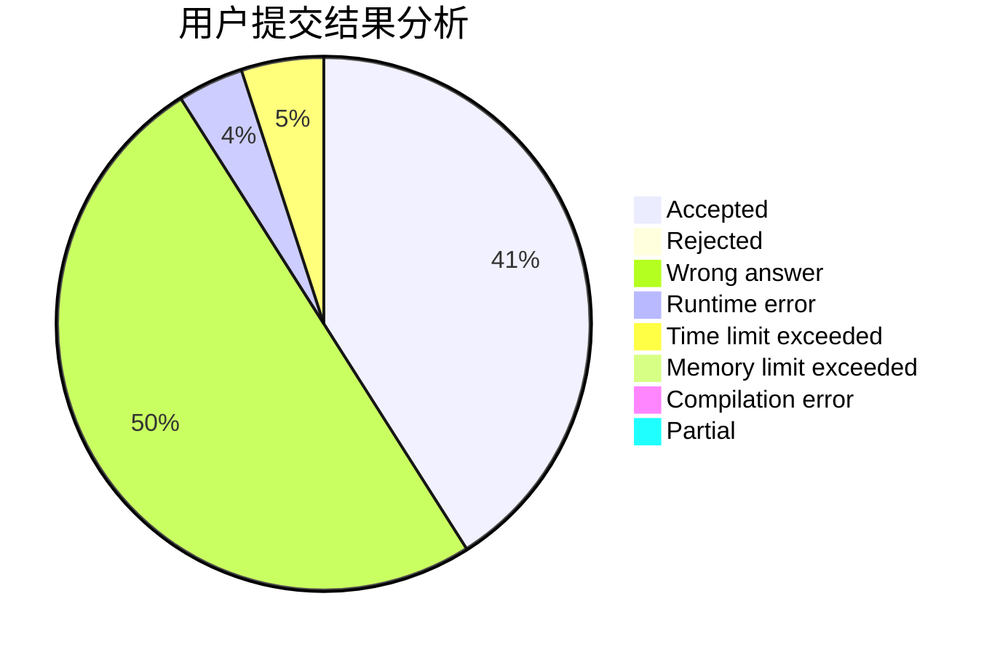
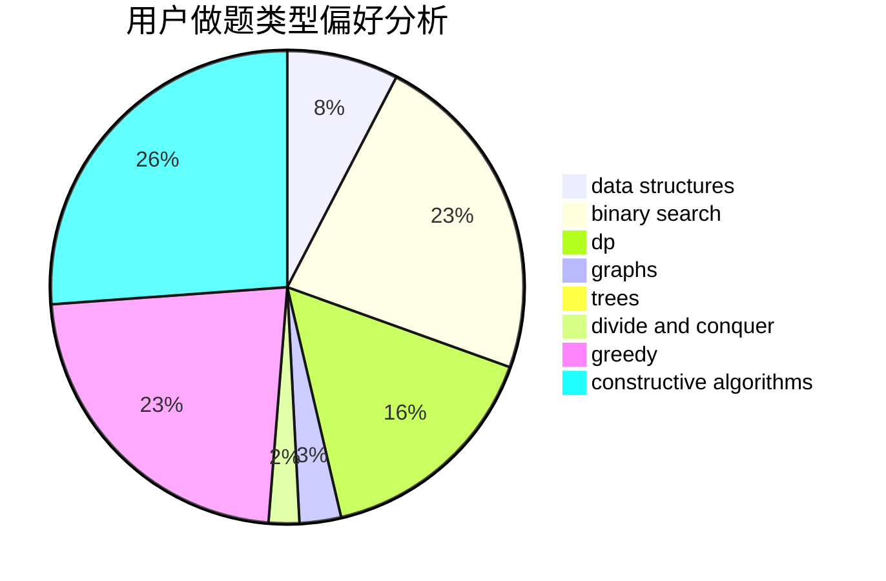
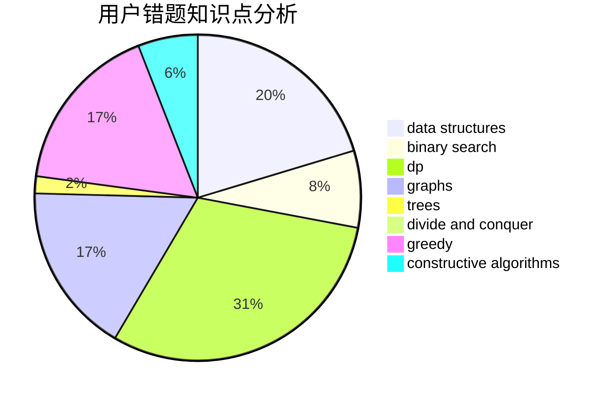

# DXTsT
<!-- tabs:start -->
#### **用户提交结果分析**

#### **用户做题类型偏好分析**

#### **用户错题知识点分析**

<!-- tabs:end -->
# 推荐题目
[Different Rules](http://codeforces.com/problemset/problem/1313/B)		constructive algorithms,
                        greedy,
                        implementation,
                        math		  
[Xenon's Attack on the Gangs](http://codeforces.com/problemset/problem/1292/C)		combinatorics,
                        dfs and similar,
                        dp,
                        greedy,
                        trees		  
[World Evil](http://codeforces.com/problemset/problem/62/E)		dp,
                        flows		  
[Roadside Trees](http://codeforces.com/problemset/problem/264/E)		data structures,
                        dp		  
[New Road Network](http://codeforces.com/problemset/problem/1054/G)		constructive algorithms,
                        greedy,
                        math		  
[Economy Game](http://codeforces.com/problemset/problem/681/B)		brute force		  
[Two strings](http://codeforces.com/problemset/problem/762/C)		binary search,
                        hashing,
                        strings,
                        two pointers		  
[USB vs. PS/2](http://codeforces.com/problemset/problem/762/B)		greedy,
                        implementation,
                        sortings,
                        two pointers		  
[k-th divisor](http://codeforces.com/problemset/problem/762/A)		math,
                        number theory		  
[Square Difference](http://codeforces.com/problemset/problem/1033/B)		math,
                        number theory		  
<!-- tabs:start -->
#### **data structures**
[Roadside Trees](http://codeforces.com/problemset/problem/264/E)		data structures,
                        dp		  
[Radio stations](http://codeforces.com/problemset/problem/762/E)		binary search,
                        data structures		  
[Lorenzo Von Matterhorn](https://codeforces.com/contest/697/problem/C)		brute force,
                        data structures,
                        implementation,
                        trees		  
[Modulo Sum](http://codeforces.com/problemset/problem/577/B)		combinatorics,
                        data structures,
                        dp,
                        two pointers		  
[Flip the Cards](http://codeforces.com/problemset/problem/1503/D)		2-sat,
                        constructive algorithms,
                        data structures,
                        greedy,
                        sortings,
                        two pointers		  
[A Simple Task](http://codeforces.com/problemset/problem/558/E)		data structures,
                        sortings,
                        strings		  
[Maximum width](http://codeforces.com/problemset/problem/1492/C)		binary search,
                        data structures,
                        dp,
                        greedy,
                        two pointers		  
[Old Floppy Drive](http://codeforces.com/problemset/problem/1490/G)		binary search,
                        data structures,
                        math		  
[Odd Mineral Resource](http://codeforces.com/problemset/problem/1479/D)		binary search,
                        bitmasks,
                        brute force,
                        data structures,
                        probabilities,
                        trees		  
[Meximization](http://codeforces.com/problemset/problem/1497/A)		brute force,
                        data structures,
                        greedy,
                        sortings		  
#### **binary search**
[Two strings](http://codeforces.com/problemset/problem/762/C)		binary search,
                        hashing,
                        strings,
                        two pointers		  
[Radio stations](http://codeforces.com/problemset/problem/762/E)		binary search,
                        data structures		  
[Sport Mafia](http://codeforces.com/problemset/problem/1195/B)		binary search,
                        brute force,
                        math		  
[Game with modulo](http://codeforces.com/problemset/problem/1103/B)		binary search,
                        constructive algorithms,
                        interactive		  
[Maximum width](http://codeforces.com/problemset/problem/1492/C)		binary search,
                        data structures,
                        dp,
                        greedy,
                        two pointers		  
[Pairs](http://codeforces.com/problemset/problem/1463/D)		binary search,
                        constructive algorithms,
                        greedy,
                        two pointers		  
[Old Floppy Drive](http://codeforces.com/problemset/problem/1490/G)		binary search,
                        data structures,
                        math		  
[Odd Mineral Resource](http://codeforces.com/problemset/problem/1479/D)		binary search,
                        bitmasks,
                        brute force,
                        data structures,
                        probabilities,
                        trees		  
[Complicated Computations](http://codeforces.com/problemset/problem/1436/E)		binary search,
                        data structures,
                        two pointers		  
[Divide and Summarize](http://codeforces.com/problemset/problem/1461/D)		binary search,
                        brute force,
                        data structures,
                        divide and conquer,
                        implementation,
                        sortings		  
#### **dp**
[Xenon's Attack on the Gangs](http://codeforces.com/problemset/problem/1292/C)		combinatorics,
                        dfs and similar,
                        dp,
                        greedy,
                        trees		  
[World Evil](http://codeforces.com/problemset/problem/62/E)		dp,
                        flows		  
[Roadside Trees](http://codeforces.com/problemset/problem/264/E)		data structures,
                        dp		  
[Maximum path](http://codeforces.com/problemset/problem/762/D)		dp,
                        greedy,
                        implementation		  
[Complete the Projects (hard version)](http://codeforces.com/problemset/problem/1203/F2)		dp,
                        greedy		  
[Timofey and a tree](http://codeforces.com/problemset/problem/763/A)		dfs and similar,
                        dp,
                        dsu,
                        graphs,
                        implementation,
                        trees		  
[Modulo Sum](http://codeforces.com/problemset/problem/577/B)		combinatorics,
                        data structures,
                        dp,
                        two pointers		  
[Minlexes](http://codeforces.com/problemset/problem/1422/E)		dp,
                        greedy,
                        implementation,
                        strings		  
[Maximum width](http://codeforces.com/problemset/problem/1492/C)		binary search,
                        data structures,
                        dp,
                        greedy,
                        two pointers		  
[Bouncing Ball](https://codeforces.com/contest/1457/problem/C)		brute force,
                        dp,
                        implementation		  
#### **graph**
[Rats](http://codeforces.com/problemset/problem/254/D)		brute force,
                        dfs and similar,
                        graphs,
                        implementation,
                        shortest paths		  
[Tree nesting](http://codeforces.com/problemset/problem/762/F)		combinatorics,
                        graphs,
                        trees		  
[Timofey and a tree](http://codeforces.com/problemset/problem/763/A)		dfs and similar,
                        dp,
                        dsu,
                        graphs,
                        implementation,
                        trees		  
[Cutting Figure](http://codeforces.com/problemset/problem/193/A)		constructive algorithms,
                        graphs,
                        trees		  
[Labyrinth](https://codeforces.com/contest/1064/problem/D)		graphs,
                        shortest paths		  
[Minimum Ties](http://codeforces.com/problemset/problem/1487/C)		brute force,
                        constructive algorithms,
                        dfs and similar,
                        graphs,
                        greedy,
                        implementation,
                        math		  
[Chef Monocarp](http://codeforces.com/problemset/problem/1437/C)		dp,
                        flows,
                        graph matchings,
                        greedy,
                        math,
                        sortings		  
[Strange Housing](http://codeforces.com/problemset/problem/1470/D)		constructive algorithms,
                        dfs and similar,
                        graph matchings,
                        graphs,
                        greedy		  
[Longest Simple Cycle](http://codeforces.com/problemset/problem/1476/C)		dp,
                        graphs,
                        greedy		  
[Shortest and Longest LIS](http://codeforces.com/problemset/problem/1304/D)		constructive algorithms,
                        graphs,
                        greedy,
                        two pointers		  
#### **trees**
[Xenon's Attack on the Gangs](http://codeforces.com/problemset/problem/1292/C)		combinatorics,
                        dfs and similar,
                        dp,
                        greedy,
                        trees		  
[Tree nesting](http://codeforces.com/problemset/problem/762/F)		combinatorics,
                        graphs,
                        trees		  
[Lorenzo Von Matterhorn](https://codeforces.com/contest/697/problem/C)		brute force,
                        data structures,
                        implementation,
                        trees		  
[Timofey and a tree](http://codeforces.com/problemset/problem/763/A)		dfs and similar,
                        dp,
                        dsu,
                        graphs,
                        implementation,
                        trees		  
[Cutting Figure](http://codeforces.com/problemset/problem/193/A)		constructive algorithms,
                        graphs,
                        trees		  
[Odd Mineral Resource](http://codeforces.com/problemset/problem/1479/D)		binary search,
                        bitmasks,
                        brute force,
                        data structures,
                        probabilities,
                        trees		  
[Yet Another Card Deck](http://codeforces.com/problemset/problem/1511/C)		brute force,
                        data structures,
                        implementation,
                        trees		  
[Diameter Cuts](http://codeforces.com/problemset/problem/1499/F)		combinatorics,
                        dfs and similar,
                        dp,
                        trees		  
[Fib-tree](http://codeforces.com/problemset/problem/1491/E)		brute force,
                        dfs and similar,
                        divide and conquer,
                        number theory,
                        trees		  
[13th Labour of Heracles](http://codeforces.com/problemset/problem/1466/D)		data structures,
                        greedy,
                        sortings,
                        trees		  
#### **divide and conquer**
[Divide and Summarize](http://codeforces.com/problemset/problem/1461/D)		binary search,
                        brute force,
                        data structures,
                        divide and conquer,
                        implementation,
                        sortings		  
[Song of the Sirens](http://codeforces.com/problemset/problem/1466/G)		combinatorics,
                        divide and conquer,
                        hashing,
                        math,
                        string suffix structures,
                        strings		  
[Permutation Transformation](http://codeforces.com/problemset/problem/1490/D)		dfs and similar,
                        divide and conquer,
                        implementation		  
[Skyline Photo](https://codeforces.com/contest/1483/problem/C)		data structures,
                        divide and conquer,
                        dp		  
[Fib-tree](http://codeforces.com/problemset/problem/1491/E)		brute force,
                        dfs and similar,
                        divide and conquer,
                        number theory,
                        trees		  
[Sum of Prefix Sums](http://codeforces.com/problemset/problem/1303/G)		data structures,
                        divide and conquer,
                        geometry,
                        trees		  
[Dogeforces](http://codeforces.com/problemset/problem/1494/D)		constructive algorithms,
                        data structures,
                        dfs and similar,
                        divide and conquer,
                        dsu,
                        greedy,
                        sortings,
                        trees		  
[Logistical Questions](http://codeforces.com/problemset/problem/566/C)		dfs and similar,
                        divide and conquer,
                        trees		  
[Fruit Sequences](http://codeforces.com/problemset/problem/1428/F)		binary search,
                        data structures,
                        divide and conquer,
                        dp,
                        two pointers		  
[Dr. Evil Underscores](http://codeforces.com/problemset/problem/1285/D)		bitmasks,
                        brute force,
                        dfs and similar,
                        divide and conquer,
                        dp,
                        greedy,
                        strings,
                        trees		  
#### **greedy**
[Different Rules](http://codeforces.com/problemset/problem/1313/B)		constructive algorithms,
                        greedy,
                        implementation,
                        math		  
[Xenon's Attack on the Gangs](http://codeforces.com/problemset/problem/1292/C)		combinatorics,
                        dfs and similar,
                        dp,
                        greedy,
                        trees		  
[New Road Network](http://codeforces.com/problemset/problem/1054/G)		constructive algorithms,
                        greedy,
                        math		  
[USB vs. PS/2](http://codeforces.com/problemset/problem/762/B)		greedy,
                        implementation,
                        sortings,
                        two pointers		  
[Maximum path](http://codeforces.com/problemset/problem/762/D)		dp,
                        greedy,
                        implementation		  
[Complete the Projects (hard version)](http://codeforces.com/problemset/problem/1203/F2)		dp,
                        greedy		  
[Death Note](http://codeforces.com/problemset/problem/1016/A)		greedy,
                        implementation,
                        math		  
[Debate](http://codeforces.com/problemset/problem/1070/F)		greedy		  
[There Are Two Types Of Burgers](http://codeforces.com/problemset/problem/1207/A)		brute force,
                        greedy,
                        implementation,
                        math		  
[Duff and Weight Lifting](https://codeforces.com/contest/588/problem/C)		greedy		  
#### **constructive algorithms**
[Different Rules](http://codeforces.com/problemset/problem/1313/B)		constructive algorithms,
                        greedy,
                        implementation,
                        math		  
[New Road Network](http://codeforces.com/problemset/problem/1054/G)		constructive algorithms,
                        greedy,
                        math		  
[Lucky Permutation](http://codeforces.com/problemset/problem/286/A)		constructive algorithms,
                        math		  
[Get Ready for the Battle](http://codeforces.com/problemset/problem/1119/G)		constructive algorithms,
                        implementation		  
[Easy Chess](http://codeforces.com/problemset/problem/1089/E)		constructive algorithms		  
[Unshuffling a Deck](http://codeforces.com/problemset/problem/1427/D)		constructive algorithms,
                        implementation		  
[Game with modulo](http://codeforces.com/problemset/problem/1103/B)		binary search,
                        constructive algorithms,
                        interactive		  
[Cutting Figure](http://codeforces.com/problemset/problem/193/A)		constructive algorithms,
                        graphs,
                        trees		  
[Flip the Cards](http://codeforces.com/problemset/problem/1503/D)		2-sat,
                        constructive algorithms,
                        data structures,
                        greedy,
                        sortings,
                        two pointers		  
[Anti-knapsack](http://codeforces.com/problemset/problem/1493/A)		constructive algorithms,
                        greedy		  
#### **sortings**
[USB vs. PS/2](http://codeforces.com/problemset/problem/762/B)		greedy,
                        implementation,
                        sortings,
                        two pointers		  
[Flip the Cards](http://codeforces.com/problemset/problem/1503/D)		2-sat,
                        constructive algorithms,
                        data structures,
                        greedy,
                        sortings,
                        two pointers		  
[A Simple Task](http://codeforces.com/problemset/problem/558/E)		data structures,
                        sortings,
                        strings		  
[Diamond Miner](https://codeforces.com/contest/1496/problem/C)		geometry,
                        greedy,
                        math,
                        sortings		  
[Meximization](http://codeforces.com/problemset/problem/1497/A)		brute force,
                        data structures,
                        greedy,
                        sortings		  
[Avoiding Zero](http://codeforces.com/problemset/problem/1427/A)		math,
                        sortings		  
[Divide and Summarize](http://codeforces.com/problemset/problem/1461/D)		binary search,
                        brute force,
                        data structures,
                        divide and conquer,
                        implementation,
                        sortings		  
[Chef Monocarp](http://codeforces.com/problemset/problem/1437/C)		dp,
                        flows,
                        graph matchings,
                        greedy,
                        math,
                        sortings		  
[Replacing Elements](http://codeforces.com/problemset/problem/1473/A)		greedy,
                        implementation,
                        math,
                        sortings		  
[Eastern Exhibition](http://codeforces.com/problemset/problem/1486/B)		binary search,
                        geometry,
                        shortest paths,
                        sortings		  
<!-- tabs:end -->
