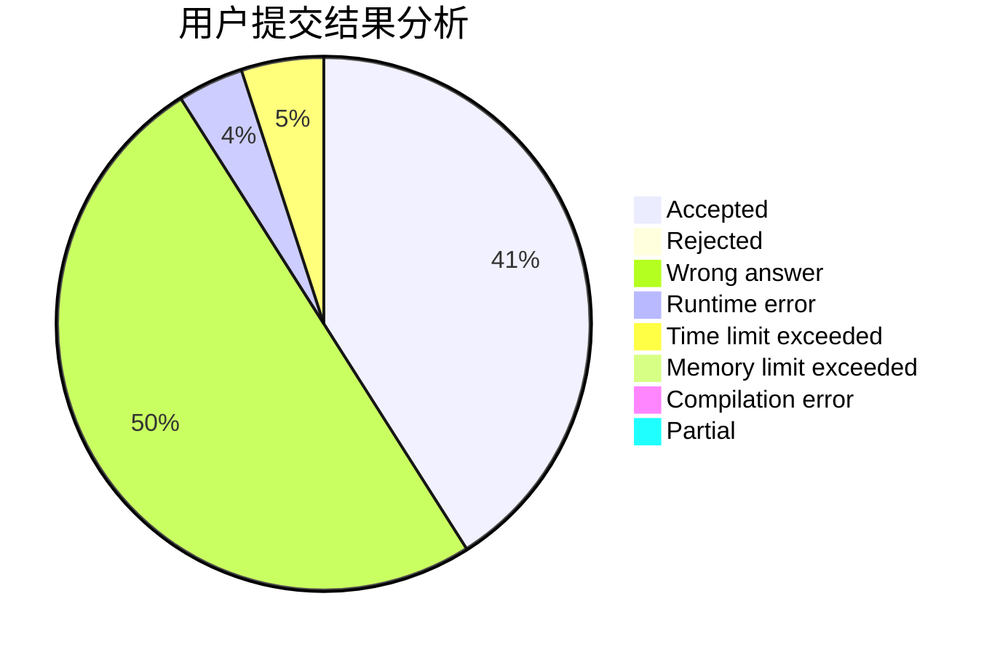
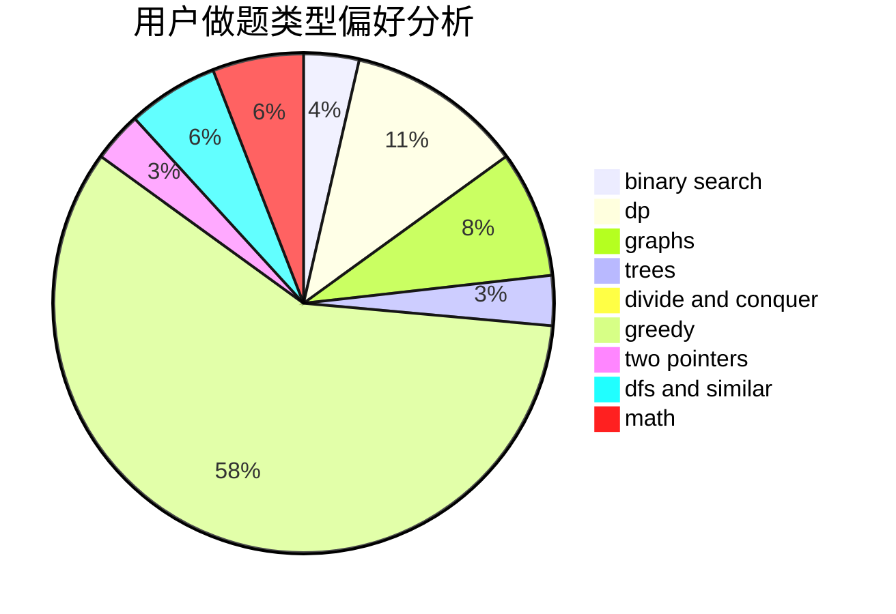

# DXTsT

<!-- tabs:start -->

#### **用户提交结果分析**

#### **用户做题类型偏好分析**

<!-- tabs:end -->
# 推荐题目
[1299C](https://codeforces.com/contest/1299/problem/C)
[1322E](https://codeforces.com/contest/1322/problem/E)
[780E](https://codeforces.com/contest/780/problem/E)
[659G](https://codeforces.com/contest/659/problem/G)
[280E](https://codeforces.com/contest/280/problem/E)
[781C](https://codeforces.com/contest/781/problem/C)
[1033E](https://codeforces.com/contest/1033/problem/E)
[1129C](https://codeforces.com/contest/1129/problem/C)
[1055B](https://codeforces.com/contest/1055/problem/B)
[705A](https://codeforces.com/contest/705/problem/A)
