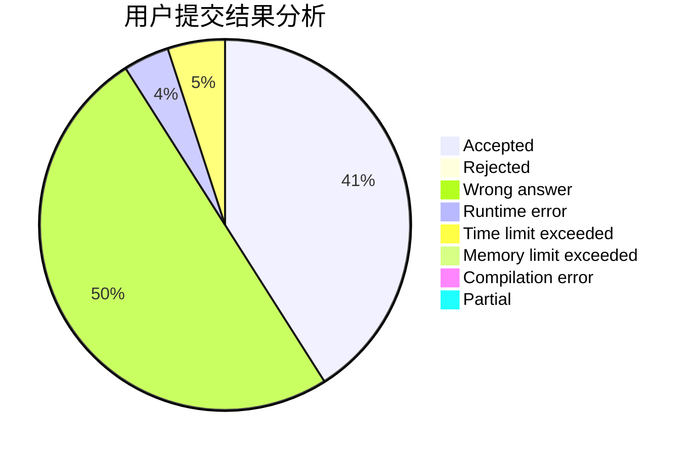
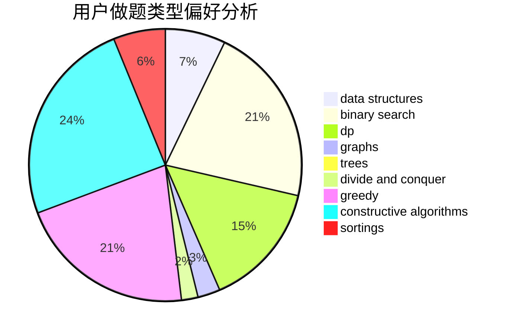
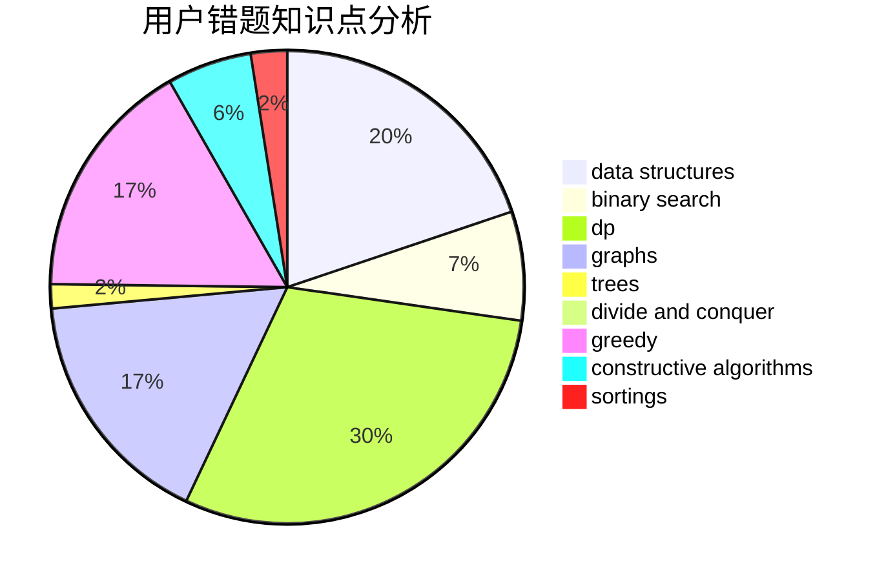

# DXTsT
<!-- tabs:start -->
#### **用户提交结果分析**

#### **用户做题类型偏好分析**

#### **用户错题知识点分析**

<!-- tabs:end -->
# 推荐题目
[1313B](http://codeforces.com/problemset/problem/1313/B)		constructive algorithms,
                        greedy,
                        implementation,
                        math		  
[1292C](http://codeforces.com/problemset/problem/1292/C)		combinatorics,
                        dfs and similar,
                        dp,
                        greedy,
                        trees		  
[62E](http://codeforces.com/problemset/problem/62/E)		dp,
                        flows		  
[264E](http://codeforces.com/problemset/problem/264/E)		data structures,
                        dp		  
[1054G](http://codeforces.com/problemset/problem/1054/G)		constructive algorithms,
                        greedy,
                        math		  
[681B](http://codeforces.com/problemset/problem/681/B)		brute force		  
[762C](http://codeforces.com/problemset/problem/762/C)		binary search,
                        hashing,
                        strings,
                        two pointers		  
[762B](http://codeforces.com/problemset/problem/762/B)		greedy,
                        implementation,
                        sortings,
                        two pointers		  
[762A](http://codeforces.com/problemset/problem/762/A)		math,
                        number theory		  
[1033B](http://codeforces.com/problemset/problem/1033/B)		math,
                        number theory		  
<!-- tabs:start -->
#### **data structures**
[264E](http://codeforces.com/problemset/problem/264/E)		data structures,
                        dp		  
[762E](http://codeforces.com/problemset/problem/762/E)		binary search,
                        data structures		  
[697C](https://codeforces.com/contest/697/problem/C)		brute force,
                        data structures,
                        implementation,
                        trees		  
[577B](http://codeforces.com/problemset/problem/577/B)		combinatorics,
                        data structures,
                        dp,
                        two pointers		  
[1503D](http://codeforces.com/problemset/problem/1503/D)		2-sat,
                        constructive algorithms,
                        data structures,
                        greedy,
                        sortings,
                        two pointers		  
[558E](http://codeforces.com/problemset/problem/558/E)		data structures,
                        sortings,
                        strings		  
[1492C](http://codeforces.com/problemset/problem/1492/C)		binary search,
                        data structures,
                        dp,
                        greedy,
                        two pointers		  
[1490G](http://codeforces.com/problemset/problem/1490/G)		binary search,
                        data structures,
                        math		  
[1479D](http://codeforces.com/problemset/problem/1479/D)		binary search,
                        bitmasks,
                        brute force,
                        data structures,
                        probabilities,
                        trees		  
[1497A](http://codeforces.com/problemset/problem/1497/A)		brute force,
                        data structures,
                        greedy,
                        sortings		  
#### **binary search**
[762C](http://codeforces.com/problemset/problem/762/C)		binary search,
                        hashing,
                        strings,
                        two pointers		  
[762E](http://codeforces.com/problemset/problem/762/E)		binary search,
                        data structures		  
[1195B](http://codeforces.com/problemset/problem/1195/B)		binary search,
                        brute force,
                        math		  
[1103B](http://codeforces.com/problemset/problem/1103/B)		binary search,
                        constructive algorithms,
                        interactive		  
[1492C](http://codeforces.com/problemset/problem/1492/C)		binary search,
                        data structures,
                        dp,
                        greedy,
                        two pointers		  
[1463D](http://codeforces.com/problemset/problem/1463/D)		binary search,
                        constructive algorithms,
                        greedy,
                        two pointers		  
[1490G](http://codeforces.com/problemset/problem/1490/G)		binary search,
                        data structures,
                        math		  
[1479D](http://codeforces.com/problemset/problem/1479/D)		binary search,
                        bitmasks,
                        brute force,
                        data structures,
                        probabilities,
                        trees		  
[1436E](http://codeforces.com/problemset/problem/1436/E)		binary search,
                        data structures,
                        two pointers		  
[1461D](http://codeforces.com/problemset/problem/1461/D)		binary search,
                        brute force,
                        data structures,
                        divide and conquer,
                        implementation,
                        sortings		  
#### **dp**
[1292C](http://codeforces.com/problemset/problem/1292/C)		combinatorics,
                        dfs and similar,
                        dp,
                        greedy,
                        trees		  
[62E](http://codeforces.com/problemset/problem/62/E)		dp,
                        flows		  
[264E](http://codeforces.com/problemset/problem/264/E)		data structures,
                        dp		  
[762D](http://codeforces.com/problemset/problem/762/D)		dp,
                        greedy,
                        implementation		  
[1203F2](http://codeforces.com/problemset/problem/1203/F2)		dp,
                        greedy		  
[763A](http://codeforces.com/problemset/problem/763/A)		dfs and similar,
                        dp,
                        dsu,
                        graphs,
                        implementation,
                        trees		  
[577B](http://codeforces.com/problemset/problem/577/B)		combinatorics,
                        data structures,
                        dp,
                        two pointers		  
[1422E](http://codeforces.com/problemset/problem/1422/E)		dp,
                        greedy,
                        implementation,
                        strings		  
[1492C](http://codeforces.com/problemset/problem/1492/C)		binary search,
                        data structures,
                        dp,
                        greedy,
                        two pointers		  
[1457C](https://codeforces.com/contest/1457/problem/C)		brute force,
                        dp,
                        implementation		  
#### **graph**
[254D](http://codeforces.com/problemset/problem/254/D)		brute force,
                        dfs and similar,
                        graphs,
                        implementation,
                        shortest paths		  
[762F](http://codeforces.com/problemset/problem/762/F)		combinatorics,
                        graphs,
                        trees		  
[763A](http://codeforces.com/problemset/problem/763/A)		dfs and similar,
                        dp,
                        dsu,
                        graphs,
                        implementation,
                        trees		  
[193A](http://codeforces.com/problemset/problem/193/A)		constructive algorithms,
                        graphs,
                        trees		  
[1064D](https://codeforces.com/contest/1064/problem/D)		graphs,
                        shortest paths		  
[1487C](http://codeforces.com/problemset/problem/1487/C)		brute force,
                        constructive algorithms,
                        dfs and similar,
                        graphs,
                        greedy,
                        implementation,
                        math		  
[1437C](http://codeforces.com/problemset/problem/1437/C)		dp,
                        flows,
                        graph matchings,
                        greedy,
                        math,
                        sortings		  
[1470D](http://codeforces.com/problemset/problem/1470/D)		constructive algorithms,
                        dfs and similar,
                        graph matchings,
                        graphs,
                        greedy		  
[1476C](http://codeforces.com/problemset/problem/1476/C)		dp,
                        graphs,
                        greedy		  
[1304D](http://codeforces.com/problemset/problem/1304/D)		constructive algorithms,
                        graphs,
                        greedy,
                        two pointers		  
#### **trees**
[1292C](http://codeforces.com/problemset/problem/1292/C)		combinatorics,
                        dfs and similar,
                        dp,
                        greedy,
                        trees		  
[762F](http://codeforces.com/problemset/problem/762/F)		combinatorics,
                        graphs,
                        trees		  
[697C](https://codeforces.com/contest/697/problem/C)		brute force,
                        data structures,
                        implementation,
                        trees		  
[763A](http://codeforces.com/problemset/problem/763/A)		dfs and similar,
                        dp,
                        dsu,
                        graphs,
                        implementation,
                        trees		  
[193A](http://codeforces.com/problemset/problem/193/A)		constructive algorithms,
                        graphs,
                        trees		  
[1479D](http://codeforces.com/problemset/problem/1479/D)		binary search,
                        bitmasks,
                        brute force,
                        data structures,
                        probabilities,
                        trees		  
[1511C](http://codeforces.com/problemset/problem/1511/C)		brute force,
                        data structures,
                        implementation,
                        trees		  
[1499F](http://codeforces.com/problemset/problem/1499/F)		combinatorics,
                        dfs and similar,
                        dp,
                        trees		  
[1491E](http://codeforces.com/problemset/problem/1491/E)		brute force,
                        dfs and similar,
                        divide and conquer,
                        number theory,
                        trees		  
[1466D](http://codeforces.com/problemset/problem/1466/D)		data structures,
                        greedy,
                        sortings,
                        trees		  
#### **divide and conquer**
[1461D](http://codeforces.com/problemset/problem/1461/D)		binary search,
                        brute force,
                        data structures,
                        divide and conquer,
                        implementation,
                        sortings		  
[1466G](http://codeforces.com/problemset/problem/1466/G)		combinatorics,
                        divide and conquer,
                        hashing,
                        math,
                        string suffix structures,
                        strings		  
[1490D](http://codeforces.com/problemset/problem/1490/D)		dfs and similar,
                        divide and conquer,
                        implementation		  
[1483C](https://codeforces.com/contest/1483/problem/C)		data structures,
                        divide and conquer,
                        dp		  
[1491E](http://codeforces.com/problemset/problem/1491/E)		brute force,
                        dfs and similar,
                        divide and conquer,
                        number theory,
                        trees		  
[1303G](http://codeforces.com/problemset/problem/1303/G)		data structures,
                        divide and conquer,
                        geometry,
                        trees		  
[1494D](http://codeforces.com/problemset/problem/1494/D)		constructive algorithms,
                        data structures,
                        dfs and similar,
                        divide and conquer,
                        dsu,
                        greedy,
                        sortings,
                        trees		  
[1482E](http://codeforces.com/problemset/problem/1482/E)		data structures,
                        divide and conquer,
                        dp		  
[566C](http://codeforces.com/problemset/problem/566/C)		dfs and similar,
                        divide and conquer,
                        trees		  
[1428F](http://codeforces.com/problemset/problem/1428/F)		binary search,
                        data structures,
                        divide and conquer,
                        dp,
                        two pointers		  
#### **greedy**
[1313B](http://codeforces.com/problemset/problem/1313/B)		constructive algorithms,
                        greedy,
                        implementation,
                        math		  
[1292C](http://codeforces.com/problemset/problem/1292/C)		combinatorics,
                        dfs and similar,
                        dp,
                        greedy,
                        trees		  
[1054G](http://codeforces.com/problemset/problem/1054/G)		constructive algorithms,
                        greedy,
                        math		  
[762B](http://codeforces.com/problemset/problem/762/B)		greedy,
                        implementation,
                        sortings,
                        two pointers		  
[762D](http://codeforces.com/problemset/problem/762/D)		dp,
                        greedy,
                        implementation		  
[1203F2](http://codeforces.com/problemset/problem/1203/F2)		dp,
                        greedy		  
[1016A](http://codeforces.com/problemset/problem/1016/A)		greedy,
                        implementation,
                        math		  
[1070F](http://codeforces.com/problemset/problem/1070/F)		greedy		  
[1207A](http://codeforces.com/problemset/problem/1207/A)		brute force,
                        greedy,
                        implementation,
                        math		  
[588C](https://codeforces.com/contest/588/problem/C)		greedy		  
#### **constructive algorithms**
[1313B](http://codeforces.com/problemset/problem/1313/B)		constructive algorithms,
                        greedy,
                        implementation,
                        math		  
[1054G](http://codeforces.com/problemset/problem/1054/G)		constructive algorithms,
                        greedy,
                        math		  
[286A](http://codeforces.com/problemset/problem/286/A)		constructive algorithms,
                        math		  
[1119G](http://codeforces.com/problemset/problem/1119/G)		constructive algorithms,
                        implementation		  
[1089E](http://codeforces.com/problemset/problem/1089/E)		constructive algorithms		  
[1427D](http://codeforces.com/problemset/problem/1427/D)		constructive algorithms,
                        implementation		  
[1103B](http://codeforces.com/problemset/problem/1103/B)		binary search,
                        constructive algorithms,
                        interactive		  
[193A](http://codeforces.com/problemset/problem/193/A)		constructive algorithms,
                        graphs,
                        trees		  
[1503D](http://codeforces.com/problemset/problem/1503/D)		2-sat,
                        constructive algorithms,
                        data structures,
                        greedy,
                        sortings,
                        two pointers		  
[1493A](http://codeforces.com/problemset/problem/1493/A)		constructive algorithms,
                        greedy		  
#### **sortings**
[762B](http://codeforces.com/problemset/problem/762/B)		greedy,
                        implementation,
                        sortings,
                        two pointers		  
[1503D](http://codeforces.com/problemset/problem/1503/D)		2-sat,
                        constructive algorithms,
                        data structures,
                        greedy,
                        sortings,
                        two pointers		  
[558E](http://codeforces.com/problemset/problem/558/E)		data structures,
                        sortings,
                        strings		  
[1496C](https://codeforces.com/contest/1496/problem/C)		geometry,
                        greedy,
                        math,
                        sortings		  
[1495A](http://codeforces.com/problemset/problem/1495/A)		geometry,
                        greedy,
                        math,
                        sortings		  
[1497A](http://codeforces.com/problemset/problem/1497/A)		brute force,
                        data structures,
                        greedy,
                        sortings		  
[1427A](http://codeforces.com/problemset/problem/1427/A)		math,
                        sortings		  
[1461D](http://codeforces.com/problemset/problem/1461/D)		binary search,
                        brute force,
                        data structures,
                        divide and conquer,
                        implementation,
                        sortings		  
[1437C](http://codeforces.com/problemset/problem/1437/C)		dp,
                        flows,
                        graph matchings,
                        greedy,
                        math,
                        sortings		  
[1473A](http://codeforces.com/problemset/problem/1473/A)		greedy,
                        implementation,
                        math,
                        sortings		  
<!-- tabs:end -->
