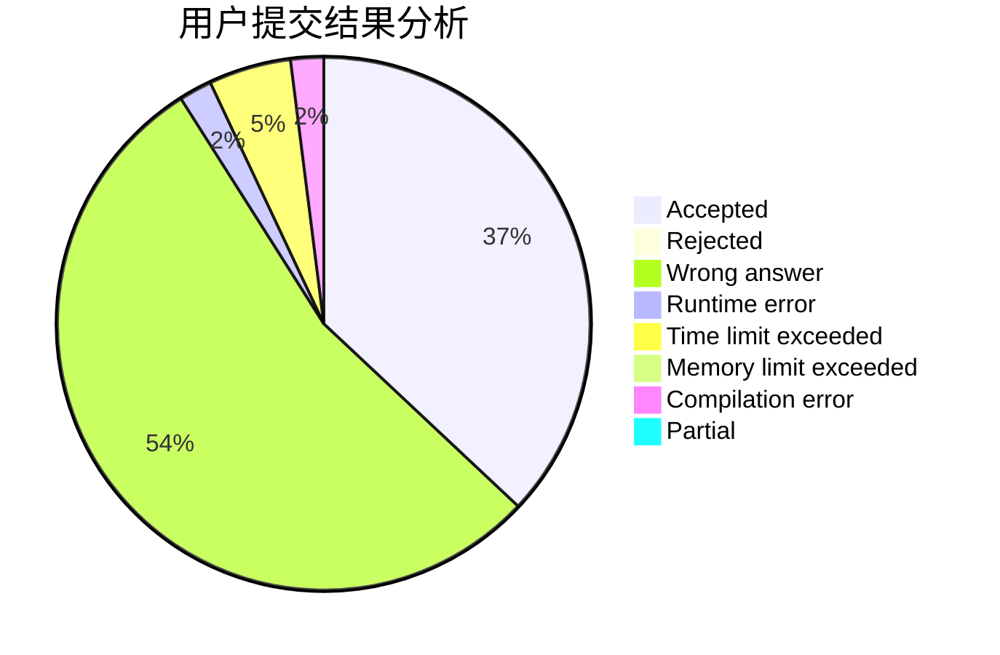
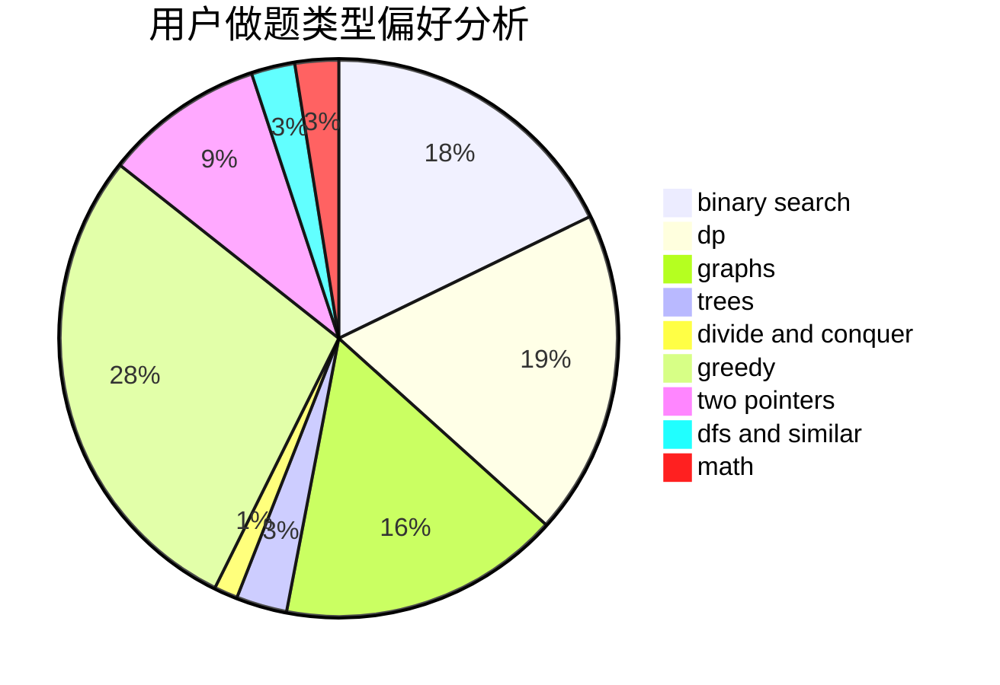

# DYf3244

<!-- tabs:start -->

#### **用户提交结果分析**

#### **用户做题类型偏好分析**

<!-- tabs:end -->
# 推荐题目
[1285D](https://codeforces.com/contest/1285/problem/D)
[285E](https://codeforces.com/contest/285/problem/E)
[782A](https://codeforces.com/contest/782/problem/A)
[1000G](https://codeforces.com/contest/1000/problem/G)
[1096D](https://codeforces.com/contest/1096/problem/D)
[1202F](https://codeforces.com/contest/1202/problem/F)
[397E](https://codeforces.com/contest/397/problem/E)
[274C](https://codeforces.com/contest/274/problem/C)
[1218H](https://codeforces.com/contest/1218/problem/H)
[189B](https://codeforces.com/contest/189/problem/B)
