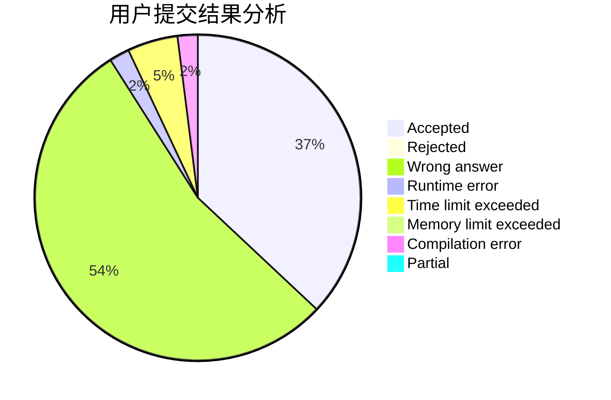
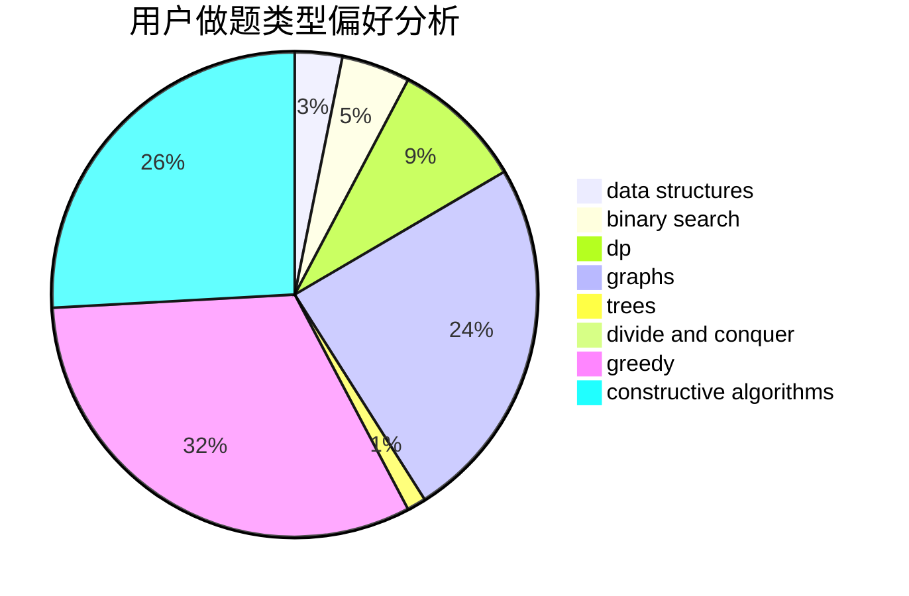

# DYf3244

<!-- tabs:start -->

#### **用户提交结果分析**

#### **用户做题类型偏好分析**

#### **用户错题知识点分析**

<!-- tabs:end -->
# 推荐题目
[1285D](https://codeforces.com/contest/1285/problem/D)		bitmasks,
                        brute force,
                        dfs and similar,
                        divide and conquer,
                        dp,
                        greedy,
                        strings,
                        trees		  
[285E](https://codeforces.com/contest/285/problem/E)		combinatorics,
                        dp,
                        math		  
[782A](https://codeforces.com/contest/782/problem/A)		dsu,graphs,sortings,trees		  
[1000G](https://codeforces.com/contest/1000/problem/G)		data structures,
                        dp,
                        trees		  
[1096D](https://codeforces.com/contest/1096/problem/D)		dp		  
[1202F](https://codeforces.com/contest/1202/problem/F)		binary search,
                        implementation,
                        math		  
[397E](https://codeforces.com/contest/397/problem/E)		dsu,graphs,sortings,trees		  
[274C](https://codeforces.com/contest/274/problem/C)		brute force,
                        geometry		  
[1218H](https://codeforces.com/contest/1218/problem/H)		dfs and similar		  
[189B](https://codeforces.com/contest/189/problem/B)		brute force,
                        math		  
