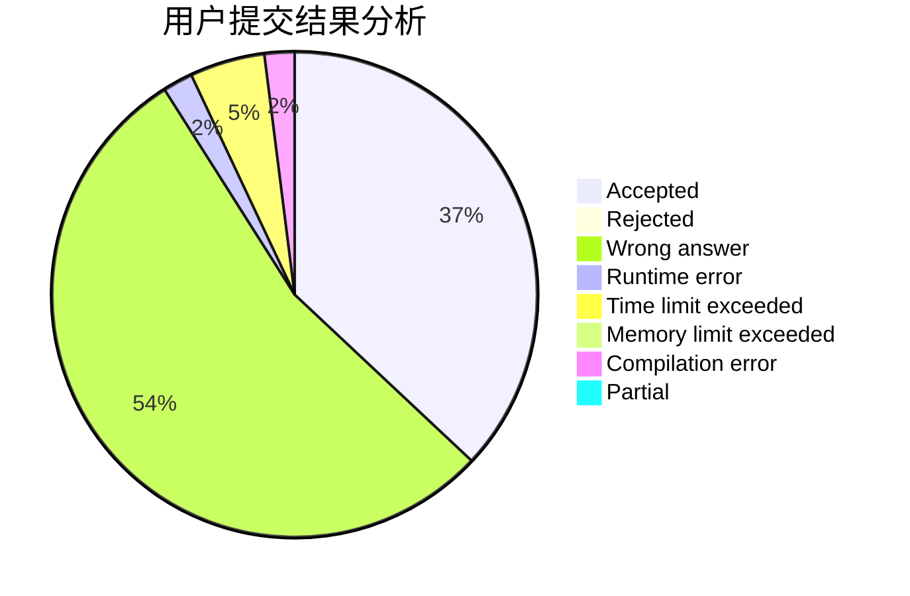
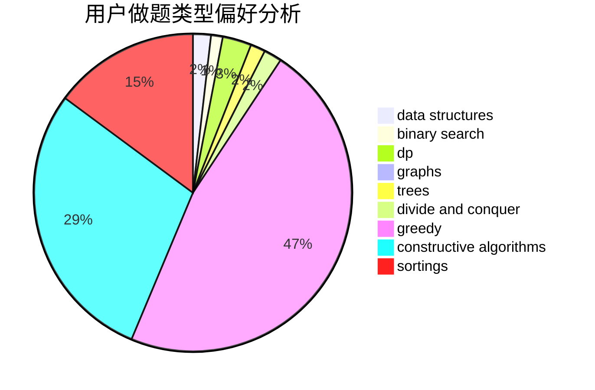

# DYf3244
<!-- tabs:start -->
#### **用户提交结果分析**

#### **用户做题类型偏好分析**

#### **用户错题知识点分析**

<!-- tabs:end -->
# 推荐题目
[269D](http://codeforces.com/problemset/problem/269/D)		data structures,
                        dp,
                        graphs,
                        sortings		  
[763C](http://codeforces.com/problemset/problem/763/C)		brute force,
                        implementation,
                        math,
                        number theory		  
[1199B](http://codeforces.com/problemset/problem/1199/B)		geometry,
                        math		  
[1000G](http://codeforces.com/problemset/problem/1000/G)		data structures,
                        dp,
                        trees		  
[256D](http://codeforces.com/problemset/problem/256/D)		dp		  
[367A](http://codeforces.com/problemset/problem/367/A)		data structures,
                        implementation		  
[1210D](http://codeforces.com/problemset/problem/1210/D)		graphs		  
[710B](http://codeforces.com/problemset/problem/710/B)		brute force,
                        sortings		  
[136B](http://codeforces.com/problemset/problem/136/B)		implementation,
                        math		  
[1213E](http://codeforces.com/problemset/problem/1213/E)		brute force,
                        constructive algorithms		  
<!-- tabs:start -->
#### **data structures**
[269D](http://codeforces.com/problemset/problem/269/D)		data structures,
                        dp,
                        graphs,
                        sortings		  
[1000G](http://codeforces.com/problemset/problem/1000/G)		data structures,
                        dp,
                        trees		  
[367A](http://codeforces.com/problemset/problem/367/A)		data structures,
                        implementation		  
[1209H](http://codeforces.com/problemset/problem/1209/H)		data structures,
                        greedy,
                        math		  
[763E](http://codeforces.com/problemset/problem/763/E)		data structures,
                        divide and conquer,
                        dsu		  
[1099F](http://codeforces.com/problemset/problem/1099/F)		binary search,
                        data structures,
                        dfs and similar,
                        dp,
                        games,
                        trees		  
[1279C](http://codeforces.com/problemset/problem/1279/C)		data structures,
                        implementation		  
[1382C2](https://codeforces.com/contest/1382/problem/C2)		constructive algorithms,
                        data structures,
                        implementation,
                        strings,
                        two pointers		  
[1214C](http://codeforces.com/problemset/problem/1214/C)		data structures,
                        greedy		  
[1468C](http://codeforces.com/problemset/problem/1468/C)		data structures,
                        implementation		  
#### **binary search**
[1099F](http://codeforces.com/problemset/problem/1099/F)		binary search,
                        data structures,
                        dfs and similar,
                        dp,
                        games,
                        trees		  
[1476A](http://codeforces.com/problemset/problem/1476/A)		binary search,
                        constructive algorithms,
                        greedy,
                        math		  
[1492C](http://codeforces.com/problemset/problem/1492/C)		binary search,
                        data structures,
                        dp,
                        greedy,
                        two pointers		  
[1463D](http://codeforces.com/problemset/problem/1463/D)		binary search,
                        constructive algorithms,
                        greedy,
                        two pointers		  
[1490G](http://codeforces.com/problemset/problem/1490/G)		binary search,
                        data structures,
                        math		  
[1479D](http://codeforces.com/problemset/problem/1479/D)		binary search,
                        bitmasks,
                        brute force,
                        data structures,
                        probabilities,
                        trees		  
[1436E](http://codeforces.com/problemset/problem/1436/E)		binary search,
                        data structures,
                        two pointers		  
[1461D](http://codeforces.com/problemset/problem/1461/D)		binary search,
                        brute force,
                        data structures,
                        divide and conquer,
                        implementation,
                        sortings		  
[1493C](http://codeforces.com/problemset/problem/1493/C)		binary search,
                        brute force,
                        constructive algorithms,
                        greedy,
                        strings		  
[1487D](http://codeforces.com/problemset/problem/1487/D)		binary search,
                        brute force,
                        math,
                        number theory		  
#### **dp**
[269D](http://codeforces.com/problemset/problem/269/D)		data structures,
                        dp,
                        graphs,
                        sortings		  
[1000G](http://codeforces.com/problemset/problem/1000/G)		data structures,
                        dp,
                        trees		  
[256D](http://codeforces.com/problemset/problem/256/D)		dp		  
[1099F](http://codeforces.com/problemset/problem/1099/F)		binary search,
                        data structures,
                        dfs and similar,
                        dp,
                        games,
                        trees		  
[1158F](http://codeforces.com/problemset/problem/1158/F)		dp,
                        math		  
[1324F](http://codeforces.com/problemset/problem/1324/F)		dfs and similar,
                        dp,
                        graphs,
                        trees		  
[1316E](http://codeforces.com/problemset/problem/1316/E)		bitmasks,
                        dp,
                        greedy,
                        sortings		  
[1492C](http://codeforces.com/problemset/problem/1492/C)		binary search,
                        data structures,
                        dp,
                        greedy,
                        two pointers		  
[1457C](https://codeforces.com/contest/1457/problem/C)		brute force,
                        dp,
                        implementation		  
[1491C](http://codeforces.com/problemset/problem/1491/C)		brute force,
                        data structures,
                        dp,
                        greedy,
                        implementation		  
#### **graph**
[269D](http://codeforces.com/problemset/problem/269/D)		data structures,
                        dp,
                        graphs,
                        sortings		  
[1210D](http://codeforces.com/problemset/problem/1210/D)		graphs		  
[120H](http://codeforces.com/problemset/problem/120/H)		graph matchings		  
[1324F](http://codeforces.com/problemset/problem/1324/F)		dfs and similar,
                        dp,
                        graphs,
                        trees		  
[763D](http://codeforces.com/problemset/problem/763/D)		data structures,
                        graphs,
                        hashing,
                        shortest paths,
                        trees		  
[1487C](http://codeforces.com/problemset/problem/1487/C)		brute force,
                        constructive algorithms,
                        dfs and similar,
                        graphs,
                        greedy,
                        implementation,
                        math		  
[1437C](http://codeforces.com/problemset/problem/1437/C)		dp,
                        flows,
                        graph matchings,
                        greedy,
                        math,
                        sortings		  
[1470D](http://codeforces.com/problemset/problem/1470/D)		constructive algorithms,
                        dfs and similar,
                        graph matchings,
                        graphs,
                        greedy		  
[1476C](http://codeforces.com/problemset/problem/1476/C)		dp,
                        graphs,
                        greedy		  
[1304D](http://codeforces.com/problemset/problem/1304/D)		constructive algorithms,
                        graphs,
                        greedy,
                        two pointers		  
#### **trees**
[1000G](http://codeforces.com/problemset/problem/1000/G)		data structures,
                        dp,
                        trees		  
[1099F](http://codeforces.com/problemset/problem/1099/F)		binary search,
                        data structures,
                        dfs and similar,
                        dp,
                        games,
                        trees		  
[1210C](http://codeforces.com/problemset/problem/1210/C)		math,
                        number theory,
                        trees		  
[1324F](http://codeforces.com/problemset/problem/1324/F)		dfs and similar,
                        dp,
                        graphs,
                        trees		  
[763D](http://codeforces.com/problemset/problem/763/D)		data structures,
                        graphs,
                        hashing,
                        shortest paths,
                        trees		  
[1479D](http://codeforces.com/problemset/problem/1479/D)		binary search,
                        bitmasks,
                        brute force,
                        data structures,
                        probabilities,
                        trees		  
[1511C](http://codeforces.com/problemset/problem/1511/C)		brute force,
                        data structures,
                        implementation,
                        trees		  
[1499F](http://codeforces.com/problemset/problem/1499/F)		combinatorics,
                        dfs and similar,
                        dp,
                        trees		  
[1491E](http://codeforces.com/problemset/problem/1491/E)		brute force,
                        dfs and similar,
                        divide and conquer,
                        number theory,
                        trees		  
[1466D](http://codeforces.com/problemset/problem/1466/D)		data structures,
                        greedy,
                        sortings,
                        trees		  
#### **divide and conquer**
[763E](http://codeforces.com/problemset/problem/763/E)		data structures,
                        divide and conquer,
                        dsu		  
[1461D](http://codeforces.com/problemset/problem/1461/D)		binary search,
                        brute force,
                        data structures,
                        divide and conquer,
                        implementation,
                        sortings		  
[1466G](http://codeforces.com/problemset/problem/1466/G)		combinatorics,
                        divide and conquer,
                        hashing,
                        math,
                        string suffix structures,
                        strings		  
[1490D](http://codeforces.com/problemset/problem/1490/D)		dfs and similar,
                        divide and conquer,
                        implementation		  
[1483C](https://codeforces.com/contest/1483/problem/C)		data structures,
                        divide and conquer,
                        dp		  
[1491E](http://codeforces.com/problemset/problem/1491/E)		brute force,
                        dfs and similar,
                        divide and conquer,
                        number theory,
                        trees		  
[1303G](http://codeforces.com/problemset/problem/1303/G)		data structures,
                        divide and conquer,
                        geometry,
                        trees		  
[1494D](http://codeforces.com/problemset/problem/1494/D)		constructive algorithms,
                        data structures,
                        dfs and similar,
                        divide and conquer,
                        dsu,
                        greedy,
                        sortings,
                        trees		  
[1482E](http://codeforces.com/problemset/problem/1482/E)		data structures,
                        divide and conquer,
                        dp		  
[566C](http://codeforces.com/problemset/problem/566/C)		dfs and similar,
                        divide and conquer,
                        trees		  
#### **greedy**
[1209H](http://codeforces.com/problemset/problem/1209/H)		data structures,
                        greedy,
                        math		  
[1214C](http://codeforces.com/problemset/problem/1214/C)		data structures,
                        greedy		  
[1096A](http://codeforces.com/problemset/problem/1096/A)		greedy,
                        implementation,
                        math		  
[1209G1](http://codeforces.com/problemset/problem/1209/G1)		data structures,
                        dsu,
                        greedy,
                        implementation,
                        two pointers		  
[1316E](http://codeforces.com/problemset/problem/1316/E)		bitmasks,
                        dp,
                        greedy,
                        sortings		  
[1476A](http://codeforces.com/problemset/problem/1476/A)		binary search,
                        constructive algorithms,
                        greedy,
                        math		  
[1492C](http://codeforces.com/problemset/problem/1492/C)		binary search,
                        data structures,
                        dp,
                        greedy,
                        two pointers		  
[1496C](https://codeforces.com/contest/1496/problem/C)		geometry,
                        greedy,
                        math,
                        sortings		  
[1493A](http://codeforces.com/problemset/problem/1493/A)		constructive algorithms,
                        greedy		  
[1463D](http://codeforces.com/problemset/problem/1463/D)		binary search,
                        constructive algorithms,
                        greedy,
                        two pointers		  
#### **constructive algorithms**
[1213E](http://codeforces.com/problemset/problem/1213/E)		brute force,
                        constructive algorithms		  
[1382C2](https://codeforces.com/contest/1382/problem/C2)		constructive algorithms,
                        data structures,
                        implementation,
                        strings,
                        two pointers		  
[763B](http://codeforces.com/problemset/problem/763/B)		constructive algorithms,
                        geometry		  
[1476A](http://codeforces.com/problemset/problem/1476/A)		binary search,
                        constructive algorithms,
                        greedy,
                        math		  
[1493A](http://codeforces.com/problemset/problem/1493/A)		constructive algorithms,
                        greedy		  
[1463D](http://codeforces.com/problemset/problem/1463/D)		binary search,
                        constructive algorithms,
                        greedy,
                        two pointers		  
[1456B](https://codeforces.com/contest/1456/problem/B)		bitmasks,
                        brute force,
                        constructive algorithms		  
[1492D](http://codeforces.com/problemset/problem/1492/D)		bitmasks,
                        constructive algorithms,
                        greedy,
                        math		  
[1504D](https://codeforces.com/contest/1504/problem/D)		constructive algorithms,
                        games,
                        interactive		  
[1483A](https://codeforces.com/contest/1483/problem/A)		brute force,
                        constructive algorithms,
                        greedy,
                        implementation		  
#### **sortings**
[269D](http://codeforces.com/problemset/problem/269/D)		data structures,
                        dp,
                        graphs,
                        sortings		  
[710B](http://codeforces.com/problemset/problem/710/B)		brute force,
                        sortings		  
[1316E](http://codeforces.com/problemset/problem/1316/E)		bitmasks,
                        dp,
                        greedy,
                        sortings		  
[1496C](https://codeforces.com/contest/1496/problem/C)		geometry,
                        greedy,
                        math,
                        sortings		  
[1495A](http://codeforces.com/problemset/problem/1495/A)		geometry,
                        greedy,
                        math,
                        sortings		  
[1497A](http://codeforces.com/problemset/problem/1497/A)		brute force,
                        data structures,
                        greedy,
                        sortings		  
[1427A](http://codeforces.com/problemset/problem/1427/A)		math,
                        sortings		  
[1461D](http://codeforces.com/problemset/problem/1461/D)		binary search,
                        brute force,
                        data structures,
                        divide and conquer,
                        implementation,
                        sortings		  
[1437C](http://codeforces.com/problemset/problem/1437/C)		dp,
                        flows,
                        graph matchings,
                        greedy,
                        math,
                        sortings		  
[1473A](http://codeforces.com/problemset/problem/1473/A)		greedy,
                        implementation,
                        math,
                        sortings		  
<!-- tabs:end -->
