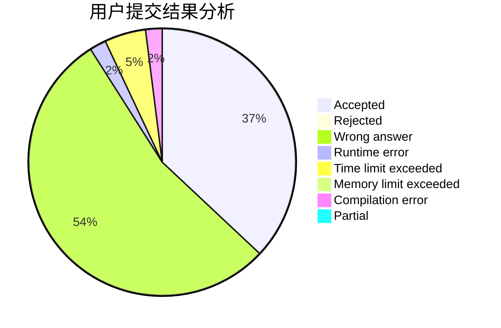
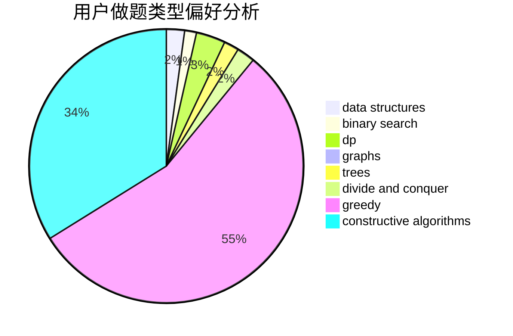

# DYf3244

<!-- tabs:start -->

#### **用户提交结果分析**

#### **用户做题类型偏好分析**

#### **用户错题知识点分析**

<!-- tabs:end -->
# 推荐题目
[1279C](https://codeforces.com/contest/1279/problem/C)		data structures,
                        implementation		  
[269D](https://codeforces.com/contest/269/problem/D)		data structures,
                        dp,
                        graphs,
                        sortings		  
[763C](https://codeforces.com/contest/763/problem/C)		brute force,
                        implementation,
                        math,
                        number theory		  
[1000G](https://codeforces.com/contest/1000/problem/G)		data structures,
                        dp,
                        trees		  
[1096A](https://codeforces.com/contest/1096/problem/A)		greedy,
                        implementation,
                        math		  
[1199B](https://codeforces.com/contest/1199/problem/B)		geometry,
                        math		  
[367A](https://codeforces.com/contest/367/problem/A)		data structures,
                        implementation		  
[256D](https://codeforces.com/contest/256/problem/D)		dp		  
[1213E](https://codeforces.com/contest/1213/problem/E)		brute force,
                        constructive algorithms		  
[163D](https://codeforces.com/contest/163/problem/D)		brute force		  
