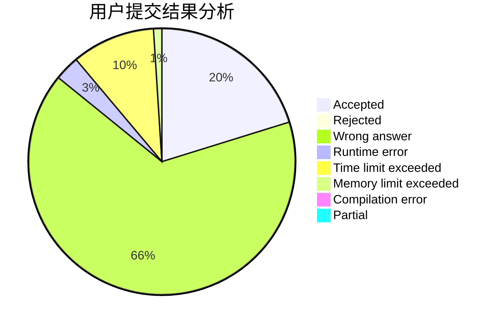
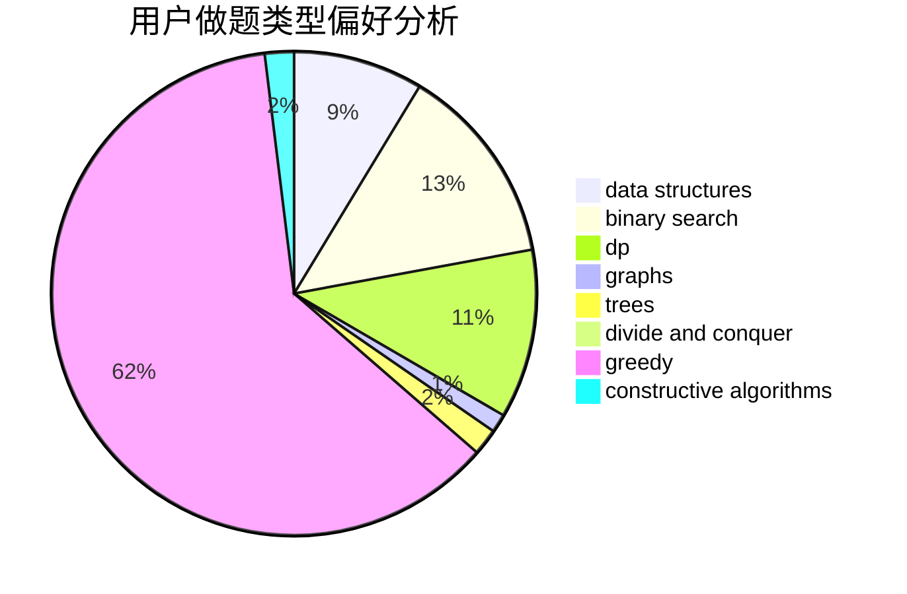
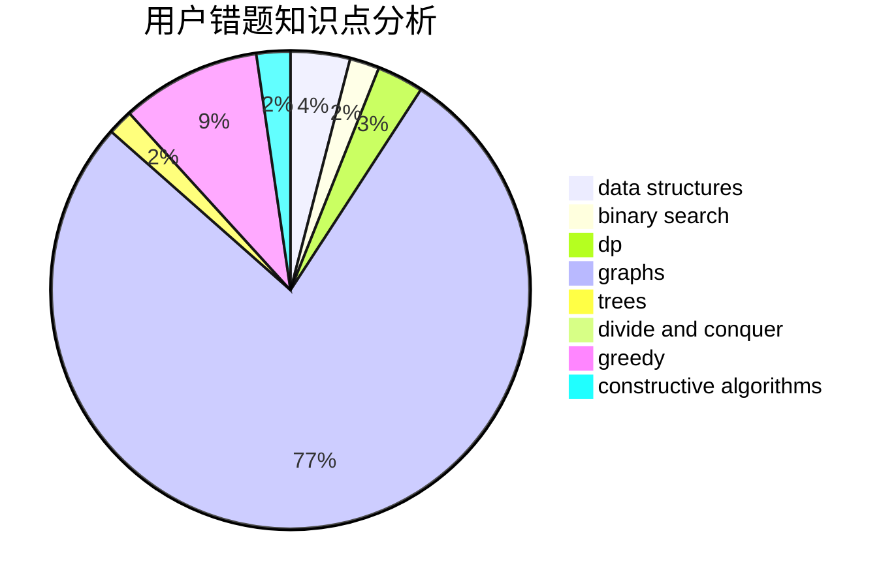

# 2005lz
<!-- tabs:start -->
#### **用户提交结果分析**

#### **用户做题类型偏好分析**

#### **用户错题知识点分析**

<!-- tabs:end -->
# 推荐题目
[Rotate Columns (easy version)](http://codeforces.com/problemset/problem/1209/E1)		bitmasks,
                        brute force,
                        dp,
                        greedy,
                        sortings		  
[Postcard](http://codeforces.com/problemset/problem/1099/C)		constructive algorithms,
                        implementation		  
[Book Reading](http://codeforces.com/problemset/problem/1213/C)		math		  
[Konrad and Company Evaluation](http://codeforces.com/problemset/problem/1210/D)		graphs		  
[Divisor Subtraction](http://codeforces.com/problemset/problem/1076/B)		implementation,
                        math,
                        number theory		  
[Two-Paths](http://codeforces.com/problemset/problem/1000/G)		data structures,
                        dp,
                        trees		  
[Network Safety](http://codeforces.com/problemset/problem/1039/C)		dfs and similar,
                        dsu,
                        graphs,
                        math,
                        sortings		  
[Rectangle Painting 1](https://codeforces.com/contest/1199/problem/F)		dp		  
[Find Divisible](http://codeforces.com/problemset/problem/1096/A)		greedy,
                        implementation,
                        math		  
[Rotate Columns (hard version)](http://codeforces.com/problemset/problem/1209/E2)		bitmasks,
                        dp,
                        greedy,
                        sortings		  
<!-- tabs:start -->
#### **data structures**
[Rotate Columns (easy version)](http://codeforces.com/problemset/problem/1000/G)		data structures,
                        dp,
                        trees		  
[Postcard](http://codeforces.com/problemset/problem/1117/G)		data structures		  
[Book Reading](http://codeforces.com/problemset/problem/1213/B)		data structures,
                        implementation		  
[Konrad and Company Evaluation](http://codeforces.com/problemset/problem/1209/H)		data structures,
                        greedy,
                        math		  
[Divisor Subtraction](http://codeforces.com/problemset/problem/1209/G2)		data structures		  
[Two-Paths](http://codeforces.com/problemset/problem/1213/F)		data structures,
                        dfs and similar,
                        dsu,
                        graphs,
                        greedy,
                        implementation,
                        strings		  
[Network Safety](http://codeforces.com/problemset/problem/1209/F)		data structures,
                        dfs and similar,
                        graphs,
                        shortest paths,
                        strings,
                        trees		  
[Rectangle Painting 1](http://codeforces.com/problemset/problem/1214/C)		data structures,
                        greedy		  
[Find Divisible](http://codeforces.com/problemset/problem/1209/G1)		data structures,
                        dsu,
                        greedy,
                        implementation,
                        two pointers		  
[Rotate Columns (hard version)](http://codeforces.com/problemset/problem/1492/C)		binary search,
                        data structures,
                        dp,
                        greedy,
                        two pointers		  
#### **binary search**
[Rotate Columns (easy version)](http://codeforces.com/problemset/problem/1103/B)		binary search,
                        constructive algorithms,
                        interactive		  
[Postcard](http://codeforces.com/problemset/problem/1492/C)		binary search,
                        data structures,
                        dp,
                        greedy,
                        two pointers		  
[Book Reading](http://codeforces.com/problemset/problem/1463/D)		binary search,
                        constructive algorithms,
                        greedy,
                        two pointers		  
[Konrad and Company Evaluation](http://codeforces.com/problemset/problem/1490/G)		binary search,
                        data structures,
                        math		  
[Divisor Subtraction](http://codeforces.com/problemset/problem/1479/D)		binary search,
                        bitmasks,
                        brute force,
                        data structures,
                        probabilities,
                        trees		  
[Two-Paths](http://codeforces.com/problemset/problem/1436/E)		binary search,
                        data structures,
                        two pointers		  
[Network Safety](http://codeforces.com/problemset/problem/1461/D)		binary search,
                        brute force,
                        data structures,
                        divide and conquer,
                        implementation,
                        sortings		  
[Rectangle Painting 1](http://codeforces.com/problemset/problem/1493/C)		binary search,
                        brute force,
                        constructive algorithms,
                        greedy,
                        strings		  
[Find Divisible](http://codeforces.com/problemset/problem/1487/D)		binary search,
                        brute force,
                        math,
                        number theory		  
[Rotate Columns (hard version)](http://codeforces.com/problemset/problem/1486/B)		binary search,
                        geometry,
                        shortest paths,
                        sortings		  
#### **dp**
[Rotate Columns (easy version)](http://codeforces.com/problemset/problem/1209/E1)		bitmasks,
                        brute force,
                        dp,
                        greedy,
                        sortings		  
[Postcard](http://codeforces.com/problemset/problem/1000/G)		data structures,
                        dp,
                        trees		  
[Book Reading](https://codeforces.com/contest/1199/problem/F)		dp		  
[Konrad and Company Evaluation](http://codeforces.com/problemset/problem/1209/E2)		bitmasks,
                        dp,
                        greedy,
                        sortings		  
[Divisor Subtraction](http://codeforces.com/problemset/problem/1093/F)		dp		  
[Two-Paths](http://codeforces.com/problemset/problem/1158/F)		dp,
                        math		  
[Network Safety](http://codeforces.com/problemset/problem/1492/C)		binary search,
                        data structures,
                        dp,
                        greedy,
                        two pointers		  
[Rectangle Painting 1](https://codeforces.com/contest/1457/problem/C)		brute force,
                        dp,
                        implementation		  
[Find Divisible](http://codeforces.com/problemset/problem/1491/C)		brute force,
                        data structures,
                        dp,
                        greedy,
                        implementation		  
[Rotate Columns (hard version)](http://codeforces.com/problemset/problem/1437/C)		dp,
                        flows,
                        graph matchings,
                        greedy,
                        math,
                        sortings		  
#### **graph**
[Rotate Columns (easy version)](http://codeforces.com/problemset/problem/1210/D)		graphs		  
[Postcard](http://codeforces.com/problemset/problem/1039/C)		dfs and similar,
                        dsu,
                        graphs,
                        math,
                        sortings		  
[Book Reading](http://codeforces.com/problemset/problem/120/H)		graph matchings		  
[Konrad and Company Evaluation](http://codeforces.com/problemset/problem/1213/F)		data structures,
                        dfs and similar,
                        dsu,
                        graphs,
                        greedy,
                        implementation,
                        strings		  
[Divisor Subtraction](http://codeforces.com/problemset/problem/1209/F)		data structures,
                        dfs and similar,
                        graphs,
                        shortest paths,
                        strings,
                        trees		  
[Two-Paths](http://codeforces.com/problemset/problem/1213/G)		divide and conquer,
                        dsu,
                        graphs,
                        sortings,
                        trees		  
[Network Safety](http://codeforces.com/problemset/problem/1209/D)		dfs and similar,
                        dsu,
                        graphs		  
[Rectangle Painting 1](http://codeforces.com/problemset/problem/1487/C)		brute force,
                        constructive algorithms,
                        dfs and similar,
                        graphs,
                        greedy,
                        implementation,
                        math		  
[Find Divisible](http://codeforces.com/problemset/problem/1437/C)		dp,
                        flows,
                        graph matchings,
                        greedy,
                        math,
                        sortings		  
[Rotate Columns (hard version)](http://codeforces.com/problemset/problem/1470/D)		constructive algorithms,
                        dfs and similar,
                        graph matchings,
                        graphs,
                        greedy		  
#### **trees**
[Rotate Columns (easy version)](http://codeforces.com/problemset/problem/1000/G)		data structures,
                        dp,
                        trees		  
[Postcard](http://codeforces.com/problemset/problem/1210/C)		math,
                        number theory,
                        trees		  
[Book Reading](http://codeforces.com/problemset/problem/1209/F)		data structures,
                        dfs and similar,
                        graphs,
                        shortest paths,
                        strings,
                        trees		  
[Konrad and Company Evaluation](http://codeforces.com/problemset/problem/1213/G)		divide and conquer,
                        dsu,
                        graphs,
                        sortings,
                        trees		  
[Divisor Subtraction](http://codeforces.com/problemset/problem/1479/D)		binary search,
                        bitmasks,
                        brute force,
                        data structures,
                        probabilities,
                        trees		  
[Two-Paths](http://codeforces.com/problemset/problem/1511/C)		brute force,
                        data structures,
                        implementation,
                        trees		  
[Network Safety](http://codeforces.com/problemset/problem/1499/F)		combinatorics,
                        dfs and similar,
                        dp,
                        trees		  
[Rectangle Painting 1](http://codeforces.com/problemset/problem/1491/E)		brute force,
                        dfs and similar,
                        divide and conquer,
                        number theory,
                        trees		  
[Find Divisible](http://codeforces.com/problemset/problem/1466/D)		data structures,
                        greedy,
                        sortings,
                        trees		  
[Rotate Columns (hard version)](http://codeforces.com/problemset/problem/1495/D)		combinatorics,
                        dfs and similar,
                        graphs,
                        math,
                        shortest paths,
                        trees		  
#### **divide and conquer**
[Rotate Columns (easy version)](http://codeforces.com/problemset/problem/120/J)		divide and conquer,
                        geometry,
                        sortings		  
[Postcard](http://codeforces.com/problemset/problem/1213/G)		divide and conquer,
                        dsu,
                        graphs,
                        sortings,
                        trees		  
[Book Reading](http://codeforces.com/problemset/problem/1461/D)		binary search,
                        brute force,
                        data structures,
                        divide and conquer,
                        implementation,
                        sortings		  
[Konrad and Company Evaluation](http://codeforces.com/problemset/problem/1466/G)		combinatorics,
                        divide and conquer,
                        hashing,
                        math,
                        string suffix structures,
                        strings		  
[Divisor Subtraction](http://codeforces.com/problemset/problem/1490/D)		dfs and similar,
                        divide and conquer,
                        implementation		  
[Two-Paths](https://codeforces.com/contest/1483/problem/C)		data structures,
                        divide and conquer,
                        dp		  
[Network Safety](http://codeforces.com/problemset/problem/1491/E)		brute force,
                        dfs and similar,
                        divide and conquer,
                        number theory,
                        trees		  
[Rectangle Painting 1](http://codeforces.com/problemset/problem/1303/G)		data structures,
                        divide and conquer,
                        geometry,
                        trees		  
[Find Divisible](http://codeforces.com/problemset/problem/1494/D)		constructive algorithms,
                        data structures,
                        dfs and similar,
                        divide and conquer,
                        dsu,
                        greedy,
                        sortings,
                        trees		  
[Rotate Columns (hard version)](http://codeforces.com/problemset/problem/1482/E)		data structures,
                        divide and conquer,
                        dp		  
#### **greedy**
[Rotate Columns (easy version)](http://codeforces.com/problemset/problem/1209/E1)		bitmasks,
                        brute force,
                        dp,
                        greedy,
                        sortings		  
[Postcard](http://codeforces.com/problemset/problem/1096/A)		greedy,
                        implementation,
                        math		  
[Book Reading](http://codeforces.com/problemset/problem/1209/E2)		bitmasks,
                        dp,
                        greedy,
                        sortings		  
[Konrad and Company Evaluation](http://codeforces.com/problemset/problem/1209/H)		data structures,
                        greedy,
                        math		  
[Divisor Subtraction](http://codeforces.com/problemset/problem/1209/A)		greedy,
                        implementation,
                        math		  
[Two-Paths](http://codeforces.com/problemset/problem/1167/D)		constructive algorithms,
                        greedy		  
[Network Safety](http://codeforces.com/problemset/problem/1208/G)		greedy,
                        math,
                        number theory		  
[Rectangle Painting 1](http://codeforces.com/problemset/problem/1213/F)		data structures,
                        dfs and similar,
                        dsu,
                        graphs,
                        greedy,
                        implementation,
                        strings		  
[Find Divisible](http://codeforces.com/problemset/problem/1214/C)		data structures,
                        greedy		  
[Rotate Columns (hard version)](http://codeforces.com/problemset/problem/1209/G1)		data structures,
                        dsu,
                        greedy,
                        implementation,
                        two pointers		  
#### **constructive algorithms**
[Rotate Columns (easy version)](http://codeforces.com/problemset/problem/1099/C)		constructive algorithms,
                        implementation		  
[Postcard](http://codeforces.com/problemset/problem/1213/E)		brute force,
                        constructive algorithms		  
[Book Reading](http://codeforces.com/problemset/problem/1167/D)		constructive algorithms,
                        greedy		  
[Konrad and Company Evaluation](http://codeforces.com/problemset/problem/1089/E)		constructive algorithms		  
[Divisor Subtraction](http://codeforces.com/problemset/problem/1103/B)		binary search,
                        constructive algorithms,
                        interactive		  
[Two-Paths](http://codeforces.com/problemset/problem/1209/C)		constructive algorithms,
                        greedy,
                        implementation		  
[Network Safety](http://codeforces.com/problemset/problem/1493/A)		constructive algorithms,
                        greedy		  
[Rectangle Painting 1](http://codeforces.com/problemset/problem/1463/D)		binary search,
                        constructive algorithms,
                        greedy,
                        two pointers		  
[Find Divisible](https://codeforces.com/contest/1456/problem/B)		bitmasks,
                        brute force,
                        constructive algorithms		  
[Rotate Columns (hard version)](http://codeforces.com/problemset/problem/1492/D)		bitmasks,
                        constructive algorithms,
                        greedy,
                        math		  
#### **sortings**
[Rotate Columns (easy version)](http://codeforces.com/problemset/problem/1209/E1)		bitmasks,
                        brute force,
                        dp,
                        greedy,
                        sortings		  
[Postcard](http://codeforces.com/problemset/problem/1039/C)		dfs and similar,
                        dsu,
                        graphs,
                        math,
                        sortings		  
[Book Reading](http://codeforces.com/problemset/problem/1209/E2)		bitmasks,
                        dp,
                        greedy,
                        sortings		  
[Konrad and Company Evaluation](http://codeforces.com/problemset/problem/120/J)		divide and conquer,
                        geometry,
                        sortings		  
[Divisor Subtraction](http://codeforces.com/problemset/problem/1213/G)		divide and conquer,
                        dsu,
                        graphs,
                        sortings,
                        trees		  
[Two-Paths](http://codeforces.com/problemset/problem/1213/D2)		brute force,
                        math,
                        sortings		  
[Network Safety](https://codeforces.com/contest/1496/problem/C)		geometry,
                        greedy,
                        math,
                        sortings		  
[Rectangle Painting 1](http://codeforces.com/problemset/problem/1495/A)		geometry,
                        greedy,
                        math,
                        sortings		  
[Find Divisible](http://codeforces.com/problemset/problem/1497/A)		brute force,
                        data structures,
                        greedy,
                        sortings		  
[Rotate Columns (hard version)](http://codeforces.com/problemset/problem/1427/A)		math,
                        sortings		  
<!-- tabs:end -->
