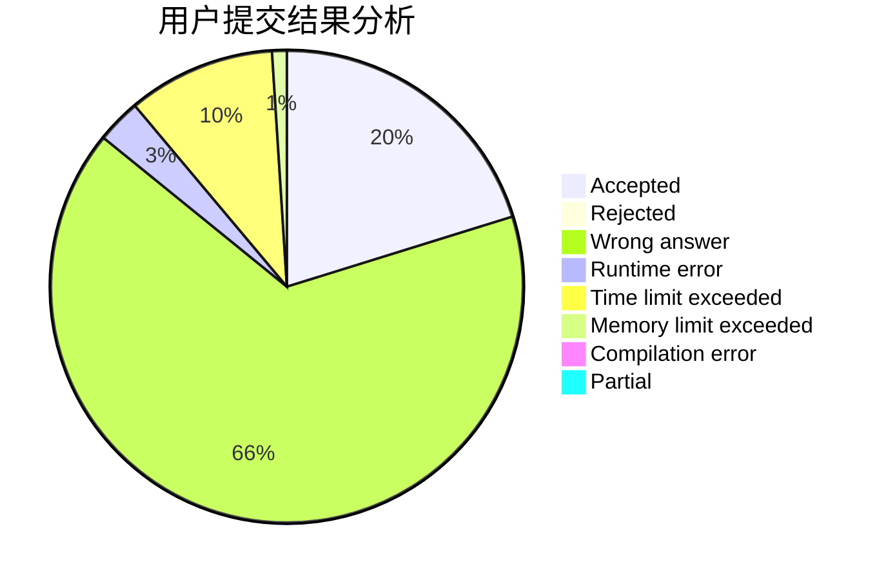
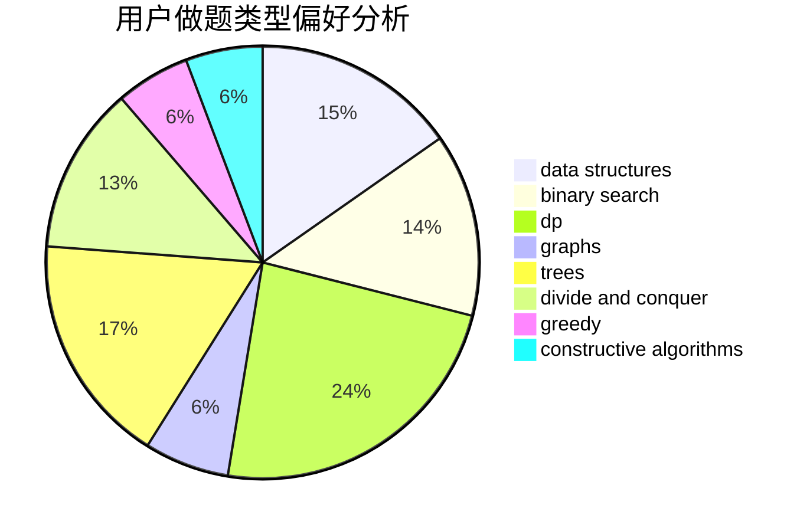
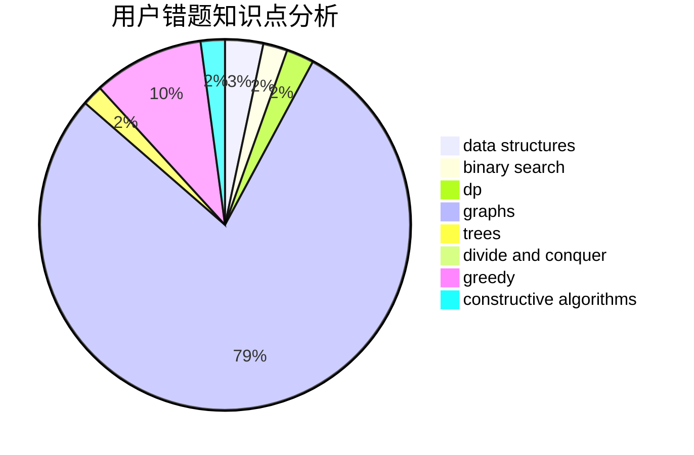

# 2005lz

<!-- tabs:start -->

#### **用户提交结果分析**

#### **用户做题类型偏好分析**

#### **用户错题知识点分析**

<!-- tabs:end -->
# 推荐题目
[1217E](https://codeforces.com/contest/1217/problem/E)		data structures,
                        greedy,
                        implementation,
                        math		  
[1099F](https://codeforces.com/contest/1099/problem/F)		binary search,
                        data structures,
                        dfs and similar,
                        dp,
                        games,
                        trees		  
[1215B](https://codeforces.com/contest/1215/problem/B)		combinatorics,
                        dp,
                        implementation		  
[1096D](https://codeforces.com/contest/1096/problem/D)		dp		  
[1214E](https://codeforces.com/contest/1214/problem/E)		constructive algorithms,
                        graphs,
                        math,
                        sortings,
                        trees		  
[1000G](https://codeforces.com/contest/1000/problem/G)		data structures,
                        dp,
                        trees		  
[1214G](https://codeforces.com/contest/1214/problem/G)		bitmasks,
                        data structures		  
[1218C](https://codeforces.com/contest/1218/problem/C)		dp		  
[1172A](https://codeforces.com/contest/1172/problem/A)		greedy,
                        implementation		  
[1216F](https://codeforces.com/contest/1216/problem/F)		data structures,
                        dp,
                        greedy		  
