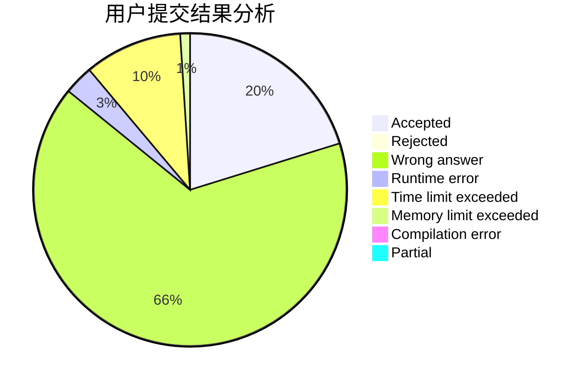
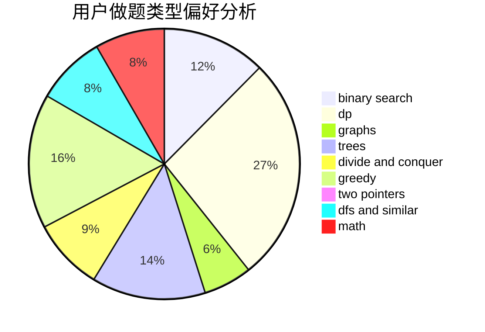

# 2005lz

<!-- tabs:start -->

#### **用户提交结果分析**

#### **用户做题类型偏好分析**

<!-- tabs:end -->
# 推荐题目
[1217E](https://codeforces.com/contest/1217/problem/E)
[1099F](https://codeforces.com/contest/1099/problem/F)
[1215B](https://codeforces.com/contest/1215/problem/B)
[1096D](https://codeforces.com/contest/1096/problem/D)
[1214E](https://codeforces.com/contest/1214/problem/E)
[1000G](https://codeforces.com/contest/1000/problem/G)
[1214G](https://codeforces.com/contest/1214/problem/G)
[1218C](https://codeforces.com/contest/1218/problem/C)
[1172A](https://codeforces.com/contest/1172/problem/A)
[1216F](https://codeforces.com/contest/1216/problem/F)
