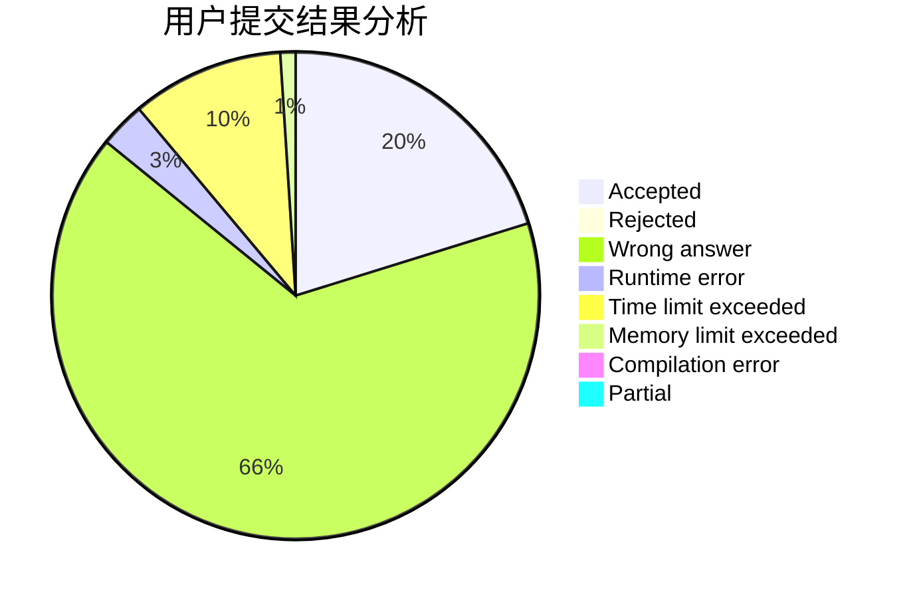
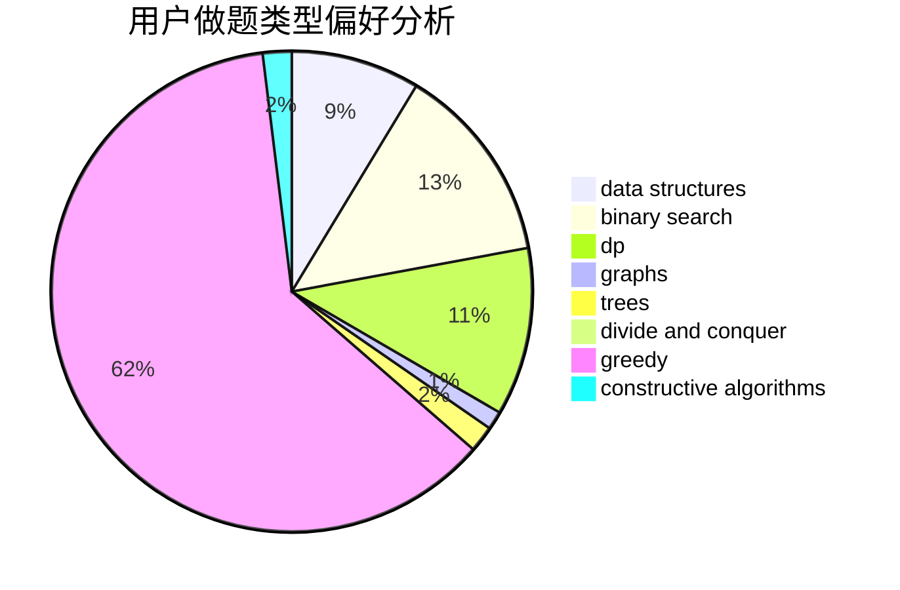
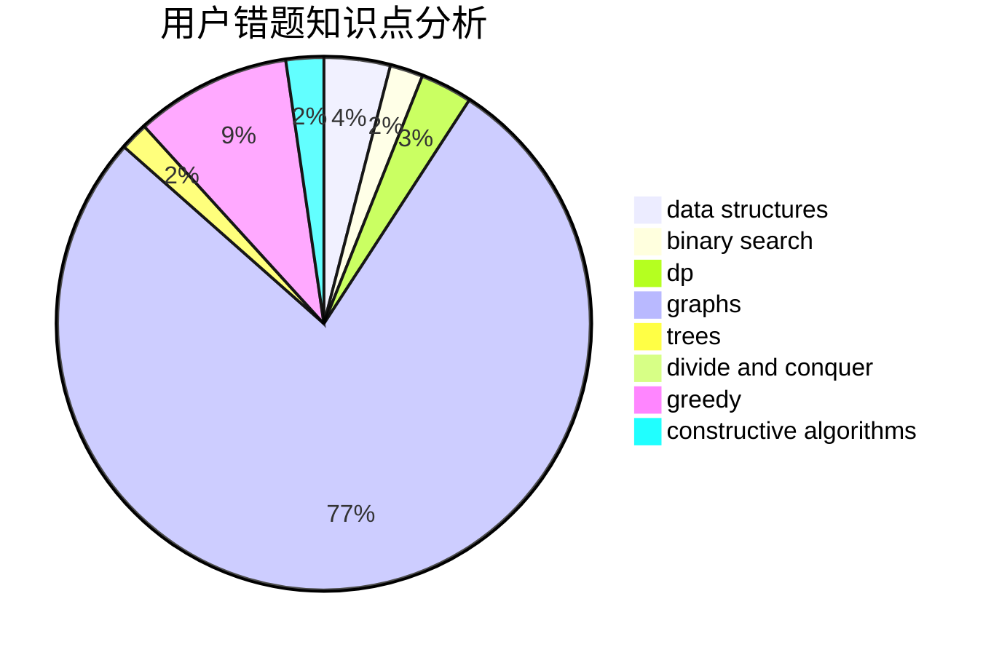

# 2005lz

<!-- tabs:start -->

#### **用户提交结果分析**

#### **用户做题类型偏好分析**

#### **用户错题知识点分析**

<!-- tabs:end -->
# 推荐题目
[1213C](https://codeforces.com/contest/1213/problem/C)		math		  
[1099C](https://codeforces.com/contest/1099/problem/C)		constructive algorithms,
                        implementation		  
[1209E2](https://codeforces.com/contest/1209E/problem/2)		bitmasks,
                        dp,
                        greedy,
                        sortings		  
[1096A](https://codeforces.com/contest/1096/problem/A)		greedy,
                        implementation,
                        math		  
[1209A](https://codeforces.com/contest/1209/problem/A)		greedy,
                        implementation,
                        math		  
[1000G](https://codeforces.com/contest/1000/problem/G)		data structures,
                        dp,
                        trees		  
[1209C](https://codeforces.com/contest/1209/problem/C)		constructive algorithms,
                        greedy,
                        implementation		  
[1213D2](https://codeforces.com/contest/1213D/problem/2)		brute force,
                        math,
                        sortings		  
[1167D](https://codeforces.com/contest/1167/problem/D)		constructive algorithms,
                        greedy		  
[1210F2](https://codeforces.com/contest/1210F/problem/2)		brute force,
                        probabilities		  
