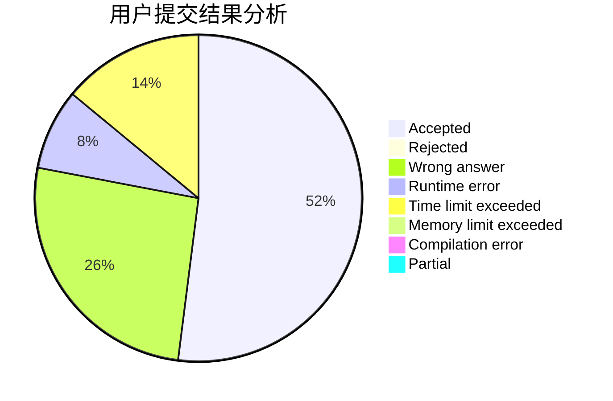
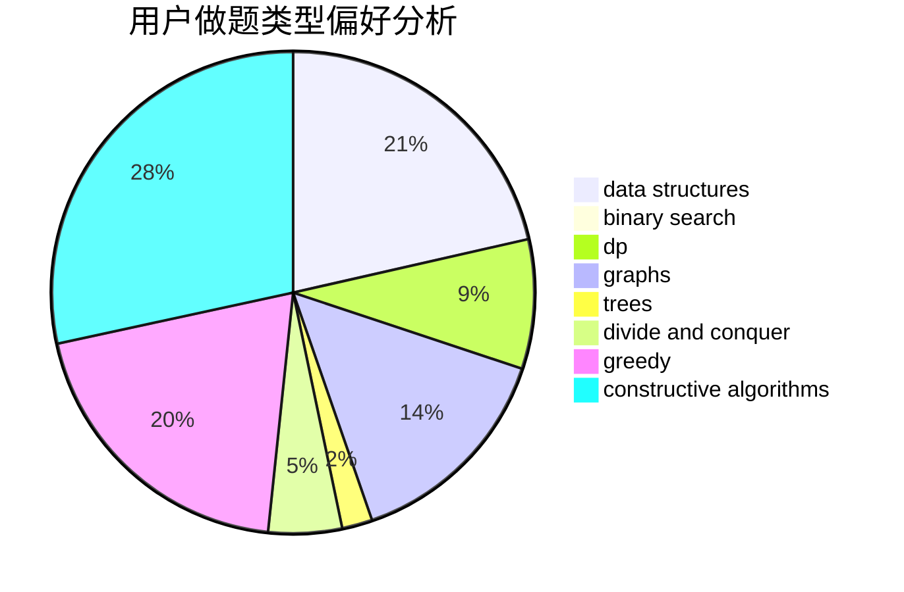

# D_O_Time

<!-- tabs:start -->

#### **用户提交结果分析**

#### **用户做题类型偏好分析**

#### **用户错题知识点分析**

<!-- tabs:end -->
# 推荐题目
[741A](https://codeforces.com/contest/741/problem/A)		dfs and similar,
                        math		  
[1117G](https://codeforces.com/contest/1117/problem/G)		data structures		  
[1510K](https://codeforces.com/contest/1510/problem/K)		brute force,
                        graphs,
                        implementation		  
[764B](https://codeforces.com/contest/764/problem/B)		constructive algorithms,
                        implementation		  
[762A](https://codeforces.com/contest/762/problem/A)		math,
                        number theory		  
[280E](https://codeforces.com/contest/280/problem/E)		data structures,
                        dp,
                        implementation,
                        math		  
[1216C](https://codeforces.com/contest/1216/problem/C)		geometry,
                        math		  
[199E](https://codeforces.com/contest/199/problem/E)		dsu,graphs,sortings,trees		  
[260C](https://codeforces.com/contest/260/problem/C)		constructive algorithms,
                        greedy,
                        implementation		  
[437A](https://codeforces.com/contest/437/problem/A)		implementation		  
