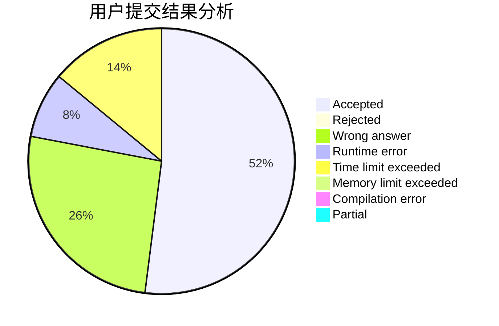
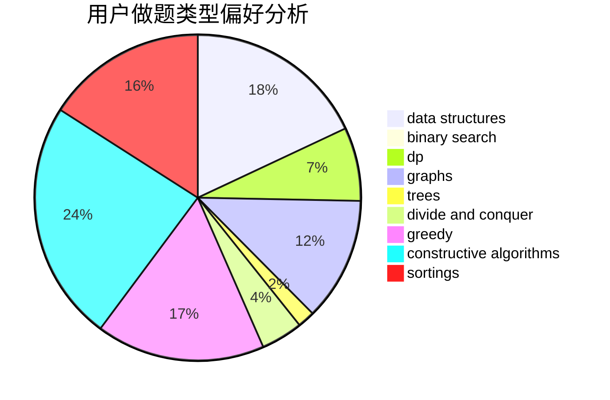

# D_O_Time
<!-- tabs:start -->
#### **用户提交结果分析**

#### **用户做题类型偏好分析**

#### **用户错题知识点分析**

<!-- tabs:end -->
# 推荐题目
[1106C](http://codeforces.com/problemset/problem/1106/C)		greedy,
                        implementation,
                        math,
                        sortings		  
[1510K](http://codeforces.com/problemset/problem/1510/K)		brute force,
                        graphs,
                        implementation		  
[27E](http://codeforces.com/problemset/problem/27/E)		brute force,
                        dp,
                        number theory		  
[1216C](http://codeforces.com/problemset/problem/1216/C)		geometry,
                        math		  
[199E](https://codeforces.com/contest/199/problem/E)		binary search,
                        geometry		  
[484C](http://codeforces.com/problemset/problem/484/C)		implementation,
                        math		  
[762A](http://codeforces.com/problemset/problem/762/A)		math,
                        number theory		  
[280E](http://codeforces.com/problemset/problem/280/E)		data structures,
                        dp,
                        implementation,
                        math		  
[1220B](http://codeforces.com/problemset/problem/1220/B)		math,
                        number theory		  
[764B](http://codeforces.com/problemset/problem/764/B)		constructive algorithms,
                        implementation		  
<!-- tabs:start -->
#### **data structures**
[280E](http://codeforces.com/problemset/problem/280/E)		data structures,
                        dp,
                        implementation,
                        math		  
[1117G](http://codeforces.com/problemset/problem/1117/G)		data structures		  
[1140G](http://codeforces.com/problemset/problem/1140/G)		data structures,
                        divide and conquer,
                        shortest paths,
                        trees		  
[1284B](http://codeforces.com/problemset/problem/1284/B)		binary search,
                        combinatorics,
                        data structures,
                        dp,
                        implementation,
                        sortings		  
[1139F](http://codeforces.com/problemset/problem/1139/F)		data structures,
                        divide and conquer		  
[1332G](http://codeforces.com/problemset/problem/1332/G)		data structures		  
[1209G2](http://codeforces.com/problemset/problem/1209/G2)		data structures		  
[242E](http://codeforces.com/problemset/problem/242/E)		bitmasks,
                        data structures		  
[258E](http://codeforces.com/problemset/problem/258/E)		data structures,
                        dfs and similar,
                        trees		  
[232D](http://codeforces.com/problemset/problem/232/D)		binary search,
                        data structures,
                        string suffix structures		  
#### **binary search**
[199E](https://codeforces.com/contest/199/problem/E)		binary search,
                        geometry		  
[1284B](http://codeforces.com/problemset/problem/1284/B)		binary search,
                        combinatorics,
                        data structures,
                        dp,
                        implementation,
                        sortings		  
[1491F](http://codeforces.com/problemset/problem/1491/F)		binary search,
                        constructive algorithms,
                        interactive		  
[232D](http://codeforces.com/problemset/problem/232/D)		binary search,
                        data structures,
                        string suffix structures		  
[1284D](http://codeforces.com/problemset/problem/1284/D)		binary search,
                        data structures,
                        hashing,
                        sortings		  
[1492C](http://codeforces.com/problemset/problem/1492/C)		binary search,
                        data structures,
                        dp,
                        greedy,
                        two pointers		  
[1463D](http://codeforces.com/problemset/problem/1463/D)		binary search,
                        constructive algorithms,
                        greedy,
                        two pointers		  
[1490G](http://codeforces.com/problemset/problem/1490/G)		binary search,
                        data structures,
                        math		  
[1479D](http://codeforces.com/problemset/problem/1479/D)		binary search,
                        bitmasks,
                        brute force,
                        data structures,
                        probabilities,
                        trees		  
[1436E](http://codeforces.com/problemset/problem/1436/E)		binary search,
                        data structures,
                        two pointers		  
#### **dp**
[27E](http://codeforces.com/problemset/problem/27/E)		brute force,
                        dp,
                        number theory		  
[280E](http://codeforces.com/problemset/problem/280/E)		data structures,
                        dp,
                        implementation,
                        math		  
[1029B](http://codeforces.com/problemset/problem/1029/B)		dp,
                        greedy,
                        math		  
[1288C](http://codeforces.com/problemset/problem/1288/C)		combinatorics,
                        dp		  
[1256E](http://codeforces.com/problemset/problem/1256/E)		dp,
                        greedy,
                        sortings		  
[1284B](http://codeforces.com/problemset/problem/1284/B)		binary search,
                        combinatorics,
                        data structures,
                        dp,
                        implementation,
                        sortings		  
[1500F](http://codeforces.com/problemset/problem/1500/F)		dp		  
[764C](https://codeforces.com/contest/764/problem/C)		dfs and similar,
                        dp,
                        dsu,
                        graphs,
                        implementation,
                        trees		  
[1492C](http://codeforces.com/problemset/problem/1492/C)		binary search,
                        data structures,
                        dp,
                        greedy,
                        two pointers		  
[1457C](https://codeforces.com/contest/1457/problem/C)		brute force,
                        dp,
                        implementation		  
#### **graph**
[1510K](http://codeforces.com/problemset/problem/1510/K)		brute force,
                        graphs,
                        implementation		  
[1147A](http://codeforces.com/problemset/problem/1147/A)		graphs		  
[574B](http://codeforces.com/problemset/problem/574/B)		brute force,
                        dfs and similar,
                        graphs,
                        hashing		  
[1139C](http://codeforces.com/problemset/problem/1139/C)		dfs and similar,
                        dsu,
                        graphs,
                        math,
                        trees		  
[764C](https://codeforces.com/contest/764/problem/C)		dfs and similar,
                        dp,
                        dsu,
                        graphs,
                        implementation,
                        trees		  
[601A](http://codeforces.com/problemset/problem/601/A)		graphs,
                        shortest paths		  
[1487C](http://codeforces.com/problemset/problem/1487/C)		brute force,
                        constructive algorithms,
                        dfs and similar,
                        graphs,
                        greedy,
                        implementation,
                        math		  
[1437C](http://codeforces.com/problemset/problem/1437/C)		dp,
                        flows,
                        graph matchings,
                        greedy,
                        math,
                        sortings		  
[1470D](http://codeforces.com/problemset/problem/1470/D)		constructive algorithms,
                        dfs and similar,
                        graph matchings,
                        graphs,
                        greedy		  
[1476C](http://codeforces.com/problemset/problem/1476/C)		dp,
                        graphs,
                        greedy		  
#### **trees**
[1140G](http://codeforces.com/problemset/problem/1140/G)		data structures,
                        divide and conquer,
                        shortest paths,
                        trees		  
[1139C](http://codeforces.com/problemset/problem/1139/C)		dfs and similar,
                        dsu,
                        graphs,
                        math,
                        trees		  
[764C](https://codeforces.com/contest/764/problem/C)		dfs and similar,
                        dp,
                        dsu,
                        graphs,
                        implementation,
                        trees		  
[258E](http://codeforces.com/problemset/problem/258/E)		data structures,
                        dfs and similar,
                        trees		  
[1479D](http://codeforces.com/problemset/problem/1479/D)		binary search,
                        bitmasks,
                        brute force,
                        data structures,
                        probabilities,
                        trees		  
[1511C](http://codeforces.com/problemset/problem/1511/C)		brute force,
                        data structures,
                        implementation,
                        trees		  
[1499F](http://codeforces.com/problemset/problem/1499/F)		combinatorics,
                        dfs and similar,
                        dp,
                        trees		  
[1491E](http://codeforces.com/problemset/problem/1491/E)		brute force,
                        dfs and similar,
                        divide and conquer,
                        number theory,
                        trees		  
[1466D](http://codeforces.com/problemset/problem/1466/D)		data structures,
                        greedy,
                        sortings,
                        trees		  
[1495D](http://codeforces.com/problemset/problem/1495/D)		combinatorics,
                        dfs and similar,
                        graphs,
                        math,
                        shortest paths,
                        trees		  
#### **divide and conquer**
[1140G](http://codeforces.com/problemset/problem/1140/G)		data structures,
                        divide and conquer,
                        shortest paths,
                        trees		  
[1139F](http://codeforces.com/problemset/problem/1139/F)		data structures,
                        divide and conquer		  
[1461D](http://codeforces.com/problemset/problem/1461/D)		binary search,
                        brute force,
                        data structures,
                        divide and conquer,
                        implementation,
                        sortings		  
[1466G](http://codeforces.com/problemset/problem/1466/G)		combinatorics,
                        divide and conquer,
                        hashing,
                        math,
                        string suffix structures,
                        strings		  
[1490D](http://codeforces.com/problemset/problem/1490/D)		dfs and similar,
                        divide and conquer,
                        implementation		  
[1483C](https://codeforces.com/contest/1483/problem/C)		data structures,
                        divide and conquer,
                        dp		  
[1491E](http://codeforces.com/problemset/problem/1491/E)		brute force,
                        dfs and similar,
                        divide and conquer,
                        number theory,
                        trees		  
[1303G](http://codeforces.com/problemset/problem/1303/G)		data structures,
                        divide and conquer,
                        geometry,
                        trees		  
[1494D](http://codeforces.com/problemset/problem/1494/D)		constructive algorithms,
                        data structures,
                        dfs and similar,
                        divide and conquer,
                        dsu,
                        greedy,
                        sortings,
                        trees		  
[1482E](http://codeforces.com/problemset/problem/1482/E)		data structures,
                        divide and conquer,
                        dp		  
#### **greedy**
[1106C](http://codeforces.com/problemset/problem/1106/C)		greedy,
                        implementation,
                        math,
                        sortings		  
[1029B](http://codeforces.com/problemset/problem/1029/B)		dp,
                        greedy,
                        math		  
[445B](http://codeforces.com/problemset/problem/445/B)		dfs and similar,
                        dsu,
                        greedy		  
[260C](http://codeforces.com/problemset/problem/260/C)		constructive algorithms,
                        greedy,
                        implementation		  
[1256E](http://codeforces.com/problemset/problem/1256/E)		dp,
                        greedy,
                        sortings		  
[369A](http://codeforces.com/problemset/problem/369/A)		greedy,
                        implementation		  
[305C](http://codeforces.com/problemset/problem/305/C)		greedy,
                        implementation		  
[1061B](http://codeforces.com/problemset/problem/1061/B)		greedy,
                        implementation,
                        sortings		  
[1419A](http://codeforces.com/problemset/problem/1419/A)		games,
                        greedy,
                        implementation		  
[1215C](http://codeforces.com/problemset/problem/1215/C)		constructive algorithms,
                        greedy		  
#### **constructive algorithms**
[764B](http://codeforces.com/problemset/problem/764/B)		constructive algorithms,
                        implementation		  
[42D](http://codeforces.com/problemset/problem/42/D)		constructive algorithms,
                        math		  
[260C](http://codeforces.com/problemset/problem/260/C)		constructive algorithms,
                        greedy,
                        implementation		  
[1491F](http://codeforces.com/problemset/problem/1491/F)		binary search,
                        constructive algorithms,
                        interactive		  
[1215C](http://codeforces.com/problemset/problem/1215/C)		constructive algorithms,
                        greedy		  
[1405B](http://codeforces.com/problemset/problem/1405/B)		constructive algorithms,
                        implementation		  
[1493A](http://codeforces.com/problemset/problem/1493/A)		constructive algorithms,
                        greedy		  
[1463D](http://codeforces.com/problemset/problem/1463/D)		binary search,
                        constructive algorithms,
                        greedy,
                        two pointers		  
[1456B](https://codeforces.com/contest/1456/problem/B)		bitmasks,
                        brute force,
                        constructive algorithms		  
[1492D](http://codeforces.com/problemset/problem/1492/D)		bitmasks,
                        constructive algorithms,
                        greedy,
                        math		  
#### **sortings**
[1106C](http://codeforces.com/problemset/problem/1106/C)		greedy,
                        implementation,
                        math,
                        sortings		  
[1256E](http://codeforces.com/problemset/problem/1256/E)		dp,
                        greedy,
                        sortings		  
[34C](http://codeforces.com/problemset/problem/34/C)		expression parsing,
                        implementation,
                        sortings,
                        strings		  
[1284B](http://codeforces.com/problemset/problem/1284/B)		binary search,
                        combinatorics,
                        data structures,
                        dp,
                        implementation,
                        sortings		  
[460E](http://codeforces.com/problemset/problem/460/E)		brute force,
                        geometry,
                        math,
                        sortings		  
[1061B](http://codeforces.com/problemset/problem/1061/B)		greedy,
                        implementation,
                        sortings		  
[1284D](http://codeforces.com/problemset/problem/1284/D)		binary search,
                        data structures,
                        hashing,
                        sortings		  
[1496C](https://codeforces.com/contest/1496/problem/C)		geometry,
                        greedy,
                        math,
                        sortings		  
[1495A](http://codeforces.com/problemset/problem/1495/A)		geometry,
                        greedy,
                        math,
                        sortings		  
[1497A](http://codeforces.com/problemset/problem/1497/A)		brute force,
                        data structures,
                        greedy,
                        sortings		  
<!-- tabs:end -->
