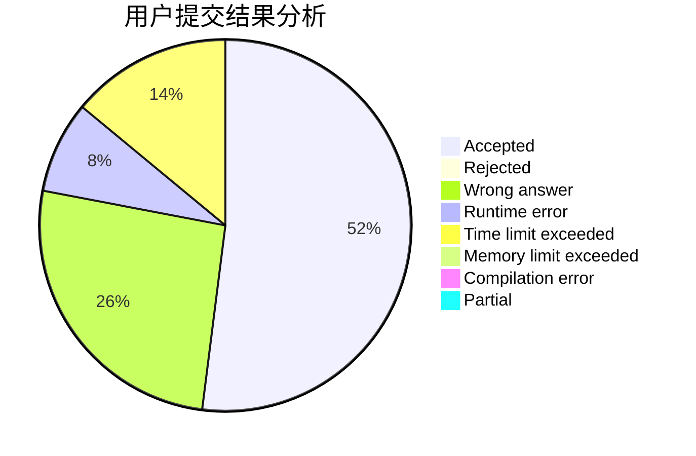
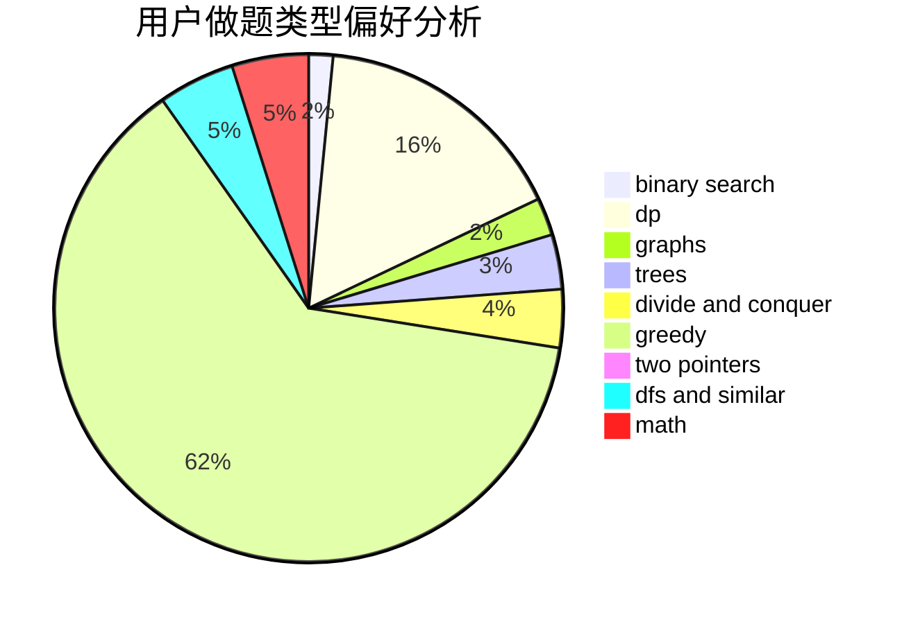

# D_O_Time

<!-- tabs:start -->

#### **用户提交结果分析**

#### **用户做题类型偏好分析**

<!-- tabs:end -->
# 推荐题目
[762A](https://codeforces.com/contest/762/problem/A)
[1119E](https://codeforces.com/contest/1119/problem/E)
[166E](https://codeforces.com/contest/166/problem/E)
[782E](https://codeforces.com/contest/782/problem/E)
[780E](https://codeforces.com/contest/780/problem/E)
[297B](https://codeforces.com/contest/297/problem/B)
[1221G](https://codeforces.com/contest/1221/problem/G)
[220E](https://codeforces.com/contest/220/problem/E)
[279A](https://codeforces.com/contest/279/problem/A)
[459C](https://codeforces.com/contest/459/problem/C)
