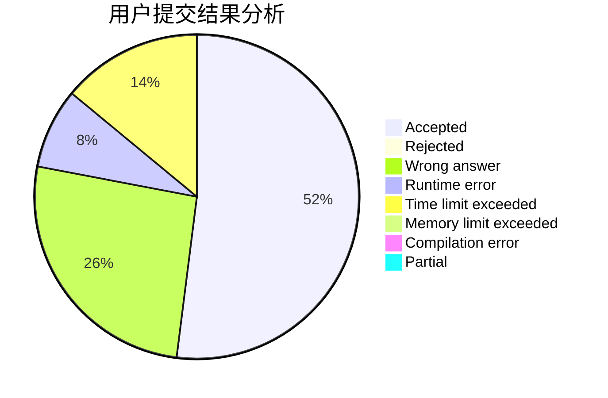
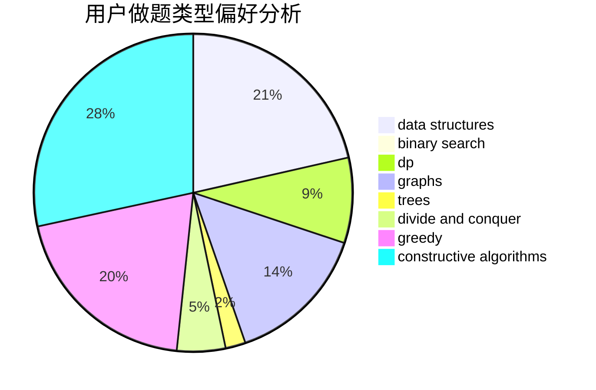

# D_O_Time
<!-- tabs:start -->
#### **用户提交结果分析**

#### **用户做题类型偏好分析**

#### **用户错题知识点分析**

<!-- tabs:end -->
# 推荐题目
[Lunar New Year and Number Division](http://codeforces.com/problemset/problem/1106/C)		greedy,
                        implementation,
                        math,
                        sortings		  
[King's Task](http://codeforces.com/problemset/problem/1510/K)		brute force,
                        graphs,
                        implementation		  
[Number With The Given Amount Of Divisors](http://codeforces.com/problemset/problem/27/E)		brute force,
                        dp,
                        number theory		  
[White Sheet](http://codeforces.com/problemset/problem/1216/C)		geometry,
                        math		  
[Delivering Carcinogen](https://codeforces.com/contest/199/problem/E)		binary search,
                        geometry		  
[Strange Sorting](http://codeforces.com/problemset/problem/484/C)		implementation,
                        math		  
[k-th divisor](http://codeforces.com/problemset/problem/762/A)		math,
                        number theory		  
[Sequence Transformation](http://codeforces.com/problemset/problem/280/E)		data structures,
                        dp,
                        implementation,
                        math		  
[Multiplication Table](http://codeforces.com/problemset/problem/1220/B)		math,
                        number theory		  
[Timofey and cubes](http://codeforces.com/problemset/problem/764/B)		constructive algorithms,
                        implementation		  
<!-- tabs:start -->
#### **data structures**
[Sequence Transformation](http://codeforces.com/problemset/problem/280/E)		data structures,
                        dp,
                        implementation,
                        math		  
[Recursive Queries](http://codeforces.com/problemset/problem/1117/G)		data structures		  
[Double Tree](http://codeforces.com/problemset/problem/1140/G)		data structures,
                        divide and conquer,
                        shortest paths,
                        trees		  
[New Year and Ascent Sequence](http://codeforces.com/problemset/problem/1284/B)		binary search,
                        combinatorics,
                        data structures,
                        dp,
                        implementation,
                        sortings		  
[Dish Shopping](http://codeforces.com/problemset/problem/1139/F)		data structures,
                        divide and conquer		  
[No Monotone Triples](http://codeforces.com/problemset/problem/1332/G)		data structures		  
[Into Blocks (hard version)](http://codeforces.com/problemset/problem/1209/G2)		data structures		  
[XOR on Segment](http://codeforces.com/problemset/problem/242/E)		bitmasks,
                        data structures		  
[Little Elephant and Tree](http://codeforces.com/problemset/problem/258/E)		data structures,
                        dfs and similar,
                        trees		  
[Fence](http://codeforces.com/problemset/problem/232/D)		binary search,
                        data structures,
                        string suffix structures		  
#### **binary search**
[Delivering Carcinogen](https://codeforces.com/contest/199/problem/E)		binary search,
                        geometry		  
[New Year and Ascent Sequence](http://codeforces.com/problemset/problem/1284/B)		binary search,
                        combinatorics,
                        data structures,
                        dp,
                        implementation,
                        sortings		  
[Magnets](http://codeforces.com/problemset/problem/1491/F)		binary search,
                        constructive algorithms,
                        interactive		  
[Fence](http://codeforces.com/problemset/problem/232/D)		binary search,
                        data structures,
                        string suffix structures		  
[New Year and Conference](http://codeforces.com/problemset/problem/1284/D)		binary search,
                        data structures,
                        hashing,
                        sortings		  
[Maximum width](http://codeforces.com/problemset/problem/1492/C)		binary search,
                        data structures,
                        dp,
                        greedy,
                        two pointers		  
[Pairs](http://codeforces.com/problemset/problem/1463/D)		binary search,
                        constructive algorithms,
                        greedy,
                        two pointers		  
[Old Floppy Drive](http://codeforces.com/problemset/problem/1490/G)		binary search,
                        data structures,
                        math		  
[Odd Mineral Resource](http://codeforces.com/problemset/problem/1479/D)		binary search,
                        bitmasks,
                        brute force,
                        data structures,
                        probabilities,
                        trees		  
[Complicated Computations](http://codeforces.com/problemset/problem/1436/E)		binary search,
                        data structures,
                        two pointers		  
#### **dp**
[Number With The Given Amount Of Divisors](http://codeforces.com/problemset/problem/27/E)		brute force,
                        dp,
                        number theory		  
[Sequence Transformation](http://codeforces.com/problemset/problem/280/E)		data structures,
                        dp,
                        implementation,
                        math		  
[Creating the Contest](http://codeforces.com/problemset/problem/1029/B)		dp,
                        greedy,
                        math		  
[Two Arrays](http://codeforces.com/problemset/problem/1288/C)		combinatorics,
                        dp		  
[Yet Another Division Into Teams](http://codeforces.com/problemset/problem/1256/E)		dp,
                        greedy,
                        sortings		  
[New Year and Ascent Sequence](http://codeforces.com/problemset/problem/1284/B)		binary search,
                        combinatorics,
                        data structures,
                        dp,
                        implementation,
                        sortings		  
[Cupboards Jumps](http://codeforces.com/problemset/problem/1500/F)		dp		  
[Timofey and a tree](https://codeforces.com/contest/764/problem/C)		dfs and similar,
                        dp,
                        dsu,
                        graphs,
                        implementation,
                        trees		  
[Maximum width](http://codeforces.com/problemset/problem/1492/C)		binary search,
                        data structures,
                        dp,
                        greedy,
                        two pointers		  
[Bouncing Ball](https://codeforces.com/contest/1457/problem/C)		brute force,
                        dp,
                        implementation		  
#### **graph**
[King's Task](http://codeforces.com/problemset/problem/1510/K)		brute force,
                        graphs,
                        implementation		  
[Hide and Seek](http://codeforces.com/problemset/problem/1147/A)		graphs		  
[Bear and Three Musketeers](http://codeforces.com/problemset/problem/574/B)		brute force,
                        dfs and similar,
                        graphs,
                        hashing		  
[Edgy Trees](http://codeforces.com/problemset/problem/1139/C)		dfs and similar,
                        dsu,
                        graphs,
                        math,
                        trees		  
[Timofey and a tree](https://codeforces.com/contest/764/problem/C)		dfs and similar,
                        dp,
                        dsu,
                        graphs,
                        implementation,
                        trees		  
[The Two Routes](http://codeforces.com/problemset/problem/601/A)		graphs,
                        shortest paths		  
[Minimum Ties](http://codeforces.com/problemset/problem/1487/C)		brute force,
                        constructive algorithms,
                        dfs and similar,
                        graphs,
                        greedy,
                        implementation,
                        math		  
[Chef Monocarp](http://codeforces.com/problemset/problem/1437/C)		dp,
                        flows,
                        graph matchings,
                        greedy,
                        math,
                        sortings		  
[Strange Housing](http://codeforces.com/problemset/problem/1470/D)		constructive algorithms,
                        dfs and similar,
                        graph matchings,
                        graphs,
                        greedy		  
[Longest Simple Cycle](http://codeforces.com/problemset/problem/1476/C)		dp,
                        graphs,
                        greedy		  
#### **trees**
[Double Tree](http://codeforces.com/problemset/problem/1140/G)		data structures,
                        divide and conquer,
                        shortest paths,
                        trees		  
[Edgy Trees](http://codeforces.com/problemset/problem/1139/C)		dfs and similar,
                        dsu,
                        graphs,
                        math,
                        trees		  
[Timofey and a tree](https://codeforces.com/contest/764/problem/C)		dfs and similar,
                        dp,
                        dsu,
                        graphs,
                        implementation,
                        trees		  
[Little Elephant and Tree](http://codeforces.com/problemset/problem/258/E)		data structures,
                        dfs and similar,
                        trees		  
[Odd Mineral Resource](http://codeforces.com/problemset/problem/1479/D)		binary search,
                        bitmasks,
                        brute force,
                        data structures,
                        probabilities,
                        trees		  
[Yet Another Card Deck](http://codeforces.com/problemset/problem/1511/C)		brute force,
                        data structures,
                        implementation,
                        trees		  
[Diameter Cuts](http://codeforces.com/problemset/problem/1499/F)		combinatorics,
                        dfs and similar,
                        dp,
                        trees		  
[Fib-tree](http://codeforces.com/problemset/problem/1491/E)		brute force,
                        dfs and similar,
                        divide and conquer,
                        number theory,
                        trees		  
[13th Labour of Heracles](http://codeforces.com/problemset/problem/1466/D)		data structures,
                        greedy,
                        sortings,
                        trees		  
[BFS Trees](http://codeforces.com/problemset/problem/1495/D)		combinatorics,
                        dfs and similar,
                        graphs,
                        math,
                        shortest paths,
                        trees		  
#### **divide and conquer**
[Double Tree](http://codeforces.com/problemset/problem/1140/G)		data structures,
                        divide and conquer,
                        shortest paths,
                        trees		  
[Dish Shopping](http://codeforces.com/problemset/problem/1139/F)		data structures,
                        divide and conquer		  
[Divide and Summarize](http://codeforces.com/problemset/problem/1461/D)		binary search,
                        brute force,
                        data structures,
                        divide and conquer,
                        implementation,
                        sortings		  
[Song of the Sirens](http://codeforces.com/problemset/problem/1466/G)		combinatorics,
                        divide and conquer,
                        hashing,
                        math,
                        string suffix structures,
                        strings		  
[Permutation Transformation](http://codeforces.com/problemset/problem/1490/D)		dfs and similar,
                        divide and conquer,
                        implementation		  
[Skyline Photo](https://codeforces.com/contest/1483/problem/C)		data structures,
                        divide and conquer,
                        dp		  
[Fib-tree](http://codeforces.com/problemset/problem/1491/E)		brute force,
                        dfs and similar,
                        divide and conquer,
                        number theory,
                        trees		  
[Sum of Prefix Sums](http://codeforces.com/problemset/problem/1303/G)		data structures,
                        divide and conquer,
                        geometry,
                        trees		  
[Dogeforces](http://codeforces.com/problemset/problem/1494/D)		constructive algorithms,
                        data structures,
                        dfs and similar,
                        divide and conquer,
                        dsu,
                        greedy,
                        sortings,
                        trees		  
[Skyline Photo](http://codeforces.com/problemset/problem/1482/E)		data structures,
                        divide and conquer,
                        dp		  
#### **greedy**
[Lunar New Year and Number Division](http://codeforces.com/problemset/problem/1106/C)		greedy,
                        implementation,
                        math,
                        sortings		  
[Creating the Contest](http://codeforces.com/problemset/problem/1029/B)		dp,
                        greedy,
                        math		  
[DZY Loves Chemistry](http://codeforces.com/problemset/problem/445/B)		dfs and similar,
                        dsu,
                        greedy		  
[Balls and Boxes](http://codeforces.com/problemset/problem/260/C)		constructive algorithms,
                        greedy,
                        implementation		  
[Yet Another Division Into Teams](http://codeforces.com/problemset/problem/1256/E)		dp,
                        greedy,
                        sortings		  
[Valera and Plates](http://codeforces.com/problemset/problem/369/A)		greedy,
                        implementation		  
[Ivan and Powers of Two](http://codeforces.com/problemset/problem/305/C)		greedy,
                        implementation		  
[Views Matter](http://codeforces.com/problemset/problem/1061/B)		greedy,
                        implementation,
                        sortings		  
[Digit Game](http://codeforces.com/problemset/problem/1419/A)		games,
                        greedy,
                        implementation		  
[Swap Letters](http://codeforces.com/problemset/problem/1215/C)		constructive algorithms,
                        greedy		  
#### **constructive algorithms**
[Timofey and cubes](http://codeforces.com/problemset/problem/764/B)		constructive algorithms,
                        implementation		  
[Strange town](http://codeforces.com/problemset/problem/42/D)		constructive algorithms,
                        math		  
[Balls and Boxes](http://codeforces.com/problemset/problem/260/C)		constructive algorithms,
                        greedy,
                        implementation		  
[Magnets](http://codeforces.com/problemset/problem/1491/F)		binary search,
                        constructive algorithms,
                        interactive		  
[Swap Letters](http://codeforces.com/problemset/problem/1215/C)		constructive algorithms,
                        greedy		  
[Array Cancellation](http://codeforces.com/problemset/problem/1405/B)		constructive algorithms,
                        implementation		  
[Anti-knapsack](http://codeforces.com/problemset/problem/1493/A)		constructive algorithms,
                        greedy		  
[Pairs](http://codeforces.com/problemset/problem/1463/D)		binary search,
                        constructive algorithms,
                        greedy,
                        two pointers		  
[XOR-gun](https://codeforces.com/contest/1456/problem/B)		bitmasks,
                        brute force,
                        constructive algorithms		  
[Genius's Gambit](http://codeforces.com/problemset/problem/1492/D)		bitmasks,
                        constructive algorithms,
                        greedy,
                        math		  
#### **sortings**
[Lunar New Year and Number Division](http://codeforces.com/problemset/problem/1106/C)		greedy,
                        implementation,
                        math,
                        sortings		  
[Yet Another Division Into Teams](http://codeforces.com/problemset/problem/1256/E)		dp,
                        greedy,
                        sortings		  
[Page Numbers](http://codeforces.com/problemset/problem/34/C)		expression parsing,
                        implementation,
                        sortings,
                        strings		  
[New Year and Ascent Sequence](http://codeforces.com/problemset/problem/1284/B)		binary search,
                        combinatorics,
                        data structures,
                        dp,
                        implementation,
                        sortings		  
[Roland and Rose](http://codeforces.com/problemset/problem/460/E)		brute force,
                        geometry,
                        math,
                        sortings		  
[Views Matter](http://codeforces.com/problemset/problem/1061/B)		greedy,
                        implementation,
                        sortings		  
[New Year and Conference](http://codeforces.com/problemset/problem/1284/D)		binary search,
                        data structures,
                        hashing,
                        sortings		  
[Diamond Miner](https://codeforces.com/contest/1496/problem/C)		geometry,
                        greedy,
                        math,
                        sortings		  
[Diamond Miner](http://codeforces.com/problemset/problem/1495/A)		geometry,
                        greedy,
                        math,
                        sortings		  
[Meximization](http://codeforces.com/problemset/problem/1497/A)		brute force,
                        data structures,
                        greedy,
                        sortings		  
<!-- tabs:end -->
