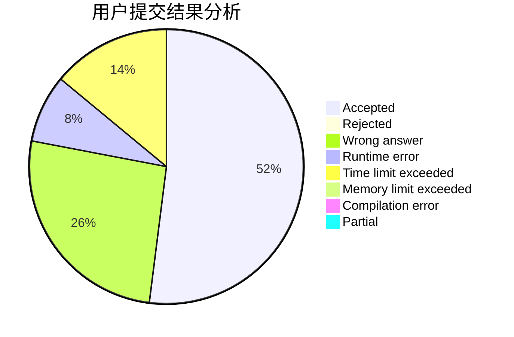
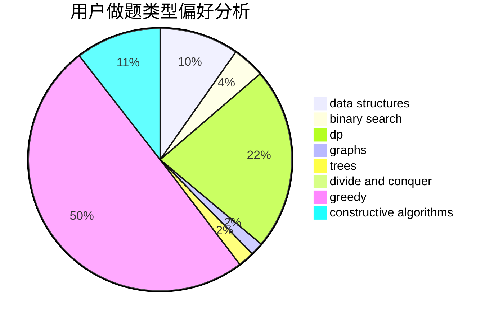

# D_O_Time

<!-- tabs:start -->

#### **用户提交结果分析**

#### **用户做题类型偏好分析**

#### **用户错题知识点分析**

<!-- tabs:end -->
# 推荐题目
[762A](https://codeforces.com/contest/762/problem/A)		math,
                        number theory		  
[1119E](https://codeforces.com/contest/1119/problem/E)		brute force,
                        dp,
                        fft,
                        greedy,
                        ternary search		  
[166E](https://codeforces.com/contest/166/problem/E)		dp,
                        math,
                        matrices		  
[782E](https://codeforces.com/contest/782/problem/E)		dsu,graphs,sortings,trees		  
[780E](https://codeforces.com/contest/780/problem/E)		constructive algorithms,
                        dfs and similar,
                        graphs		  
[297B](https://codeforces.com/contest/297/problem/B)		constructive algorithms,
                        greedy		  
[1221G](https://codeforces.com/contest/1221/problem/G)		bitmasks,
                        brute force,
                        combinatorics,
                        dp,
                        meet-in-the-middle		  
[220E](https://codeforces.com/contest/220/problem/E)		data structures,
                        two pointers		  
[279A](https://codeforces.com/contest/279/problem/A)		brute force,
                        geometry,
                        implementation		  
[459C](https://codeforces.com/contest/459/problem/C)		combinatorics,
                        constructive algorithms,
                        math		  
