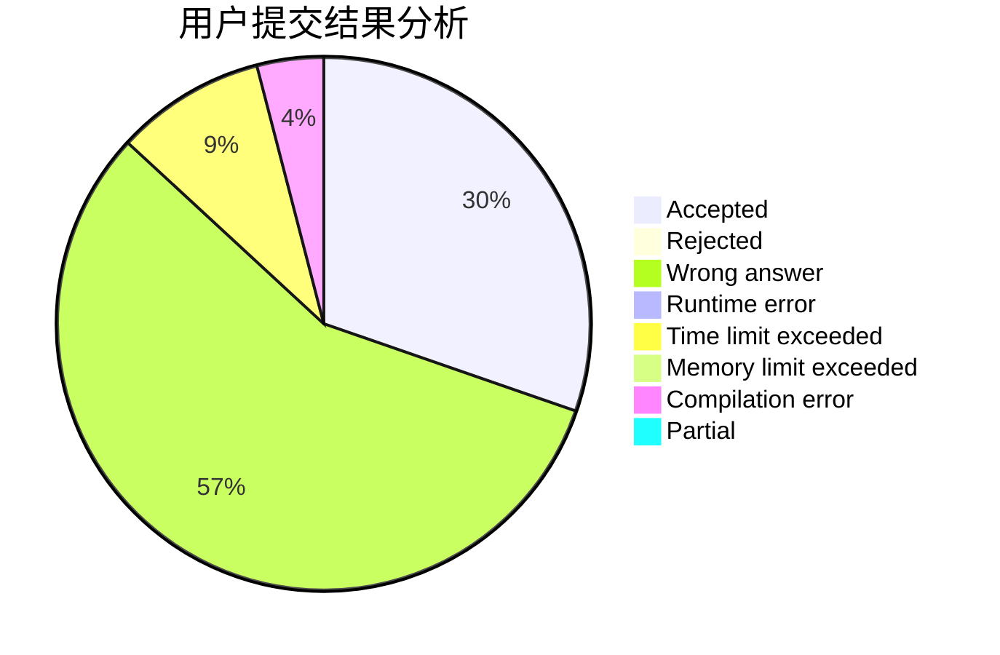
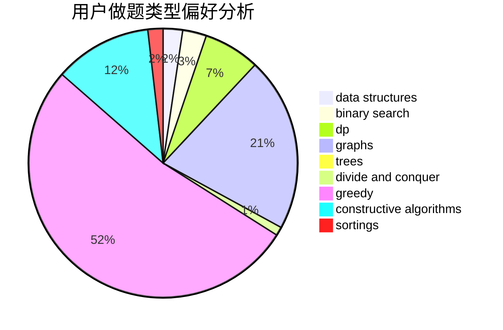
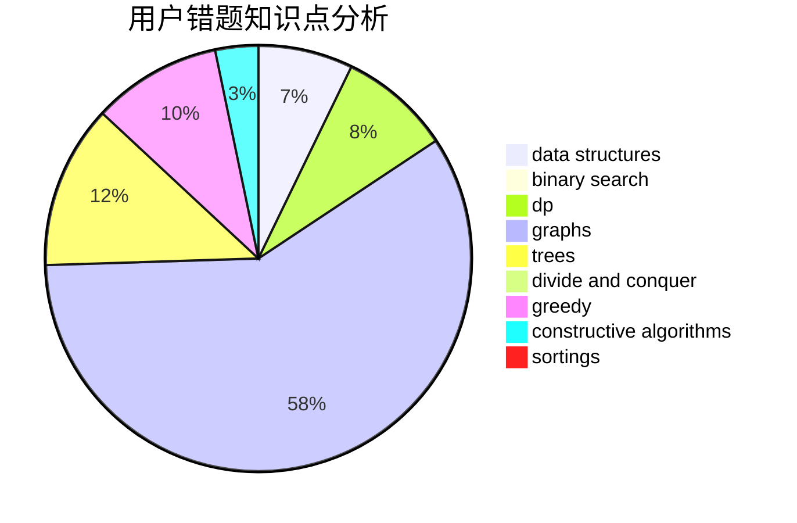

# Daas
<!-- tabs:start -->
#### **用户提交结果分析**

#### **用户做题类型偏好分析**

#### **用户错题知识点分析**

<!-- tabs:end -->
# 推荐题目
[645F](http://codeforces.com/problemset/problem/645/F)		combinatorics,
                        math,
                        number theory		  
[764E](https://codeforces.com/contest/764/problem/E)		brute force,
                        implementation,
                        math,
                        number theory		  
[1270E](http://codeforces.com/problemset/problem/1270/E)		constructive algorithms,
                        geometry,
                        math		  
[299B](http://codeforces.com/problemset/problem/299/B)		brute force,
                        implementation		  
[520C](http://codeforces.com/problemset/problem/520/C)		math,
                        strings		  
[1223A](http://codeforces.com/problemset/problem/1223/A)		math		  
[372A](http://codeforces.com/problemset/problem/372/A)		binary search,
                        greedy,
                        sortings,
                        two pointers		  
[1225A](http://codeforces.com/problemset/problem/1225/A)		math		  
[666A](http://codeforces.com/problemset/problem/666/A)		dp,
                        implementation,
                        strings		  
[744B](http://codeforces.com/problemset/problem/744/B)		bitmasks,
                        divide and conquer,
                        interactive		  
<!-- tabs:start -->
#### **data structures**
[1492C](http://codeforces.com/problemset/problem/1492/C)		binary search,
                        data structures,
                        dp,
                        greedy,
                        two pointers		  
[1490G](http://codeforces.com/problemset/problem/1490/G)		binary search,
                        data structures,
                        math		  
[1479D](http://codeforces.com/problemset/problem/1479/D)		binary search,
                        bitmasks,
                        brute force,
                        data structures,
                        probabilities,
                        trees		  
[1497A](http://codeforces.com/problemset/problem/1497/A)		brute force,
                        data structures,
                        greedy,
                        sortings		  
[1491C](http://codeforces.com/problemset/problem/1491/C)		brute force,
                        data structures,
                        dp,
                        greedy,
                        implementation		  
[1492B](http://codeforces.com/problemset/problem/1492/B)		data structures,
                        greedy,
                        math		  
[1436E](http://codeforces.com/problemset/problem/1436/E)		binary search,
                        data structures,
                        two pointers		  
[1461D](http://codeforces.com/problemset/problem/1461/D)		binary search,
                        brute force,
                        data structures,
                        divide and conquer,
                        implementation,
                        sortings		  
[1511C](http://codeforces.com/problemset/problem/1511/C)		brute force,
                        data structures,
                        implementation,
                        trees		  
[1497E1](http://codeforces.com/problemset/problem/1497/E1)		data structures,
                        dp,
                        greedy,
                        math,
                        number theory,
                        two pointers		  
#### **binary search**
[372A](http://codeforces.com/problemset/problem/372/A)		binary search,
                        greedy,
                        sortings,
                        two pointers		  
[1492C](http://codeforces.com/problemset/problem/1492/C)		binary search,
                        data structures,
                        dp,
                        greedy,
                        two pointers		  
[1463D](http://codeforces.com/problemset/problem/1463/D)		binary search,
                        constructive algorithms,
                        greedy,
                        two pointers		  
[1490G](http://codeforces.com/problemset/problem/1490/G)		binary search,
                        data structures,
                        math		  
[1479D](http://codeforces.com/problemset/problem/1479/D)		binary search,
                        bitmasks,
                        brute force,
                        data structures,
                        probabilities,
                        trees		  
[1436E](http://codeforces.com/problemset/problem/1436/E)		binary search,
                        data structures,
                        two pointers		  
[1461D](http://codeforces.com/problemset/problem/1461/D)		binary search,
                        brute force,
                        data structures,
                        divide and conquer,
                        implementation,
                        sortings		  
[1493C](http://codeforces.com/problemset/problem/1493/C)		binary search,
                        brute force,
                        constructive algorithms,
                        greedy,
                        strings		  
[1487D](http://codeforces.com/problemset/problem/1487/D)		binary search,
                        brute force,
                        math,
                        number theory		  
[1486B](http://codeforces.com/problemset/problem/1486/B)		binary search,
                        geometry,
                        shortest paths,
                        sortings		  
#### **dp**
[666A](http://codeforces.com/problemset/problem/666/A)		dp,
                        implementation,
                        strings		  
[687C](http://codeforces.com/problemset/problem/687/C)		dp		  
[339C](http://codeforces.com/problemset/problem/339/C)		constructive algorithms,
                        dfs and similar,
                        dp,
                        graphs,
                        greedy,
                        shortest paths		  
[1249E](http://codeforces.com/problemset/problem/1249/E)		dp,
                        shortest paths		  
[1225G](http://codeforces.com/problemset/problem/1225/G)		bitmasks,
                        constructive algorithms,
                        dp,
                        greedy,
                        number theory		  
[700B](http://codeforces.com/problemset/problem/700/B)		dfs and similar,
                        dp,
                        graphs,
                        trees		  
[1338D](http://codeforces.com/problemset/problem/1338/D)		constructive algorithms,
                        dfs and similar,
                        dp,
                        math,
                        trees		  
[285E](http://codeforces.com/problemset/problem/285/E)		combinatorics,
                        dp,
                        math		  
[1462B](http://codeforces.com/problemset/problem/1462/B)		dp,
                        implementation,
                        strings		  
[1492C](http://codeforces.com/problemset/problem/1492/C)		binary search,
                        data structures,
                        dp,
                        greedy,
                        two pointers		  
#### **graph**
[339C](http://codeforces.com/problemset/problem/339/C)		constructive algorithms,
                        dfs and similar,
                        dp,
                        graphs,
                        greedy,
                        shortest paths		  
[1495D](http://codeforces.com/problemset/problem/1495/D)		combinatorics,
                        dfs and similar,
                        graphs,
                        math,
                        shortest paths,
                        trees		  
[700B](http://codeforces.com/problemset/problem/700/B)		dfs and similar,
                        dp,
                        graphs,
                        trees		  
[1334D](http://codeforces.com/problemset/problem/1334/D)		constructive algorithms,
                        graphs,
                        greedy,
                        implementation		  
[1487C](http://codeforces.com/problemset/problem/1487/C)		brute force,
                        constructive algorithms,
                        dfs and similar,
                        graphs,
                        greedy,
                        implementation,
                        math		  
[1437C](http://codeforces.com/problemset/problem/1437/C)		dp,
                        flows,
                        graph matchings,
                        greedy,
                        math,
                        sortings		  
[1470D](http://codeforces.com/problemset/problem/1470/D)		constructive algorithms,
                        dfs and similar,
                        graph matchings,
                        graphs,
                        greedy		  
[1476C](http://codeforces.com/problemset/problem/1476/C)		dp,
                        graphs,
                        greedy		  
[1304D](http://codeforces.com/problemset/problem/1304/D)		constructive algorithms,
                        graphs,
                        greedy,
                        two pointers		  
[1475C](http://codeforces.com/problemset/problem/1475/C)		combinatorics,
                        graphs,
                        math		  
#### **trees**
[1495D](http://codeforces.com/problemset/problem/1495/D)		combinatorics,
                        dfs and similar,
                        graphs,
                        math,
                        shortest paths,
                        trees		  
[700B](http://codeforces.com/problemset/problem/700/B)		dfs and similar,
                        dp,
                        graphs,
                        trees		  
[1338D](http://codeforces.com/problemset/problem/1338/D)		constructive algorithms,
                        dfs and similar,
                        dp,
                        math,
                        trees		  
[1479D](http://codeforces.com/problemset/problem/1479/D)		binary search,
                        bitmasks,
                        brute force,
                        data structures,
                        probabilities,
                        trees		  
[1511C](http://codeforces.com/problemset/problem/1511/C)		brute force,
                        data structures,
                        implementation,
                        trees		  
[1499F](http://codeforces.com/problemset/problem/1499/F)		combinatorics,
                        dfs and similar,
                        dp,
                        trees		  
[1491E](http://codeforces.com/problemset/problem/1491/E)		brute force,
                        dfs and similar,
                        divide and conquer,
                        number theory,
                        trees		  
[1466D](http://codeforces.com/problemset/problem/1466/D)		data structures,
                        greedy,
                        sortings,
                        trees		  
[1495D](http://codeforces.com/problemset/problem/1495/D)		combinatorics,
                        dfs and similar,
                        graphs,
                        math,
                        shortest paths,
                        trees		  
[1303G](http://codeforces.com/problemset/problem/1303/G)		data structures,
                        divide and conquer,
                        geometry,
                        trees		  
#### **divide and conquer**
[744B](http://codeforces.com/problemset/problem/744/B)		bitmasks,
                        divide and conquer,
                        interactive		  
[1461D](http://codeforces.com/problemset/problem/1461/D)		binary search,
                        brute force,
                        data structures,
                        divide and conquer,
                        implementation,
                        sortings		  
[1466G](http://codeforces.com/problemset/problem/1466/G)		combinatorics,
                        divide and conquer,
                        hashing,
                        math,
                        string suffix structures,
                        strings		  
[1490D](http://codeforces.com/problemset/problem/1490/D)		dfs and similar,
                        divide and conquer,
                        implementation		  
[1483C](https://codeforces.com/contest/1483/problem/C)		data structures,
                        divide and conquer,
                        dp		  
[1491E](http://codeforces.com/problemset/problem/1491/E)		brute force,
                        dfs and similar,
                        divide and conquer,
                        number theory,
                        trees		  
[1303G](http://codeforces.com/problemset/problem/1303/G)		data structures,
                        divide and conquer,
                        geometry,
                        trees		  
[1494D](http://codeforces.com/problemset/problem/1494/D)		constructive algorithms,
                        data structures,
                        dfs and similar,
                        divide and conquer,
                        dsu,
                        greedy,
                        sortings,
                        trees		  
[1482E](http://codeforces.com/problemset/problem/1482/E)		data structures,
                        divide and conquer,
                        dp		  
[566C](http://codeforces.com/problemset/problem/566/C)		dfs and similar,
                        divide and conquer,
                        trees		  
#### **greedy**
[372A](http://codeforces.com/problemset/problem/372/A)		binary search,
                        greedy,
                        sortings,
                        two pointers		  
[479B](http://codeforces.com/problemset/problem/479/B)		brute force,
                        constructive algorithms,
                        greedy,
                        implementation,
                        sortings		  
[339C](http://codeforces.com/problemset/problem/339/C)		constructive algorithms,
                        dfs and similar,
                        dp,
                        graphs,
                        greedy,
                        shortest paths		  
[1371C](http://codeforces.com/problemset/problem/1371/C)		greedy,
                        implementation,
                        math		  
[351E](http://codeforces.com/problemset/problem/351/E)		greedy		  
[1225G](http://codeforces.com/problemset/problem/1225/G)		bitmasks,
                        constructive algorithms,
                        dp,
                        greedy,
                        number theory		  
[1215C](http://codeforces.com/problemset/problem/1215/C)		constructive algorithms,
                        greedy		  
[765B](http://codeforces.com/problemset/problem/765/B)		greedy,
                        implementation,
                        strings		  
[1334D](http://codeforces.com/problemset/problem/1334/D)		constructive algorithms,
                        graphs,
                        greedy,
                        implementation		  
[482A](http://codeforces.com/problemset/problem/482/A)		constructive algorithms,
                        greedy		  
#### **constructive algorithms**
[1270E](http://codeforces.com/problemset/problem/1270/E)		constructive algorithms,
                        geometry,
                        math		  
[479B](http://codeforces.com/problemset/problem/479/B)		brute force,
                        constructive algorithms,
                        greedy,
                        implementation,
                        sortings		  
[339C](http://codeforces.com/problemset/problem/339/C)		constructive algorithms,
                        dfs and similar,
                        dp,
                        graphs,
                        greedy,
                        shortest paths		  
[1450A](http://codeforces.com/problemset/problem/1450/A)		constructive algorithms,
                        sortings		  
[1225G](http://codeforces.com/problemset/problem/1225/G)		bitmasks,
                        constructive algorithms,
                        dp,
                        greedy,
                        number theory		  
[1215C](http://codeforces.com/problemset/problem/1215/C)		constructive algorithms,
                        greedy		  
[1255C](http://codeforces.com/problemset/problem/1255/C)		constructive algorithms,
                        implementation		  
[544B](http://codeforces.com/problemset/problem/544/B)		constructive algorithms,
                        implementation		  
[764D](https://codeforces.com/contest/764/problem/D)		constructive algorithms,
                        geometry		  
[1338D](http://codeforces.com/problemset/problem/1338/D)		constructive algorithms,
                        dfs and similar,
                        dp,
                        math,
                        trees		  
#### **sortings**
[372A](http://codeforces.com/problemset/problem/372/A)		binary search,
                        greedy,
                        sortings,
                        two pointers		  
[479B](http://codeforces.com/problemset/problem/479/B)		brute force,
                        constructive algorithms,
                        greedy,
                        implementation,
                        sortings		  
[141A](http://codeforces.com/problemset/problem/141/A)		implementation,
                        sortings,
                        strings		  
[1450A](http://codeforces.com/problemset/problem/1450/A)		constructive algorithms,
                        sortings		  
[1496C](https://codeforces.com/contest/1496/problem/C)		geometry,
                        greedy,
                        math,
                        sortings		  
[1495A](http://codeforces.com/problemset/problem/1495/A)		geometry,
                        greedy,
                        math,
                        sortings		  
[1497A](http://codeforces.com/problemset/problem/1497/A)		brute force,
                        data structures,
                        greedy,
                        sortings		  
[1427A](http://codeforces.com/problemset/problem/1427/A)		math,
                        sortings		  
[1461D](http://codeforces.com/problemset/problem/1461/D)		binary search,
                        brute force,
                        data structures,
                        divide and conquer,
                        implementation,
                        sortings		  
[1437C](http://codeforces.com/problemset/problem/1437/C)		dp,
                        flows,
                        graph matchings,
                        greedy,
                        math,
                        sortings		  
<!-- tabs:end -->
