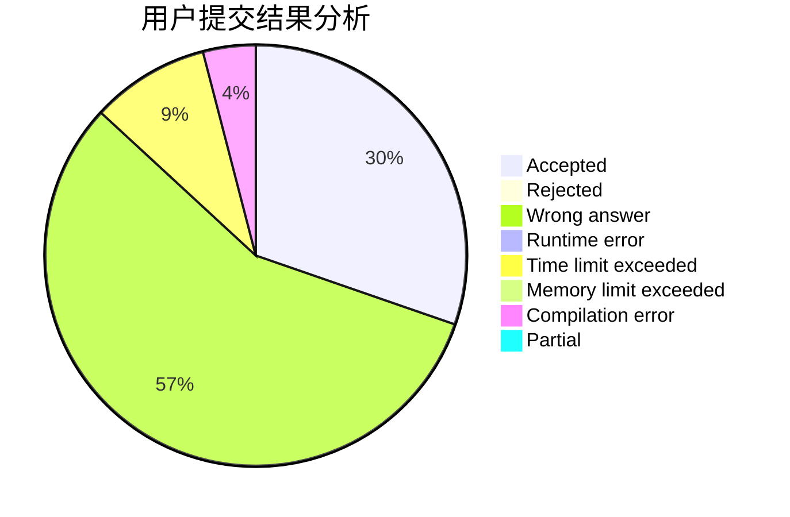
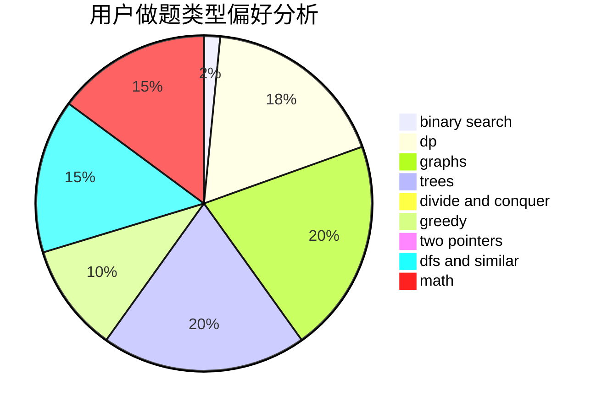

# Daas

<!-- tabs:start -->

#### **用户提交结果分析**

#### **用户做题类型偏好分析**

<!-- tabs:end -->
# 推荐题目
[1279E](https://codeforces.com/contest/1279/problem/E)
[12371](https://codeforces.com/contest/1237/problem/1)
[784C](https://codeforces.com/contest/784/problem/C)
[672B](https://codeforces.com/contest/672/problem/B)
[1463E](https://codeforces.com/contest/1463/problem/E)
[660D](https://codeforces.com/contest/660/problem/D)
[49A](https://codeforces.com/contest/49/problem/A)
[784F](https://codeforces.com/contest/784/problem/F)
[764C](https://codeforces.com/contest/764/problem/C)
[1278A](https://codeforces.com/contest/1278/problem/A)
