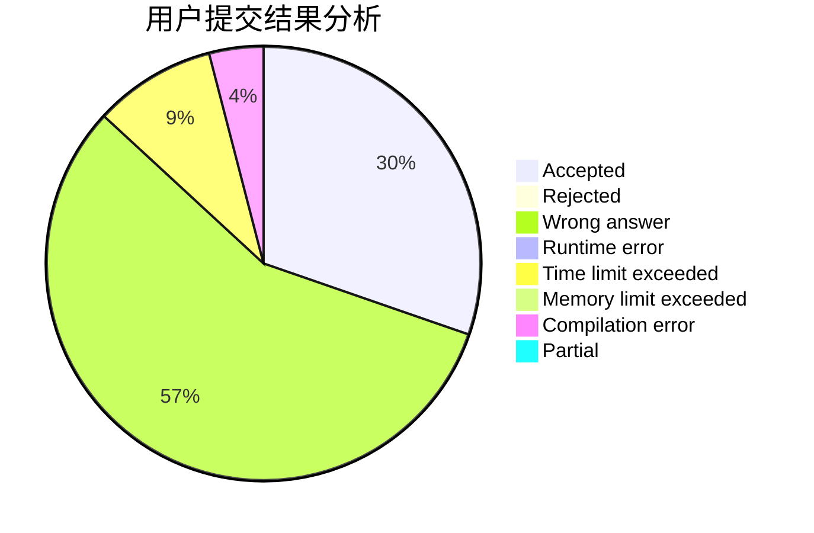
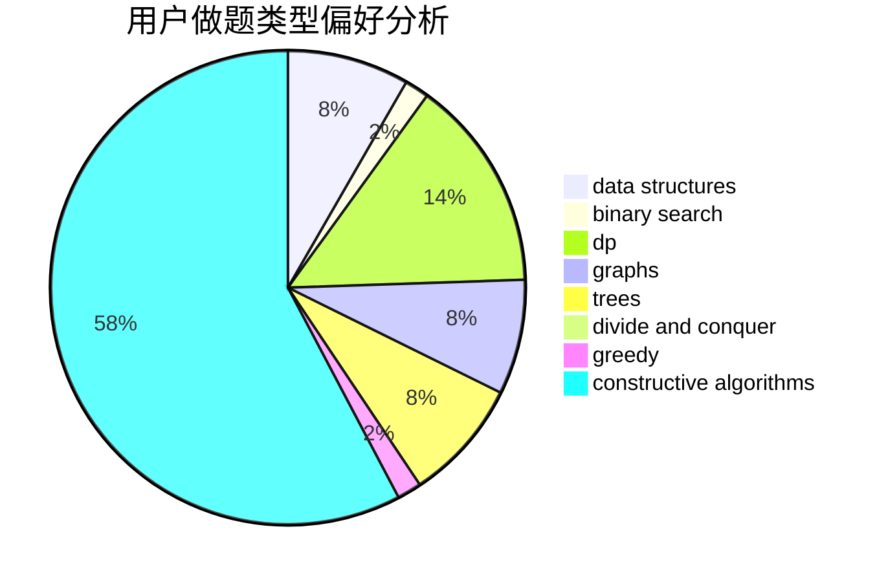
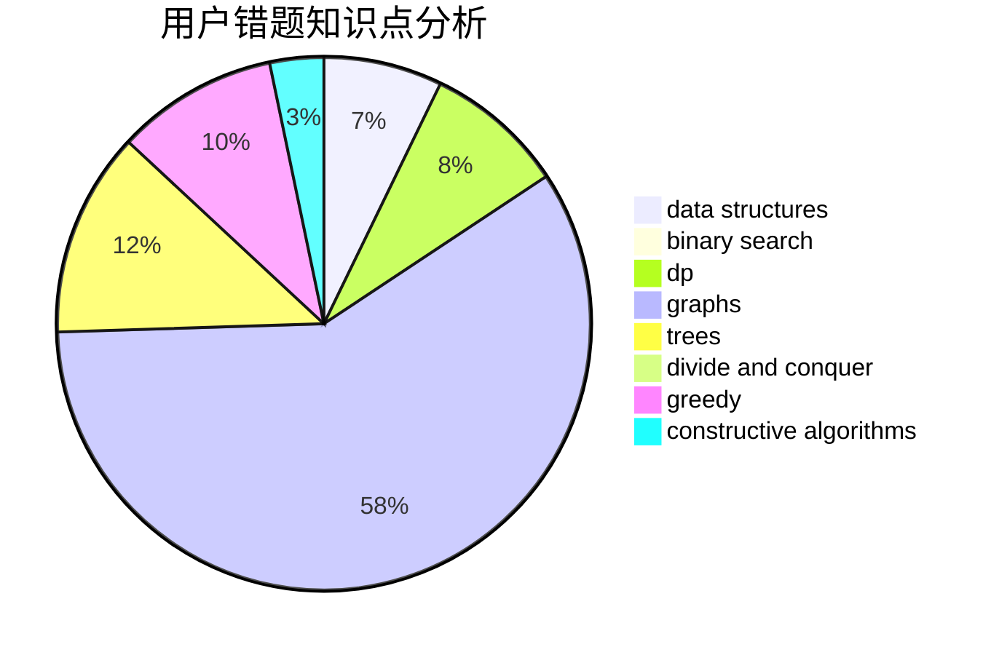

# Daas

<!-- tabs:start -->

#### **用户提交结果分析**

#### **用户做题类型偏好分析**

#### **用户错题知识点分析**

<!-- tabs:end -->
# 推荐题目
[1279E](https://codeforces.com/contest/1279/problem/E)		combinatorics,
                        dp		  
[12371](https://codeforces.com/contest/1237/problem/1)		dsu,graphs,sortings,trees		  
[784C](https://codeforces.com/contest/784/problem/C)		*special problem,
                        implementation		  
[672B](https://codeforces.com/contest/672/problem/B)		constructive algorithms,
                        implementation,
                        strings		  
[1463E](https://codeforces.com/contest/1463/problem/E)		constructive algorithms,
                        dfs and similar,
                        dsu,
                        graphs,
                        implementation,
                        sortings,
                        trees		  
[660D](https://codeforces.com/contest/660/problem/D)		geometry		  
[49A](https://codeforces.com/contest/49/problem/A)		implementation		  
[784F](https://codeforces.com/contest/784/problem/F)		*special problem,
                        implementation		  
[764C](https://codeforces.com/contest/764/problem/C)		dsu,graphs,sortings,trees		  
[1278A](https://codeforces.com/contest/1278/problem/A)		brute force,
                        implementation,
                        strings		  
