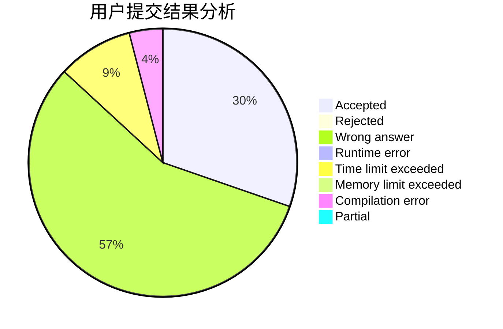
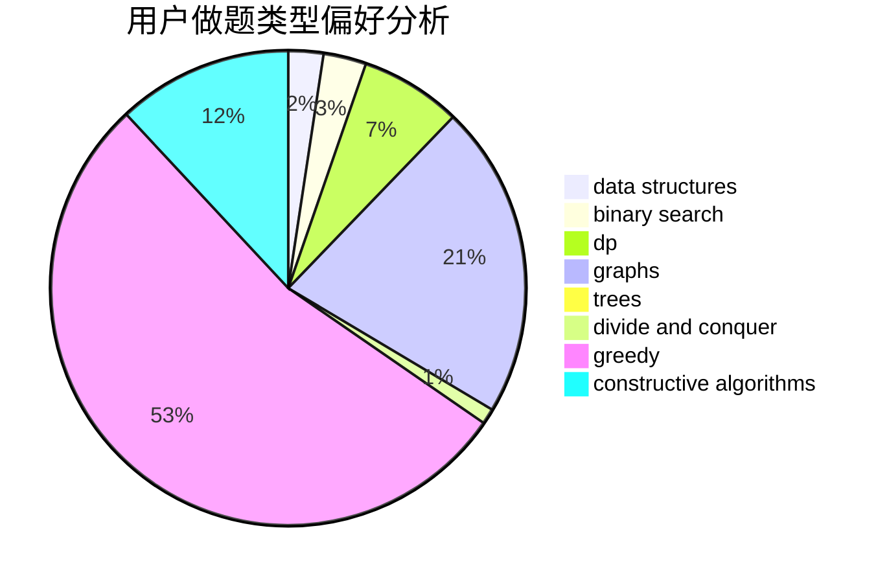
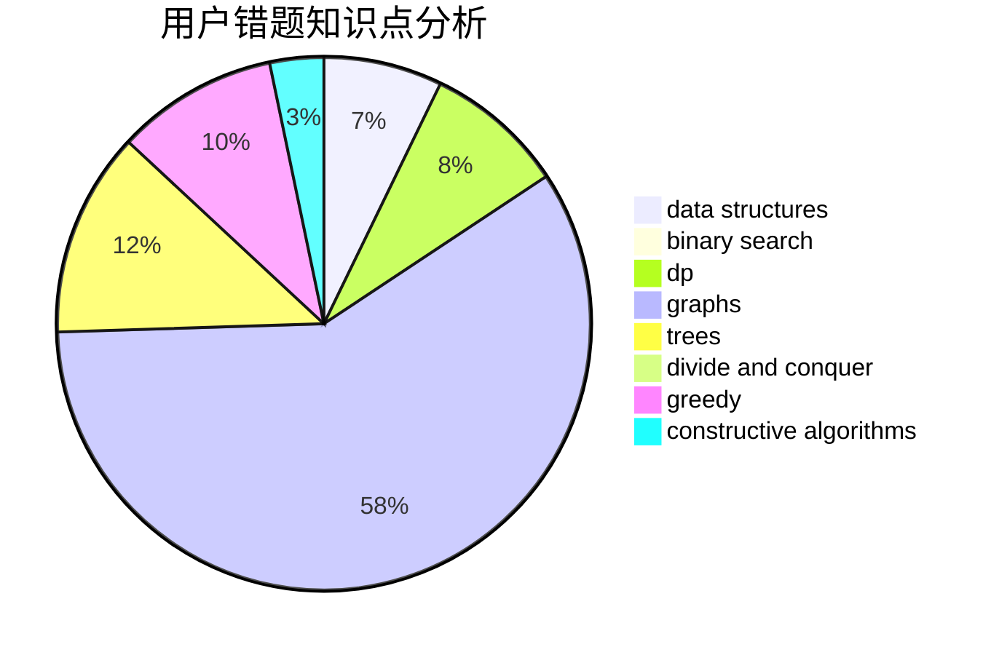

# Daas

<!-- tabs:start -->

#### **用户提交结果分析**

#### **用户做题类型偏好分析**

#### **用户错题知识点分析**

<!-- tabs:end -->
# 推荐题目
[1270E](https://codeforces.com/contest/1270/problem/E)		constructive algorithms,
                        geometry,
                        math		  
[1228A](https://codeforces.com/contest/1228/problem/A)		brute force,
                        implementation		  
[764E](https://codeforces.com/contest/764/problem/E)		dsu,graphs,sortings,trees		  
[645F](https://codeforces.com/contest/645/problem/F)		combinatorics,
                        math,
                        number theory		  
[1454B](https://codeforces.com/contest/1454/problem/B)		implementation		  
[630I](https://codeforces.com/contest/630/problem/I)		combinatorics,
                        math		  
[479B](https://codeforces.com/contest/479/problem/B)		brute force,
                        constructive algorithms,
                        greedy,
                        implementation,
                        sortings		  
[765C](https://codeforces.com/contest/765/problem/C)		math		  
[744B](https://codeforces.com/contest/744/problem/B)		bitmasks,
                        divide and conquer,
                        interactive		  
[1269A](https://codeforces.com/contest/1269/problem/A)		brute force,
                        math		  
