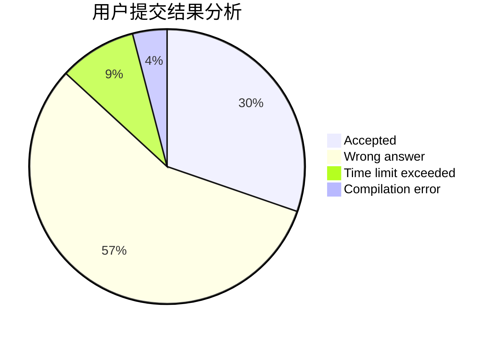
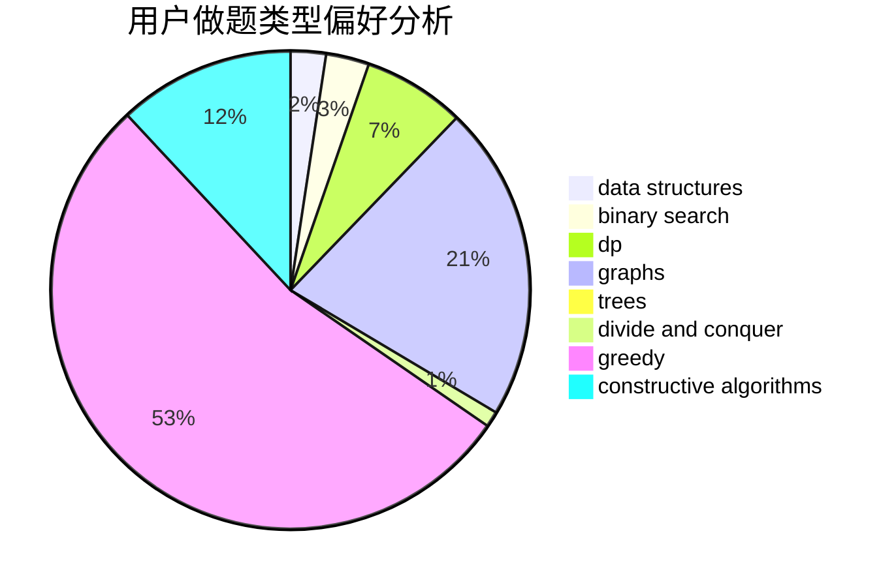
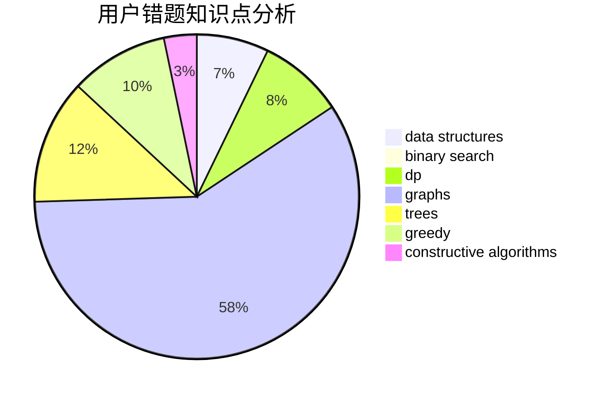

# Daas
<!-- tabs:start -->
#### **用户提交结果分析**

#### **用户做题类型偏好分析**

#### **用户错题知识点分析**

<!-- tabs:end -->
# 推荐题目
[Cowslip Collections](http://codeforces.com/problemset/problem/645/F)		combinatorics,
                        math,
                        number theory		  
[Timofey and remoduling](https://codeforces.com/contest/764/problem/E)		brute force,
                        implementation,
                        math,
                        number theory		  
[Divide Points](http://codeforces.com/problemset/problem/1270/E)		constructive algorithms,
                        geometry,
                        math		  
[Ksusha the Squirrel](http://codeforces.com/problemset/problem/299/B)		brute force,
                        implementation		  
[DNA Alignment](http://codeforces.com/problemset/problem/520/C)		math,
                        strings		  
[CME](http://codeforces.com/problemset/problem/1223/A)		math		  
[Counting Kangaroos is Fun](http://codeforces.com/problemset/problem/372/A)		binary search,
                        greedy,
                        sortings,
                        two pointers		  
[Forgetting Things](http://codeforces.com/problemset/problem/1225/A)		math		  
[Reberland Linguistics](http://codeforces.com/problemset/problem/666/A)		dp,
                        implementation,
                        strings		  
[Hongcow's Game](http://codeforces.com/problemset/problem/744/B)		bitmasks,
                        divide and conquer,
                        interactive		  
<!-- tabs:start -->
#### **data structures**
[Maximum width](http://codeforces.com/problemset/problem/1492/C)		binary search,
                        data structures,
                        dp,
                        greedy,
                        two pointers		  
[Old Floppy Drive](http://codeforces.com/problemset/problem/1490/G)		binary search,
                        data structures,
                        math		  
[Odd Mineral Resource](http://codeforces.com/problemset/problem/1479/D)		binary search,
                        bitmasks,
                        brute force,
                        data structures,
                        probabilities,
                        trees		  
[Meximization](http://codeforces.com/problemset/problem/1497/A)		brute force,
                        data structures,
                        greedy,
                        sortings		  
[Pekora and Trampoline](http://codeforces.com/problemset/problem/1491/C)		brute force,
                        data structures,
                        dp,
                        greedy,
                        implementation		  
[Card Deck](http://codeforces.com/problemset/problem/1492/B)		data structures,
                        greedy,
                        math		  
[Complicated Computations](http://codeforces.com/problemset/problem/1436/E)		binary search,
                        data structures,
                        two pointers		  
[Divide and Summarize](http://codeforces.com/problemset/problem/1461/D)		binary search,
                        brute force,
                        data structures,
                        divide and conquer,
                        implementation,
                        sortings		  
[Yet Another Card Deck](http://codeforces.com/problemset/problem/1511/C)		brute force,
                        data structures,
                        implementation,
                        trees		  
[Square-free division (easy version)](http://codeforces.com/problemset/problem/1497/E1)		data structures,
                        dp,
                        greedy,
                        math,
                        number theory,
                        two pointers		  
#### **binary search**
[Counting Kangaroos is Fun](http://codeforces.com/problemset/problem/372/A)		binary search,
                        greedy,
                        sortings,
                        two pointers		  
[Maximum width](http://codeforces.com/problemset/problem/1492/C)		binary search,
                        data structures,
                        dp,
                        greedy,
                        two pointers		  
[Pairs](http://codeforces.com/problemset/problem/1463/D)		binary search,
                        constructive algorithms,
                        greedy,
                        two pointers		  
[Old Floppy Drive](http://codeforces.com/problemset/problem/1490/G)		binary search,
                        data structures,
                        math		  
[Odd Mineral Resource](http://codeforces.com/problemset/problem/1479/D)		binary search,
                        bitmasks,
                        brute force,
                        data structures,
                        probabilities,
                        trees		  
[Complicated Computations](http://codeforces.com/problemset/problem/1436/E)		binary search,
                        data structures,
                        two pointers		  
[Divide and Summarize](http://codeforces.com/problemset/problem/1461/D)		binary search,
                        brute force,
                        data structures,
                        divide and conquer,
                        implementation,
                        sortings		  
[K-beautiful Strings](http://codeforces.com/problemset/problem/1493/C)		binary search,
                        brute force,
                        constructive algorithms,
                        greedy,
                        strings		  
[Pythagorean Triples](http://codeforces.com/problemset/problem/1487/D)		binary search,
                        brute force,
                        math,
                        number theory		  
[Eastern Exhibition](http://codeforces.com/problemset/problem/1486/B)		binary search,
                        geometry,
                        shortest paths,
                        sortings		  
#### **dp**
[Reberland Linguistics](http://codeforces.com/problemset/problem/666/A)		dp,
                        implementation,
                        strings		  
[The Values You Can Make](http://codeforces.com/problemset/problem/687/C)		dp		  
[Xenia and Weights](http://codeforces.com/problemset/problem/339/C)		constructive algorithms,
                        dfs and similar,
                        dp,
                        graphs,
                        greedy,
                        shortest paths		  
[By Elevator or Stairs?](http://codeforces.com/problemset/problem/1249/E)		dp,
                        shortest paths		  
[To Make 1](http://codeforces.com/problemset/problem/1225/G)		bitmasks,
                        constructive algorithms,
                        dp,
                        greedy,
                        number theory		  
[Connecting Universities](http://codeforces.com/problemset/problem/700/B)		dfs and similar,
                        dp,
                        graphs,
                        trees		  
[Nested Rubber Bands](http://codeforces.com/problemset/problem/1338/D)		constructive algorithms,
                        dfs and similar,
                        dp,
                        math,
                        trees		  
[Positions in Permutations](http://codeforces.com/problemset/problem/285/E)		combinatorics,
                        dp,
                        math		  
[Last Year's Substring](http://codeforces.com/problemset/problem/1462/B)		dp,
                        implementation,
                        strings		  
[Maximum width](http://codeforces.com/problemset/problem/1492/C)		binary search,
                        data structures,
                        dp,
                        greedy,
                        two pointers		  
#### **graph**
[Xenia and Weights](http://codeforces.com/problemset/problem/339/C)		constructive algorithms,
                        dfs and similar,
                        dp,
                        graphs,
                        greedy,
                        shortest paths		  
[BFS Trees](http://codeforces.com/problemset/problem/1495/D)		combinatorics,
                        dfs and similar,
                        graphs,
                        math,
                        shortest paths,
                        trees		  
[Connecting Universities](http://codeforces.com/problemset/problem/700/B)		dfs and similar,
                        dp,
                        graphs,
                        trees		  
[Minimum Euler Cycle](http://codeforces.com/problemset/problem/1334/D)		constructive algorithms,
                        graphs,
                        greedy,
                        implementation		  
[Minimum Ties](http://codeforces.com/problemset/problem/1487/C)		brute force,
                        constructive algorithms,
                        dfs and similar,
                        graphs,
                        greedy,
                        implementation,
                        math		  
[Chef Monocarp](http://codeforces.com/problemset/problem/1437/C)		dp,
                        flows,
                        graph matchings,
                        greedy,
                        math,
                        sortings		  
[Strange Housing](http://codeforces.com/problemset/problem/1470/D)		constructive algorithms,
                        dfs and similar,
                        graph matchings,
                        graphs,
                        greedy		  
[Longest Simple Cycle](http://codeforces.com/problemset/problem/1476/C)		dp,
                        graphs,
                        greedy		  
[Shortest and Longest LIS](http://codeforces.com/problemset/problem/1304/D)		constructive algorithms,
                        graphs,
                        greedy,
                        two pointers		  
[Ball in Berland](http://codeforces.com/problemset/problem/1475/C)		combinatorics,
                        graphs,
                        math		  
#### **trees**
[BFS Trees](http://codeforces.com/problemset/problem/1495/D)		combinatorics,
                        dfs and similar,
                        graphs,
                        math,
                        shortest paths,
                        trees		  
[Connecting Universities](http://codeforces.com/problemset/problem/700/B)		dfs and similar,
                        dp,
                        graphs,
                        trees		  
[Nested Rubber Bands](http://codeforces.com/problemset/problem/1338/D)		constructive algorithms,
                        dfs and similar,
                        dp,
                        math,
                        trees		  
[Odd Mineral Resource](http://codeforces.com/problemset/problem/1479/D)		binary search,
                        bitmasks,
                        brute force,
                        data structures,
                        probabilities,
                        trees		  
[Yet Another Card Deck](http://codeforces.com/problemset/problem/1511/C)		brute force,
                        data structures,
                        implementation,
                        trees		  
[Diameter Cuts](http://codeforces.com/problemset/problem/1499/F)		combinatorics,
                        dfs and similar,
                        dp,
                        trees		  
[Fib-tree](http://codeforces.com/problemset/problem/1491/E)		brute force,
                        dfs and similar,
                        divide and conquer,
                        number theory,
                        trees		  
[13th Labour of Heracles](http://codeforces.com/problemset/problem/1466/D)		data structures,
                        greedy,
                        sortings,
                        trees		  
[Sum of Prefix Sums](http://codeforces.com/problemset/problem/1303/G)		data structures,
                        divide and conquer,
                        geometry,
                        trees		  
[Number of Simple Paths](http://codeforces.com/problemset/problem/1454/E)		combinatorics,
                        dfs and similar,
                        graphs,
                        trees		  
#### **divide and conquer**
[Hongcow's Game](http://codeforces.com/problemset/problem/744/B)		bitmasks,
                        divide and conquer,
                        interactive		  
[Divide and Summarize](http://codeforces.com/problemset/problem/1461/D)		binary search,
                        brute force,
                        data structures,
                        divide and conquer,
                        implementation,
                        sortings		  
[Song of the Sirens](http://codeforces.com/problemset/problem/1466/G)		combinatorics,
                        divide and conquer,
                        hashing,
                        math,
                        string suffix structures,
                        strings		  
[Permutation Transformation](http://codeforces.com/problemset/problem/1490/D)		dfs and similar,
                        divide and conquer,
                        implementation		  
[Skyline Photo](https://codeforces.com/contest/1483/problem/C)		data structures,
                        divide and conquer,
                        dp		  
[Fib-tree](http://codeforces.com/problemset/problem/1491/E)		brute force,
                        dfs and similar,
                        divide and conquer,
                        number theory,
                        trees		  
[Sum of Prefix Sums](http://codeforces.com/problemset/problem/1303/G)		data structures,
                        divide and conquer,
                        geometry,
                        trees		  
[Dogeforces](http://codeforces.com/problemset/problem/1494/D)		constructive algorithms,
                        data structures,
                        dfs and similar,
                        divide and conquer,
                        dsu,
                        greedy,
                        sortings,
                        trees		  
[Logistical Questions](http://codeforces.com/problemset/problem/566/C)		dfs and similar,
                        divide and conquer,
                        trees		  
[Fruit Sequences](http://codeforces.com/problemset/problem/1428/F)		binary search,
                        data structures,
                        divide and conquer,
                        dp,
                        two pointers		  
#### **greedy**
[Counting Kangaroos is Fun](http://codeforces.com/problemset/problem/372/A)		binary search,
                        greedy,
                        sortings,
                        two pointers		  
[Towers](http://codeforces.com/problemset/problem/479/B)		brute force,
                        constructive algorithms,
                        greedy,
                        implementation,
                        sortings		  
[Xenia and Weights](http://codeforces.com/problemset/problem/339/C)		constructive algorithms,
                        dfs and similar,
                        dp,
                        graphs,
                        greedy,
                        shortest paths		  
[A Cookie for You](http://codeforces.com/problemset/problem/1371/C)		greedy,
                        implementation,
                        math		  
[Jeff and Permutation](http://codeforces.com/problemset/problem/351/E)		greedy		  
[To Make 1](http://codeforces.com/problemset/problem/1225/G)		bitmasks,
                        constructive algorithms,
                        dp,
                        greedy,
                        number theory		  
[Swap Letters](http://codeforces.com/problemset/problem/1215/C)		constructive algorithms,
                        greedy		  
[Code obfuscation](http://codeforces.com/problemset/problem/765/B)		greedy,
                        implementation,
                        strings		  
[Minimum Euler Cycle](http://codeforces.com/problemset/problem/1334/D)		constructive algorithms,
                        graphs,
                        greedy,
                        implementation		  
[Diverse Permutation](http://codeforces.com/problemset/problem/482/A)		constructive algorithms,
                        greedy		  
#### **constructive algorithms**
[Divide Points](http://codeforces.com/problemset/problem/1270/E)		constructive algorithms,
                        geometry,
                        math		  
[Towers](http://codeforces.com/problemset/problem/479/B)		brute force,
                        constructive algorithms,
                        greedy,
                        implementation,
                        sortings		  
[Xenia and Weights](http://codeforces.com/problemset/problem/339/C)		constructive algorithms,
                        dfs and similar,
                        dp,
                        graphs,
                        greedy,
                        shortest paths		  
[Avoid Trygub](http://codeforces.com/problemset/problem/1450/A)		constructive algorithms,
                        sortings		  
[To Make 1](http://codeforces.com/problemset/problem/1225/G)		bitmasks,
                        constructive algorithms,
                        dp,
                        greedy,
                        number theory		  
[Swap Letters](http://codeforces.com/problemset/problem/1215/C)		constructive algorithms,
                        greedy		  
[League of Leesins](http://codeforces.com/problemset/problem/1255/C)		constructive algorithms,
                        implementation		  
[Sea and Islands](http://codeforces.com/problemset/problem/544/B)		constructive algorithms,
                        implementation		  
[Timofey and rectangles](https://codeforces.com/contest/764/problem/D)		constructive algorithms,
                        geometry		  
[Nested Rubber Bands](http://codeforces.com/problemset/problem/1338/D)		constructive algorithms,
                        dfs and similar,
                        dp,
                        math,
                        trees		  
#### **sortings**
[Counting Kangaroos is Fun](http://codeforces.com/problemset/problem/372/A)		binary search,
                        greedy,
                        sortings,
                        two pointers		  
[Towers](http://codeforces.com/problemset/problem/479/B)		brute force,
                        constructive algorithms,
                        greedy,
                        implementation,
                        sortings		  
[Amusing Joke](http://codeforces.com/problemset/problem/141/A)		implementation,
                        sortings,
                        strings		  
[Avoid Trygub](http://codeforces.com/problemset/problem/1450/A)		constructive algorithms,
                        sortings		  
[Diamond Miner](https://codeforces.com/contest/1496/problem/C)		geometry,
                        greedy,
                        math,
                        sortings		  
[Meximization](http://codeforces.com/problemset/problem/1497/A)		brute force,
                        data structures,
                        greedy,
                        sortings		  
[Avoiding Zero](http://codeforces.com/problemset/problem/1427/A)		math,
                        sortings		  
[Divide and Summarize](http://codeforces.com/problemset/problem/1461/D)		binary search,
                        brute force,
                        data structures,
                        divide and conquer,
                        implementation,
                        sortings		  
[Chef Monocarp](http://codeforces.com/problemset/problem/1437/C)		dp,
                        flows,
                        graph matchings,
                        greedy,
                        math,
                        sortings		  
[Replacing Elements](http://codeforces.com/problemset/problem/1473/A)		greedy,
                        implementation,
                        math,
                        sortings		  
<!-- tabs:end -->
