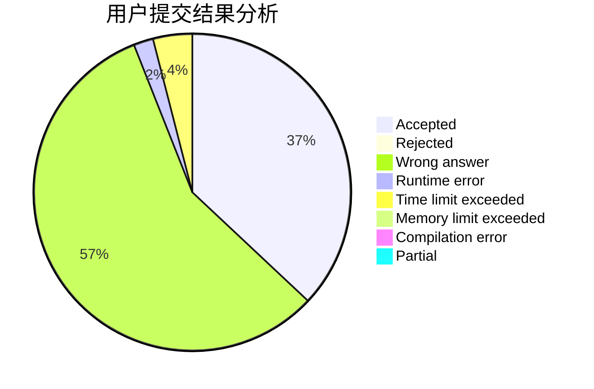
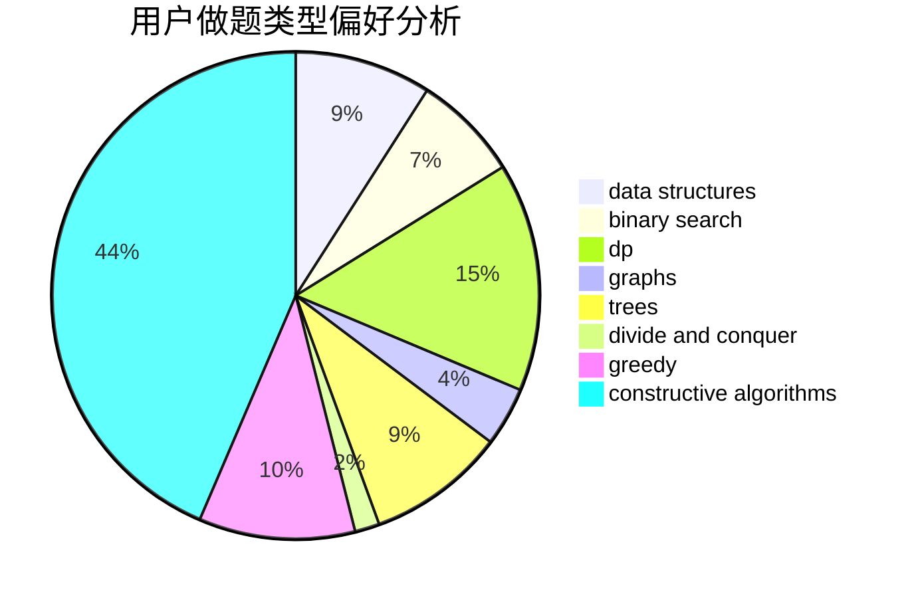

# Dage233

<!-- tabs:start -->

#### **用户提交结果分析**

#### **用户做题类型偏好分析**

#### **用户错题知识点分析**

<!-- tabs:end -->
# 推荐题目
[785E](https://codeforces.com/contest/785/problem/E)		brute force,
                        data structures		  
[786C](https://codeforces.com/contest/786/problem/C)		data structures,
                        divide and conquer		  
[1339C](https://codeforces.com/contest/1339/problem/C)		dsu,graphs,sortings,trees		  
[12472](https://codeforces.com/contest/1247/problem/2)		dsu,graphs,sortings,trees		  
[1510C](https://codeforces.com/contest/1510/problem/C)		dfs and similar,
                        graph matchings,
                        graphs		  
[1016B](https://codeforces.com/contest/1016/problem/B)		brute force,
                        implementation		  
[58E](https://codeforces.com/contest/58/problem/E)		dp		  
[1338D](https://codeforces.com/contest/1338/problem/D)		constructive algorithms,
                        dfs and similar,
                        dp,
                        math,
                        trees		  
[786A](https://codeforces.com/contest/786/problem/A)		dfs and similar,
                        dp,
                        games		  
[39D](https://codeforces.com/contest/39/problem/D)		math		  
