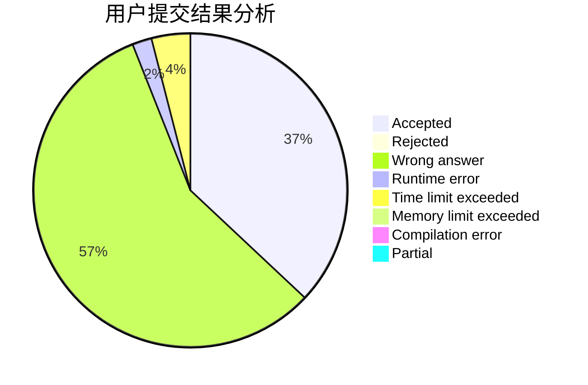
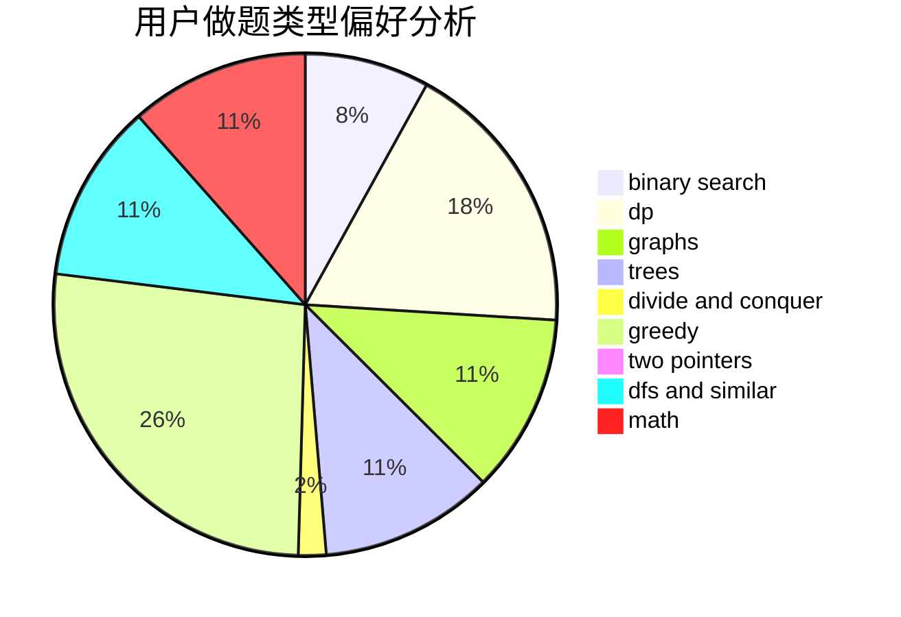

# Dage233

<!-- tabs:start -->

#### **用户提交结果分析**

#### **用户做题类型偏好分析**

<!-- tabs:end -->
# 推荐题目
[785E](https://codeforces.com/contest/785/problem/E)
[786C](https://codeforces.com/contest/786/problem/C)
[1339C](https://codeforces.com/contest/1339/problem/C)
[12472](https://codeforces.com/contest/1247/problem/2)
[1510C](https://codeforces.com/contest/1510/problem/C)
[1016B](https://codeforces.com/contest/1016/problem/B)
[58E](https://codeforces.com/contest/58/problem/E)
[1338D](https://codeforces.com/contest/1338/problem/D)
[786A](https://codeforces.com/contest/786/problem/A)
[39D](https://codeforces.com/contest/39/problem/D)
