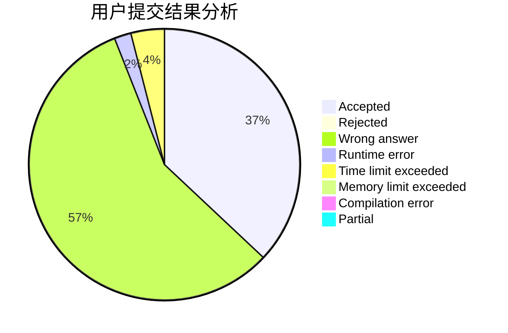
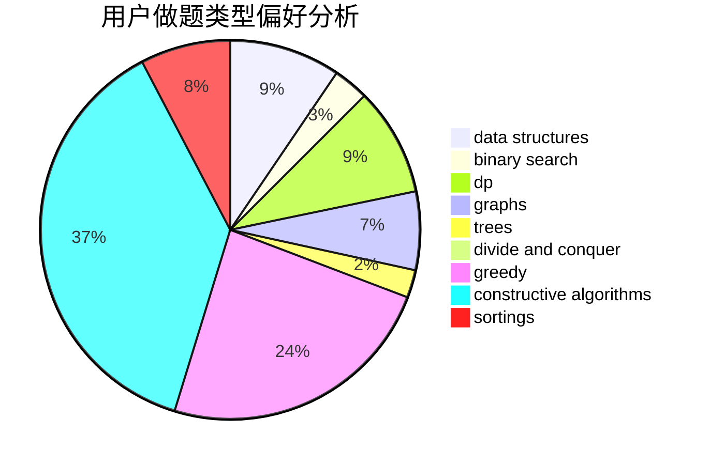

# Dage233
<!-- tabs:start -->
#### **用户提交结果分析**

#### **用户做题类型偏好分析**

#### **用户错题知识点分析**

<!-- tabs:end -->
# 推荐题目
[1110C](http://codeforces.com/problemset/problem/1110/C)		constructive algorithms,
                        math,
                        number theory		  
[1332F](http://codeforces.com/problemset/problem/1332/F)		dfs and similar,
                        dp,
                        trees		  
[1015E2](http://codeforces.com/problemset/problem/1015/E2)		binary search,
                        dp,
                        greedy		  
[1081F](http://codeforces.com/problemset/problem/1081/F)		constructive algorithms,
                        implementation,
                        interactive		  
[12C](http://codeforces.com/problemset/problem/12/C)		greedy,
                        implementation,
                        sortings		  
[121C](http://codeforces.com/problemset/problem/121/C)		brute force,
                        combinatorics,
                        number theory		  
[14B](http://codeforces.com/problemset/problem/14/B)		implementation		  
[767A](http://codeforces.com/problemset/problem/767/A)		data structures,
                        implementation		  
[765D](http://codeforces.com/problemset/problem/765/D)		constructive algorithms,
                        dsu,
                        math		  
[56B](http://codeforces.com/problemset/problem/56/B)		implementation		  
<!-- tabs:start -->
#### **data structures**
[767A](http://codeforces.com/problemset/problem/767/A)		data structures,
                        implementation		  
[765F](http://codeforces.com/problemset/problem/765/F)		data structures		  
[367B](http://codeforces.com/problemset/problem/367/B)		binary search,
                        data structures		  
[173E](http://codeforces.com/problemset/problem/173/E)		data structures,
                        sortings		  
[766D](http://codeforces.com/problemset/problem/766/D)		data structures,
                        dfs and similar,
                        dp,
                        dsu,
                        graphs		  
[620F](http://codeforces.com/problemset/problem/620/F)		data structures,
                        strings,
                        trees		  
[1400E](http://codeforces.com/problemset/problem/1400/E)		data structures,
                        divide and conquer,
                        dp,
                        greedy		  
[766E](http://codeforces.com/problemset/problem/766/E)		bitmasks,
                        constructive algorithms,
                        data structures,
                        dfs and similar,
                        dp,
                        math,
                        trees		  
[1492C](http://codeforces.com/problemset/problem/1492/C)		binary search,
                        data structures,
                        dp,
                        greedy,
                        two pointers		  
[1490G](http://codeforces.com/problemset/problem/1490/G)		binary search,
                        data structures,
                        math		  
#### **binary search**
[1015E2](http://codeforces.com/problemset/problem/1015/E2)		binary search,
                        dp,
                        greedy		  
[147B](http://codeforces.com/problemset/problem/147/B)		binary search,
                        graphs,
                        matrices		  
[1395F](https://codeforces.com/contest/1395/problem/F)		binary search,
                        geometry,
                        ternary search		  
[367B](http://codeforces.com/problemset/problem/367/B)		binary search,
                        data structures		  
[1103B](http://codeforces.com/problemset/problem/1103/B)		binary search,
                        constructive algorithms,
                        interactive		  
[1016E](http://codeforces.com/problemset/problem/1016/E)		binary search,
                        geometry		  
[1251D](http://codeforces.com/problemset/problem/1251/D)		binary search,
                        greedy,
                        sortings		  
[1436C](http://codeforces.com/problemset/problem/1436/C)		binary search,
                        combinatorics		  
[1153E](http://codeforces.com/problemset/problem/1153/E)		binary search,
                        brute force,
                        interactive		  
[1492C](http://codeforces.com/problemset/problem/1492/C)		binary search,
                        data structures,
                        dp,
                        greedy,
                        two pointers		  
#### **dp**
[1332F](http://codeforces.com/problemset/problem/1332/F)		dfs and similar,
                        dp,
                        trees		  
[1015E2](http://codeforces.com/problemset/problem/1015/E2)		binary search,
                        dp,
                        greedy		  
[766C](http://codeforces.com/problemset/problem/766/C)		brute force,
                        dp,
                        greedy,
                        strings		  
[1241D](https://codeforces.com/contest/1241/problem/D)		dp,
                        greedy,
                        two pointers		  
[765E](http://codeforces.com/problemset/problem/765/E)		dfs and similar,
                        dp,
                        greedy,
                        implementation,
                        trees		  
[741B](http://codeforces.com/problemset/problem/741/B)		dfs and similar,
                        dp,
                        dsu		  
[1146F](http://codeforces.com/problemset/problem/1146/F)		dp,
                        trees		  
[1237E](http://codeforces.com/problemset/problem/1237/E)		dp,
                        math		  
[466D](http://codeforces.com/problemset/problem/466/D)		combinatorics,
                        dp		  
[766D](http://codeforces.com/problemset/problem/766/D)		data structures,
                        dfs and similar,
                        dp,
                        dsu,
                        graphs		  
#### **graph**
[1219B](https://codeforces.com/contest/1219/problem/B)		divide and conquer,
                        fft,
                        graphs		  
[147B](http://codeforces.com/problemset/problem/147/B)		binary search,
                        graphs,
                        matrices		  
[193A](http://codeforces.com/problemset/problem/193/A)		constructive algorithms,
                        graphs,
                        trees		  
[1082D](http://codeforces.com/problemset/problem/1082/D)		constructive algorithms,
                        graphs,
                        implementation		  
[766D](http://codeforces.com/problemset/problem/766/D)		data structures,
                        dfs and similar,
                        dp,
                        dsu,
                        graphs		  
[1012B](http://codeforces.com/problemset/problem/1012/B)		constructive algorithms,
                        dfs and similar,
                        dsu,
                        graphs,
                        matrices		  
[1324F](http://codeforces.com/problemset/problem/1324/F)		dfs and similar,
                        dp,
                        graphs,
                        trees		  
[1487C](http://codeforces.com/problemset/problem/1487/C)		brute force,
                        constructive algorithms,
                        dfs and similar,
                        graphs,
                        greedy,
                        implementation,
                        math		  
[1437C](http://codeforces.com/problemset/problem/1437/C)		dp,
                        flows,
                        graph matchings,
                        greedy,
                        math,
                        sortings		  
[1470D](http://codeforces.com/problemset/problem/1470/D)		constructive algorithms,
                        dfs and similar,
                        graph matchings,
                        graphs,
                        greedy		  
#### **trees**
[1332F](http://codeforces.com/problemset/problem/1332/F)		dfs and similar,
                        dp,
                        trees		  
[765E](http://codeforces.com/problemset/problem/765/E)		dfs and similar,
                        dp,
                        greedy,
                        implementation,
                        trees		  
[193A](http://codeforces.com/problemset/problem/193/A)		constructive algorithms,
                        graphs,
                        trees		  
[1146F](http://codeforces.com/problemset/problem/1146/F)		dp,
                        trees		  
[620F](http://codeforces.com/problemset/problem/620/F)		data structures,
                        strings,
                        trees		  
[1444E](http://codeforces.com/problemset/problem/1444/E)		brute force,
                        dfs and similar,
                        dp,
                        interactive,
                        trees		  
[766E](http://codeforces.com/problemset/problem/766/E)		bitmasks,
                        constructive algorithms,
                        data structures,
                        dfs and similar,
                        dp,
                        math,
                        trees		  
[1324F](http://codeforces.com/problemset/problem/1324/F)		dfs and similar,
                        dp,
                        graphs,
                        trees		  
[1479D](http://codeforces.com/problemset/problem/1479/D)		binary search,
                        bitmasks,
                        brute force,
                        data structures,
                        probabilities,
                        trees		  
[1511C](http://codeforces.com/problemset/problem/1511/C)		brute force,
                        data structures,
                        implementation,
                        trees		  
#### **divide and conquer**
[1219B](https://codeforces.com/contest/1219/problem/B)		divide and conquer,
                        fft,
                        graphs		  
[1400E](http://codeforces.com/problemset/problem/1400/E)		data structures,
                        divide and conquer,
                        dp,
                        greedy		  
[1461D](http://codeforces.com/problemset/problem/1461/D)		binary search,
                        brute force,
                        data structures,
                        divide and conquer,
                        implementation,
                        sortings		  
[1466G](http://codeforces.com/problemset/problem/1466/G)		combinatorics,
                        divide and conquer,
                        hashing,
                        math,
                        string suffix structures,
                        strings		  
[1490D](http://codeforces.com/problemset/problem/1490/D)		dfs and similar,
                        divide and conquer,
                        implementation		  
[1483C](https://codeforces.com/contest/1483/problem/C)		data structures,
                        divide and conquer,
                        dp		  
[1491E](http://codeforces.com/problemset/problem/1491/E)		brute force,
                        dfs and similar,
                        divide and conquer,
                        number theory,
                        trees		  
[1303G](http://codeforces.com/problemset/problem/1303/G)		data structures,
                        divide and conquer,
                        geometry,
                        trees		  
[1494D](http://codeforces.com/problemset/problem/1494/D)		constructive algorithms,
                        data structures,
                        dfs and similar,
                        divide and conquer,
                        dsu,
                        greedy,
                        sortings,
                        trees		  
[1482E](http://codeforces.com/problemset/problem/1482/E)		data structures,
                        divide and conquer,
                        dp		  
#### **greedy**
[1015E2](http://codeforces.com/problemset/problem/1015/E2)		binary search,
                        dp,
                        greedy		  
[12C](http://codeforces.com/problemset/problem/12/C)		greedy,
                        implementation,
                        sortings		  
[766C](http://codeforces.com/problemset/problem/766/C)		brute force,
                        dp,
                        greedy,
                        strings		  
[1241D](https://codeforces.com/contest/1241/problem/D)		dp,
                        greedy,
                        two pointers		  
[765E](http://codeforces.com/problemset/problem/765/E)		dfs and similar,
                        dp,
                        greedy,
                        implementation,
                        trees		  
[1181B](http://codeforces.com/problemset/problem/1181/B)		greedy,
                        implementation,
                        strings		  
[766B](http://codeforces.com/problemset/problem/766/B)		constructive algorithms,
                        geometry,
                        greedy,
                        math,
                        number theory,
                        sortings		  
[1400E](http://codeforces.com/problemset/problem/1400/E)		data structures,
                        divide and conquer,
                        dp,
                        greedy		  
[1204B](http://codeforces.com/problemset/problem/1204/B)		greedy,
                        math		  
[1251D](http://codeforces.com/problemset/problem/1251/D)		binary search,
                        greedy,
                        sortings		  
#### **constructive algorithms**
[1110C](http://codeforces.com/problemset/problem/1110/C)		constructive algorithms,
                        math,
                        number theory		  
[1081F](http://codeforces.com/problemset/problem/1081/F)		constructive algorithms,
                        implementation,
                        interactive		  
[765D](http://codeforces.com/problemset/problem/765/D)		constructive algorithms,
                        dsu,
                        math		  
[484A](http://codeforces.com/problemset/problem/484/A)		bitmasks,
                        constructive algorithms		  
[369B](http://codeforces.com/problemset/problem/369/B)		constructive algorithms,
                        implementation,
                        math		  
[193A](http://codeforces.com/problemset/problem/193/A)		constructive algorithms,
                        graphs,
                        trees		  
[766A](http://codeforces.com/problemset/problem/766/A)		constructive algorithms,
                        strings		  
[1103B](http://codeforces.com/problemset/problem/1103/B)		binary search,
                        constructive algorithms,
                        interactive		  
[1082D](http://codeforces.com/problemset/problem/1082/D)		constructive algorithms,
                        graphs,
                        implementation		  
[1012B](http://codeforces.com/problemset/problem/1012/B)		constructive algorithms,
                        dfs and similar,
                        dsu,
                        graphs,
                        matrices		  
#### **sortings**
[12C](http://codeforces.com/problemset/problem/12/C)		greedy,
                        implementation,
                        sortings		  
[173E](http://codeforces.com/problemset/problem/173/E)		data structures,
                        sortings		  
[766B](http://codeforces.com/problemset/problem/766/B)		constructive algorithms,
                        geometry,
                        greedy,
                        math,
                        number theory,
                        sortings		  
[1251D](http://codeforces.com/problemset/problem/1251/D)		binary search,
                        greedy,
                        sortings		  
[1284E](http://codeforces.com/problemset/problem/1284/E)		combinatorics,
                        geometry,
                        math,
                        sortings		  
[1496C](https://codeforces.com/contest/1496/problem/C)		geometry,
                        greedy,
                        math,
                        sortings		  
[1495A](http://codeforces.com/problemset/problem/1495/A)		geometry,
                        greedy,
                        math,
                        sortings		  
[1497A](http://codeforces.com/problemset/problem/1497/A)		brute force,
                        data structures,
                        greedy,
                        sortings		  
[1427A](http://codeforces.com/problemset/problem/1427/A)		math,
                        sortings		  
[1461D](http://codeforces.com/problemset/problem/1461/D)		binary search,
                        brute force,
                        data structures,
                        divide and conquer,
                        implementation,
                        sortings		  
<!-- tabs:end -->
