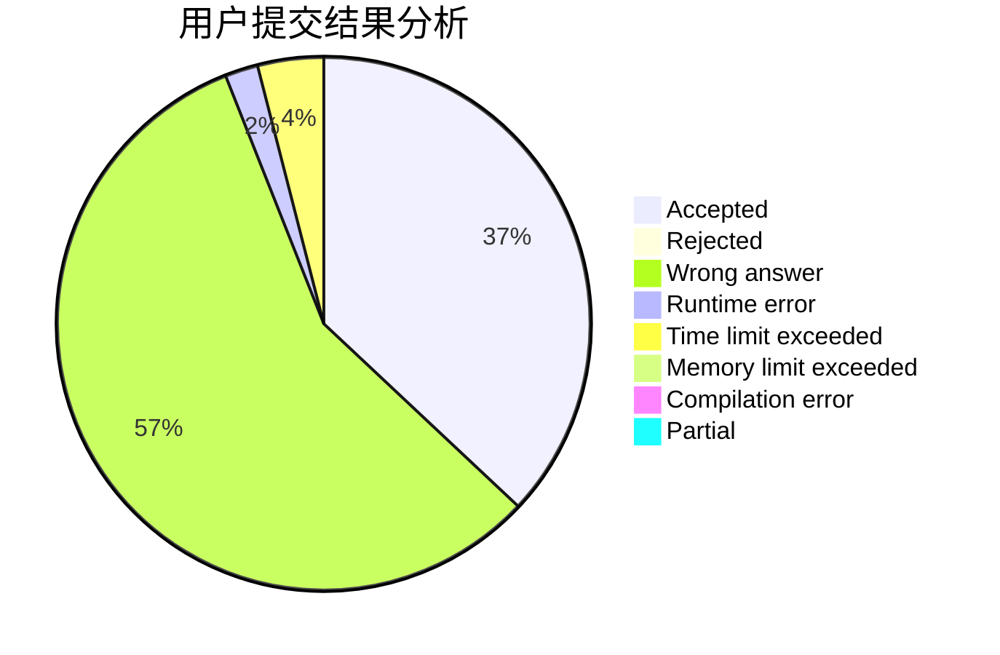
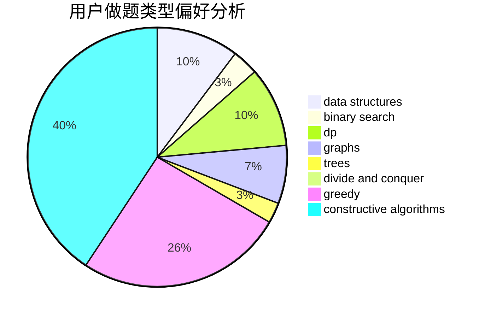

# Dage233

<!-- tabs:start -->

#### **用户提交结果分析**

#### **用户做题类型偏好分析**

#### **用户错题知识点分析**

<!-- tabs:end -->
# 推荐题目
[766C](https://codeforces.com/contest/766/problem/C)		brute force,
                        dp,
                        greedy,
                        strings		  
[767A](https://codeforces.com/contest/767/problem/A)		data structures,
                        implementation		  
[1332F](https://codeforces.com/contest/1332/problem/F)		dfs and similar,
                        dp,
                        trees		  
[1241D](https://codeforces.com/contest/1241/problem/D)		dsu,graphs,sortings,trees		  
[14B](https://codeforces.com/contest/14/problem/B)		implementation		  
[1015E2](https://codeforces.com/contest/1015E/problem/2)		binary search,
                        dp,
                        greedy		  
[56B](https://codeforces.com/contest/56/problem/B)		implementation		  
[1332B](https://codeforces.com/contest/1332/problem/B)		brute force,
                        constructive algorithms,
                        greedy,
                        math,
                        number theory		  
[766D](https://codeforces.com/contest/766/problem/D)		data structures,
                        dfs and similar,
                        dp,
                        dsu,
                        graphs		  
[369B](https://codeforces.com/contest/369/problem/B)		constructive algorithms,
                        implementation,
                        math		  
