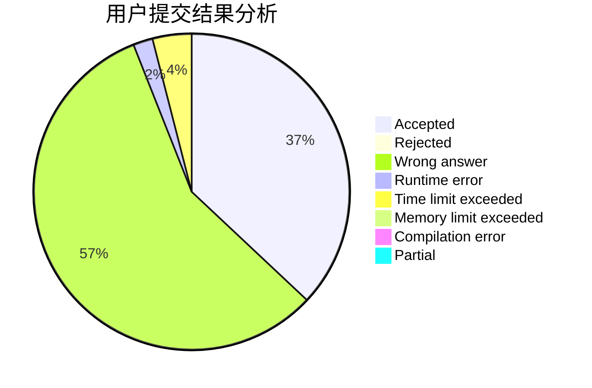
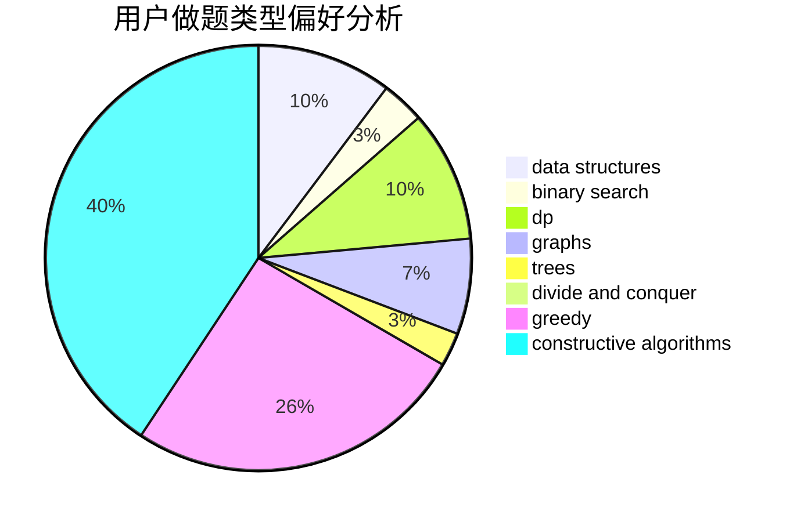

# Dage233
<!-- tabs:start -->
#### **用户提交结果分析**

#### **用户做题类型偏好分析**

#### **用户错题知识点分析**

<!-- tabs:end -->
# 推荐题目
[Meaningless Operations](http://codeforces.com/problemset/problem/1110/C)		constructive algorithms,
                        math,
                        number theory		  
[Independent Set](http://codeforces.com/problemset/problem/1332/F)		dfs and similar,
                        dp,
                        trees		  
[Stars Drawing (Hard Edition)](http://codeforces.com/problemset/problem/1015/E2)		binary search,
                        dp,
                        greedy		  
[Tricky Interactor](http://codeforces.com/problemset/problem/1081/F)		constructive algorithms,
                        implementation,
                        interactive		  
[Fruits](http://codeforces.com/problemset/problem/12/C)		greedy,
                        implementation,
                        sortings		  
[Lucky Permutation](http://codeforces.com/problemset/problem/121/C)		brute force,
                        combinatorics,
                        number theory		  
[Young Photographer](http://codeforces.com/problemset/problem/14/B)		implementation		  
[Snacktower](http://codeforces.com/problemset/problem/767/A)		data structures,
                        implementation		  
[Artsem and Saunders](http://codeforces.com/problemset/problem/765/D)		constructive algorithms,
                        dsu,
                        math		  
[Spoilt Permutation](http://codeforces.com/problemset/problem/56/B)		implementation		  
<!-- tabs:start -->
#### **data structures**
[Snacktower](http://codeforces.com/problemset/problem/767/A)		data structures,
                        implementation		  
[Souvenirs](http://codeforces.com/problemset/problem/765/F)		data structures		  
[Sereja ans Anagrams](http://codeforces.com/problemset/problem/367/B)		binary search,
                        data structures		  
[Camping Groups](http://codeforces.com/problemset/problem/173/E)		data structures,
                        sortings		  
[Mahmoud and a Dictionary](http://codeforces.com/problemset/problem/766/D)		data structures,
                        dfs and similar,
                        dp,
                        dsu,
                        graphs		  
[Xors on Segments](http://codeforces.com/problemset/problem/620/F)		data structures,
                        strings,
                        trees		  
[Clear the Multiset](http://codeforces.com/problemset/problem/1400/E)		data structures,
                        divide and conquer,
                        dp,
                        greedy		  
[Mahmoud and a xor trip](http://codeforces.com/problemset/problem/766/E)		bitmasks,
                        constructive algorithms,
                        data structures,
                        dfs and similar,
                        dp,
                        math,
                        trees		  
[Maximum width](http://codeforces.com/problemset/problem/1492/C)		binary search,
                        data structures,
                        dp,
                        greedy,
                        two pointers		  
[Old Floppy Drive](http://codeforces.com/problemset/problem/1490/G)		binary search,
                        data structures,
                        math		  
#### **binary search**
[Stars Drawing (Hard Edition)](http://codeforces.com/problemset/problem/1015/E2)		binary search,
                        dp,
                        greedy		  
[Smile House](http://codeforces.com/problemset/problem/147/B)		binary search,
                        graphs,
                        matrices		  
[Boboniu and String](https://codeforces.com/contest/1395/problem/F)		binary search,
                        geometry,
                        ternary search		  
[Sereja ans Anagrams](http://codeforces.com/problemset/problem/367/B)		binary search,
                        data structures		  
[Game with modulo](http://codeforces.com/problemset/problem/1103/B)		binary search,
                        constructive algorithms,
                        interactive		  
[Rest In The Shades](http://codeforces.com/problemset/problem/1016/E)		binary search,
                        geometry		  
[Salary Changing](http://codeforces.com/problemset/problem/1251/D)		binary search,
                        greedy,
                        sortings		  
[Binary Search](http://codeforces.com/problemset/problem/1436/C)		binary search,
                        combinatorics		  
[Serval and Snake](http://codeforces.com/problemset/problem/1153/E)		binary search,
                        brute force,
                        interactive		  
[Maximum width](http://codeforces.com/problemset/problem/1492/C)		binary search,
                        data structures,
                        dp,
                        greedy,
                        two pointers		  
#### **dp**
[Independent Set](http://codeforces.com/problemset/problem/1332/F)		dfs and similar,
                        dp,
                        trees		  
[Stars Drawing (Hard Edition)](http://codeforces.com/problemset/problem/1015/E2)		binary search,
                        dp,
                        greedy		  
[Mahmoud and a Message](http://codeforces.com/problemset/problem/766/C)		brute force,
                        dp,
                        greedy,
                        strings		  
[Sequence Sorting](https://codeforces.com/contest/1241/problem/D)		dp,
                        greedy,
                        two pointers		  
[Tree Folding](http://codeforces.com/problemset/problem/765/E)		dfs and similar,
                        dp,
                        greedy,
                        implementation,
                        trees		  
[Arpa's weak amphitheater and Mehrdad's valuable Hoses](http://codeforces.com/problemset/problem/741/B)		dfs and similar,
                        dp,
                        dsu		  
[Leaf Partition](http://codeforces.com/problemset/problem/1146/F)		dp,
                        trees		  
[Balanced Binary Search Trees](http://codeforces.com/problemset/problem/1237/E)		dp,
                        math		  
[Increase Sequence](http://codeforces.com/problemset/problem/466/D)		combinatorics,
                        dp		  
[Mahmoud and a Dictionary](http://codeforces.com/problemset/problem/766/D)		data structures,
                        dfs and similar,
                        dp,
                        dsu,
                        graphs		  
#### **graph**
[Xor Spanning Tree](https://codeforces.com/contest/1219/problem/B)		divide and conquer,
                        fft,
                        graphs		  
[Smile House](http://codeforces.com/problemset/problem/147/B)		binary search,
                        graphs,
                        matrices		  
[Cutting Figure](http://codeforces.com/problemset/problem/193/A)		constructive algorithms,
                        graphs,
                        trees		  
[Maximum Diameter Graph](http://codeforces.com/problemset/problem/1082/D)		constructive algorithms,
                        graphs,
                        implementation		  
[Mahmoud and a Dictionary](http://codeforces.com/problemset/problem/766/D)		data structures,
                        dfs and similar,
                        dp,
                        dsu,
                        graphs		  
[Chemical table](http://codeforces.com/problemset/problem/1012/B)		constructive algorithms,
                        dfs and similar,
                        dsu,
                        graphs,
                        matrices		  
[Maximum White Subtree](http://codeforces.com/problemset/problem/1324/F)		dfs and similar,
                        dp,
                        graphs,
                        trees		  
[Minimum Ties](http://codeforces.com/problemset/problem/1487/C)		brute force,
                        constructive algorithms,
                        dfs and similar,
                        graphs,
                        greedy,
                        implementation,
                        math		  
[Chef Monocarp](http://codeforces.com/problemset/problem/1437/C)		dp,
                        flows,
                        graph matchings,
                        greedy,
                        math,
                        sortings		  
[Strange Housing](http://codeforces.com/problemset/problem/1470/D)		constructive algorithms,
                        dfs and similar,
                        graph matchings,
                        graphs,
                        greedy		  
#### **trees**
[Independent Set](http://codeforces.com/problemset/problem/1332/F)		dfs and similar,
                        dp,
                        trees		  
[Tree Folding](http://codeforces.com/problemset/problem/765/E)		dfs and similar,
                        dp,
                        greedy,
                        implementation,
                        trees		  
[Cutting Figure](http://codeforces.com/problemset/problem/193/A)		constructive algorithms,
                        graphs,
                        trees		  
[Leaf Partition](http://codeforces.com/problemset/problem/1146/F)		dp,
                        trees		  
[Xors on Segments](http://codeforces.com/problemset/problem/620/F)		data structures,
                        strings,
                        trees		  
[Finding the Vertex](http://codeforces.com/problemset/problem/1444/E)		brute force,
                        dfs and similar,
                        dp,
                        interactive,
                        trees		  
[Mahmoud and a xor trip](http://codeforces.com/problemset/problem/766/E)		bitmasks,
                        constructive algorithms,
                        data structures,
                        dfs and similar,
                        dp,
                        math,
                        trees		  
[Maximum White Subtree](http://codeforces.com/problemset/problem/1324/F)		dfs and similar,
                        dp,
                        graphs,
                        trees		  
[Odd Mineral Resource](http://codeforces.com/problemset/problem/1479/D)		binary search,
                        bitmasks,
                        brute force,
                        data structures,
                        probabilities,
                        trees		  
[Yet Another Card Deck](http://codeforces.com/problemset/problem/1511/C)		brute force,
                        data structures,
                        implementation,
                        trees		  
#### **divide and conquer**
[Xor Spanning Tree](https://codeforces.com/contest/1219/problem/B)		divide and conquer,
                        fft,
                        graphs		  
[Clear the Multiset](http://codeforces.com/problemset/problem/1400/E)		data structures,
                        divide and conquer,
                        dp,
                        greedy		  
[Divide and Summarize](http://codeforces.com/problemset/problem/1461/D)		binary search,
                        brute force,
                        data structures,
                        divide and conquer,
                        implementation,
                        sortings		  
[Song of the Sirens](http://codeforces.com/problemset/problem/1466/G)		combinatorics,
                        divide and conquer,
                        hashing,
                        math,
                        string suffix structures,
                        strings		  
[Permutation Transformation](http://codeforces.com/problemset/problem/1490/D)		dfs and similar,
                        divide and conquer,
                        implementation		  
[Skyline Photo](https://codeforces.com/contest/1483/problem/C)		data structures,
                        divide and conquer,
                        dp		  
[Fib-tree](http://codeforces.com/problemset/problem/1491/E)		brute force,
                        dfs and similar,
                        divide and conquer,
                        number theory,
                        trees		  
[Sum of Prefix Sums](http://codeforces.com/problemset/problem/1303/G)		data structures,
                        divide and conquer,
                        geometry,
                        trees		  
[Dogeforces](http://codeforces.com/problemset/problem/1494/D)		constructive algorithms,
                        data structures,
                        dfs and similar,
                        divide and conquer,
                        dsu,
                        greedy,
                        sortings,
                        trees		  
[Skyline Photo](http://codeforces.com/problemset/problem/1482/E)		data structures,
                        divide and conquer,
                        dp		  
#### **greedy**
[Stars Drawing (Hard Edition)](http://codeforces.com/problemset/problem/1015/E2)		binary search,
                        dp,
                        greedy		  
[Fruits](http://codeforces.com/problemset/problem/12/C)		greedy,
                        implementation,
                        sortings		  
[Mahmoud and a Message](http://codeforces.com/problemset/problem/766/C)		brute force,
                        dp,
                        greedy,
                        strings		  
[Sequence Sorting](https://codeforces.com/contest/1241/problem/D)		dp,
                        greedy,
                        two pointers		  
[Tree Folding](http://codeforces.com/problemset/problem/765/E)		dfs and similar,
                        dp,
                        greedy,
                        implementation,
                        trees		  
[Split a Number](http://codeforces.com/problemset/problem/1181/B)		greedy,
                        implementation,
                        strings		  
[Mahmoud and a Triangle](http://codeforces.com/problemset/problem/766/B)		constructive algorithms,
                        geometry,
                        greedy,
                        math,
                        number theory,
                        sortings		  
[Clear the Multiset](http://codeforces.com/problemset/problem/1400/E)		data structures,
                        divide and conquer,
                        dp,
                        greedy		  
[Mislove Has Lost an Array](http://codeforces.com/problemset/problem/1204/B)		greedy,
                        math		  
[Salary Changing](http://codeforces.com/problemset/problem/1251/D)		binary search,
                        greedy,
                        sortings		  
#### **constructive algorithms**
[Meaningless Operations](http://codeforces.com/problemset/problem/1110/C)		constructive algorithms,
                        math,
                        number theory		  
[Tricky Interactor](http://codeforces.com/problemset/problem/1081/F)		constructive algorithms,
                        implementation,
                        interactive		  
[Artsem and Saunders](http://codeforces.com/problemset/problem/765/D)		constructive algorithms,
                        dsu,
                        math		  
[Bits](http://codeforces.com/problemset/problem/484/A)		bitmasks,
                        constructive algorithms		  
[Valera and Contest](http://codeforces.com/problemset/problem/369/B)		constructive algorithms,
                        implementation,
                        math		  
[Cutting Figure](http://codeforces.com/problemset/problem/193/A)		constructive algorithms,
                        graphs,
                        trees		  
[Mahmoud and Longest Uncommon Subsequence](http://codeforces.com/problemset/problem/766/A)		constructive algorithms,
                        strings		  
[Game with modulo](http://codeforces.com/problemset/problem/1103/B)		binary search,
                        constructive algorithms,
                        interactive		  
[Maximum Diameter Graph](http://codeforces.com/problemset/problem/1082/D)		constructive algorithms,
                        graphs,
                        implementation		  
[Chemical table](http://codeforces.com/problemset/problem/1012/B)		constructive algorithms,
                        dfs and similar,
                        dsu,
                        graphs,
                        matrices		  
#### **sortings**
[Fruits](http://codeforces.com/problemset/problem/12/C)		greedy,
                        implementation,
                        sortings		  
[Camping Groups](http://codeforces.com/problemset/problem/173/E)		data structures,
                        sortings		  
[Mahmoud and a Triangle](http://codeforces.com/problemset/problem/766/B)		constructive algorithms,
                        geometry,
                        greedy,
                        math,
                        number theory,
                        sortings		  
[Salary Changing](http://codeforces.com/problemset/problem/1251/D)		binary search,
                        greedy,
                        sortings		  
[New Year and Castle Construction](http://codeforces.com/problemset/problem/1284/E)		combinatorics,
                        geometry,
                        math,
                        sortings		  
[Diamond Miner](https://codeforces.com/contest/1496/problem/C)		geometry,
                        greedy,
                        math,
                        sortings		  
[Diamond Miner](http://codeforces.com/problemset/problem/1495/A)		geometry,
                        greedy,
                        math,
                        sortings		  
[Meximization](http://codeforces.com/problemset/problem/1497/A)		brute force,
                        data structures,
                        greedy,
                        sortings		  
[Avoiding Zero](http://codeforces.com/problemset/problem/1427/A)		math,
                        sortings		  
[Divide and Summarize](http://codeforces.com/problemset/problem/1461/D)		binary search,
                        brute force,
                        data structures,
                        divide and conquer,
                        implementation,
                        sortings		  
<!-- tabs:end -->
