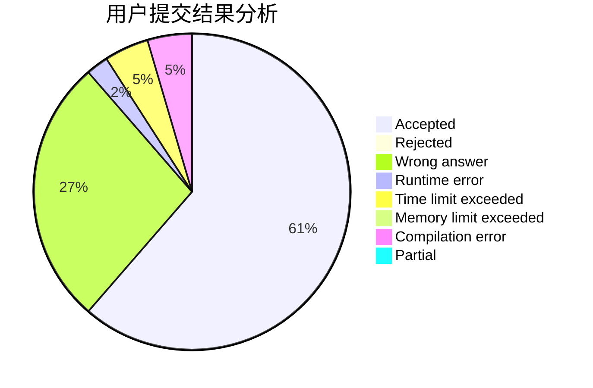
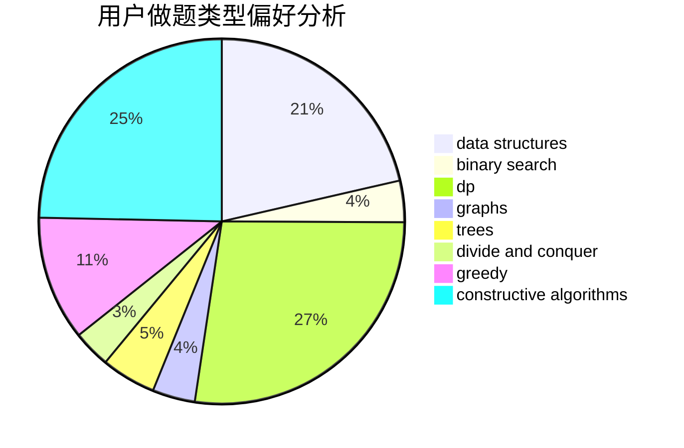

# Daidly

<!-- tabs:start -->

#### **用户提交结果分析**

#### **用户做题类型偏好分析**

#### **用户错题知识点分析**

<!-- tabs:end -->
# 推荐题目
[786D](https://codeforces.com/contest/786/problem/D)		data structures,
                        dfs and similar,
                        hashing,
                        strings,
                        trees		  
[788B](https://codeforces.com/contest/788/problem/B)		combinatorics,
                        constructive algorithms,
                        dfs and similar,
                        dsu,
                        graphs		  
[1380G](https://codeforces.com/contest/1380/problem/G)		greedy,
                        math,
                        probabilities		  
[630J](https://codeforces.com/contest/630/problem/J)		math,
                        number theory		  
[314C](https://codeforces.com/contest/314/problem/C)		data structures,
                        dp		  
[220E](https://codeforces.com/contest/220/problem/E)		data structures,
                        two pointers		  
[612A](https://codeforces.com/contest/612/problem/A)		brute force,
                        implementation,
                        strings		  
[1238G](https://codeforces.com/contest/1238/problem/G)		data structures,
                        greedy,
                        sortings		  
[659G](https://codeforces.com/contest/659/problem/G)		combinatorics,
                        dp,
                        number theory		  
[549C](https://codeforces.com/contest/549/problem/C)		games		  
