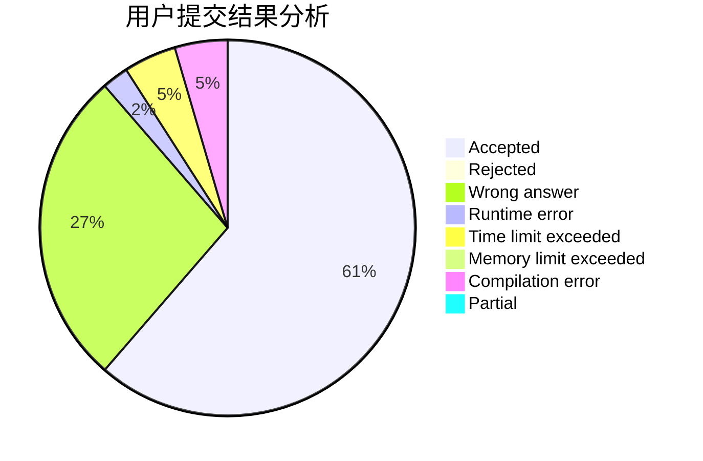
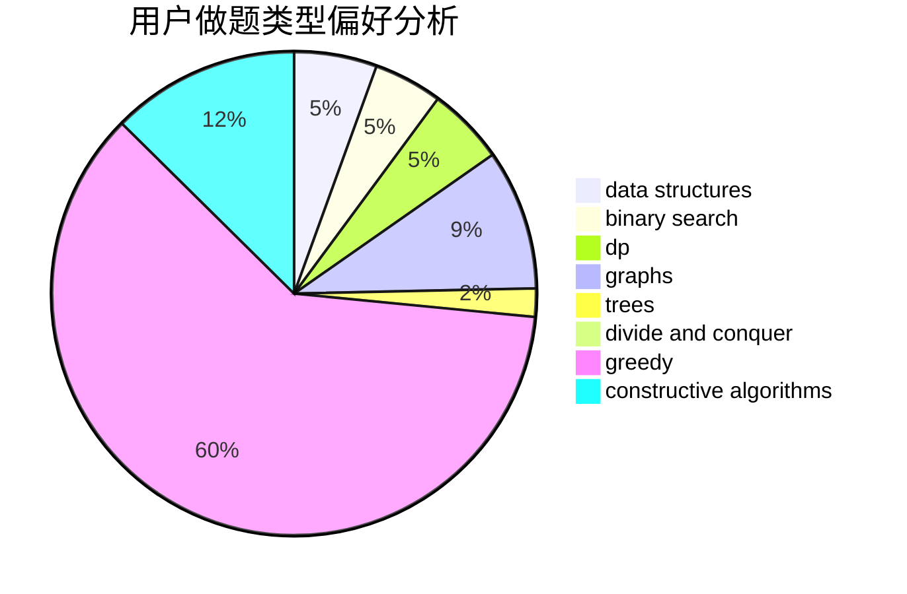

# Daidly

<!-- tabs:start -->

#### **用户提交结果分析**

#### **用户做题类型偏好分析**

#### **用户错题知识点分析**

<!-- tabs:end -->
# 推荐题目
[767B](https://codeforces.com/contest/767/problem/B)		brute force,
                        greedy		  
[768C](https://codeforces.com/contest/768/problem/C)		brute force,
                        dp,
                        implementation,
                        sortings		  
[1372B](https://codeforces.com/contest/1372/problem/B)		greedy,
                        math,
                        number theory		  
[611F](https://codeforces.com/contest/611/problem/F)		binary search,
                        implementation		  
[297D](https://codeforces.com/contest/297/problem/D)		constructive algorithms		  
[199E](https://codeforces.com/contest/199/problem/E)		dsu,graphs,sortings,trees		  
[593D](https://codeforces.com/contest/593/problem/D)		data structures,
                        dfs and similar,
                        graphs,
                        math,
                        trees		  
[1230C](https://codeforces.com/contest/1230/problem/C)		dsu,graphs,sortings,trees		  
[62E](https://codeforces.com/contest/62/problem/E)		dp,
                        flows		  
[524F](https://codeforces.com/contest/524/problem/F)		data structures,
                        greedy,
                        hashing,
                        string suffix structures,
                        strings		  
