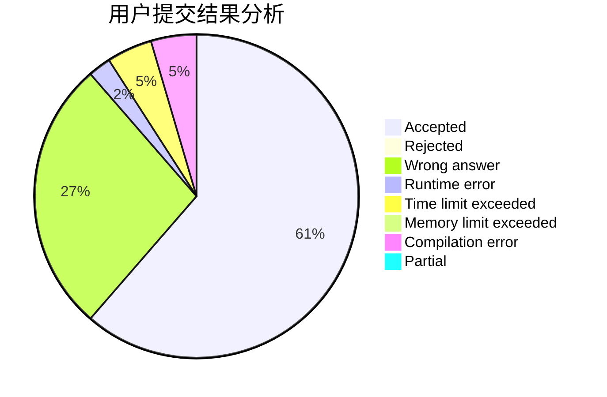
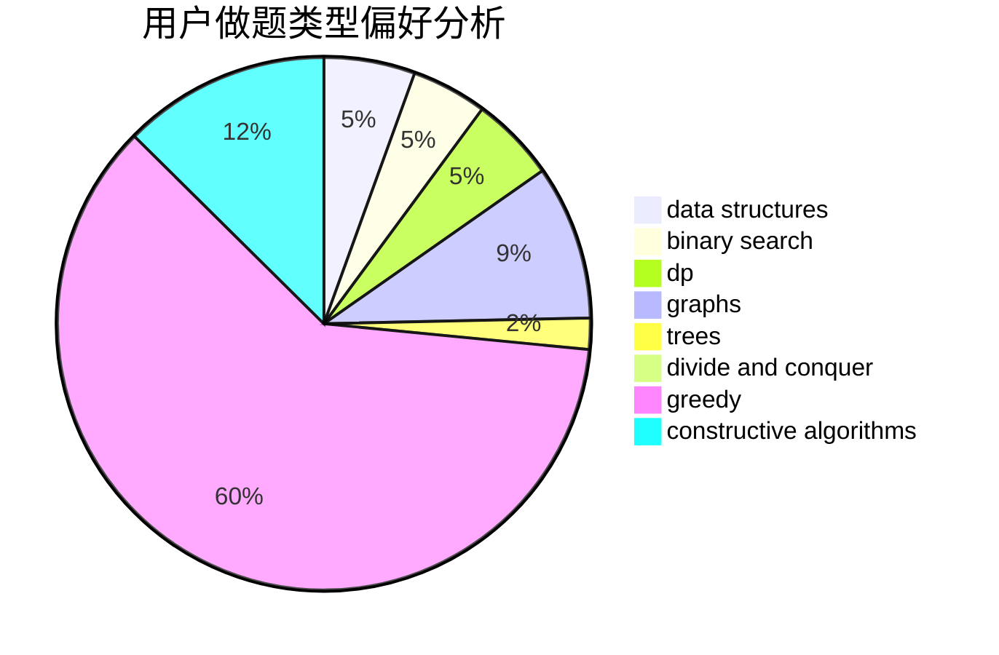

# Daidly
<!-- tabs:start -->
#### **用户提交结果分析**

#### **用户做题类型偏好分析**

#### **用户错题知识点分析**

<!-- tabs:end -->
# 推荐题目
[Anadi and Domino](https://codeforces.com/contest/1230/problem/C)		brute force,
                        graphs		  
[Happy Tree Party](http://codeforces.com/problemset/problem/593/D)		data structures,
                        dfs and similar,
                        graphs,
                        math,
                        trees		  
[Delivering Carcinogen](https://codeforces.com/contest/199/problem/E)		binary search,
                        geometry		  
[Color the Carpet](http://codeforces.com/problemset/problem/297/D)		constructive algorithms		  
[The Queue](http://codeforces.com/problemset/problem/767/B)		brute force,
                        greedy		  
[World Evil](http://codeforces.com/problemset/problem/62/E)		dp,
                        flows		  
[Monotonic Renumeration](http://codeforces.com/problemset/problem/1102/E)		combinatorics,
                        sortings		  
[Jon Snow and his Favourite Number](http://codeforces.com/problemset/problem/768/C)		brute force,
                        dp,
                        implementation,
                        sortings		  
[Brain's Photos](http://codeforces.com/problemset/problem/707/A)		implementation		  
[So Mean](http://codeforces.com/problemset/problem/1299/E)		interactive,
                        math		  
<!-- tabs:start -->
#### **data structures**
[Anadi and Domino](http://codeforces.com/problemset/problem/593/D)		data structures,
                        dfs and similar,
                        graphs,
                        math,
                        trees		  
[Happy Tree Party](http://codeforces.com/problemset/problem/524/F)		data structures,
                        greedy,
                        hashing,
                        string suffix structures,
                        strings		  
[Delivering Carcinogen](http://codeforces.com/problemset/problem/1313/E)		data structures,
                        hashing,
                        strings,
                        two pointers		  
[Color the Carpet](http://codeforces.com/problemset/problem/551/E)		binary search,
                        data structures,
                        implementation		  
[The Queue](http://codeforces.com/problemset/problem/306/B)		data structures,
                        greedy,
                        sortings		  
[World Evil](http://codeforces.com/problemset/problem/1393/B)		constructive algorithms,
                        data structures,
                        greedy,
                        implementation		  
[Monotonic Renumeration](http://codeforces.com/problemset/problem/767/D)		binary search,
                        data structures,
                        greedy,
                        sortings,
                        two pointers		  
[Jon Snow and his Favourite Number](http://codeforces.com/problemset/problem/1500/E)		binary search,
                        data structures		  
[Brain's Photos](http://codeforces.com/problemset/problem/1492/C)		binary search,
                        data structures,
                        dp,
                        greedy,
                        two pointers		  
[So Mean](http://codeforces.com/problemset/problem/1490/G)		binary search,
                        data structures,
                        math		  
#### **binary search**
[Anadi and Domino](https://codeforces.com/contest/199/problem/E)		binary search,
                        geometry		  
[Happy Tree Party](http://codeforces.com/problemset/problem/611/F)		binary search,
                        implementation		  
[Delivering Carcinogen](http://codeforces.com/problemset/problem/165/C)		binary search,
                        brute force,
                        dp,
                        math,
                        strings,
                        two pointers		  
[Color the Carpet](http://codeforces.com/problemset/problem/551/E)		binary search,
                        data structures,
                        implementation		  
[The Queue](http://codeforces.com/problemset/problem/1027/F)		binary search,
                        dfs and similar,
                        dsu,
                        graph matchings,
                        graphs		  
[World Evil](https://codeforces.com/contest/1424/problem/J)		binary search,
                        math,
                        number theory,
                        two pointers		  
[Monotonic Renumeration](http://codeforces.com/problemset/problem/767/D)		binary search,
                        data structures,
                        greedy,
                        sortings,
                        two pointers		  
[Jon Snow and his Favourite Number](http://codeforces.com/problemset/problem/1500/E)		binary search,
                        data structures		  
[Brain's Photos](http://codeforces.com/problemset/problem/1492/C)		binary search,
                        data structures,
                        dp,
                        greedy,
                        two pointers		  
[So Mean](http://codeforces.com/problemset/problem/1463/D)		binary search,
                        constructive algorithms,
                        greedy,
                        two pointers		  
#### **dp**
[Anadi and Domino](http://codeforces.com/problemset/problem/62/E)		dp,
                        flows		  
[Happy Tree Party](http://codeforces.com/problemset/problem/768/C)		brute force,
                        dp,
                        implementation,
                        sortings		  
[Delivering Carcinogen](http://codeforces.com/problemset/problem/165/C)		binary search,
                        brute force,
                        dp,
                        math,
                        strings,
                        two pointers		  
[Color the Carpet](https://codeforces.com/contest/296/problem/D)		dp,
                        graphs,
                        shortest paths		  
[The Queue](http://codeforces.com/problemset/problem/466/D)		combinatorics,
                        dp		  
[World Evil](http://codeforces.com/problemset/problem/321/D)		dp,
                        greedy,
                        math		  
[Monotonic Renumeration](http://codeforces.com/problemset/problem/212/C)		combinatorics,
                        dp,
                        math		  
[Jon Snow and his Favourite Number](http://codeforces.com/problemset/problem/309/B)		dp,
                        two pointers		  
[Brain's Photos](http://codeforces.com/problemset/problem/1051/C)		brute force,
                        dp,
                        greedy,
                        implementation,
                        math		  
[So Mean](http://codeforces.com/problemset/problem/295/B)		dp,
                        graphs,
                        shortest paths		  
#### **graph**
[Anadi and Domino](https://codeforces.com/contest/1230/problem/C)		brute force,
                        graphs		  
[Happy Tree Party](http://codeforces.com/problemset/problem/593/D)		data structures,
                        dfs and similar,
                        graphs,
                        math,
                        trees		  
[Delivering Carcinogen](https://codeforces.com/contest/296/problem/D)		dp,
                        graphs,
                        shortest paths		  
[Color the Carpet](http://codeforces.com/problemset/problem/1152/E)		constructive algorithms,
                        dfs and similar,
                        graphs		  
[The Queue](http://codeforces.com/problemset/problem/1027/F)		binary search,
                        dfs and similar,
                        dsu,
                        graph matchings,
                        graphs		  
[World Evil](http://codeforces.com/problemset/problem/295/B)		dp,
                        graphs,
                        shortest paths		  
[Monotonic Renumeration](http://codeforces.com/problemset/problem/598/D)		dfs and similar,
                        graphs,
                        shortest paths		  
[Jon Snow and his Favourite Number](http://codeforces.com/problemset/problem/1244/D)		brute force,
                        constructive algorithms,
                        dp,
                        graphs,
                        implementation,
                        trees		  
[Brain's Photos](http://codeforces.com/problemset/problem/767/C)		dfs and similar,
                        graphs,
                        greedy,
                        trees		  
[So Mean](http://codeforces.com/problemset/problem/1487/C)		brute force,
                        constructive algorithms,
                        dfs and similar,
                        graphs,
                        greedy,
                        implementation,
                        math		  
#### **trees**
[Anadi and Domino](http://codeforces.com/problemset/problem/593/D)		data structures,
                        dfs and similar,
                        graphs,
                        math,
                        trees		  
[Happy Tree Party](http://codeforces.com/problemset/problem/1244/D)		brute force,
                        constructive algorithms,
                        dp,
                        graphs,
                        implementation,
                        trees		  
[Delivering Carcinogen](http://codeforces.com/problemset/problem/767/C)		dfs and similar,
                        graphs,
                        greedy,
                        trees		  
[Color the Carpet](http://codeforces.com/problemset/problem/1479/D)		binary search,
                        bitmasks,
                        brute force,
                        data structures,
                        probabilities,
                        trees		  
[The Queue](http://codeforces.com/problemset/problem/1511/C)		brute force,
                        data structures,
                        implementation,
                        trees		  
[World Evil](http://codeforces.com/problemset/problem/1499/F)		combinatorics,
                        dfs and similar,
                        dp,
                        trees		  
[Monotonic Renumeration](http://codeforces.com/problemset/problem/1491/E)		brute force,
                        dfs and similar,
                        divide and conquer,
                        number theory,
                        trees		  
[Jon Snow and his Favourite Number](http://codeforces.com/problemset/problem/1466/D)		data structures,
                        greedy,
                        sortings,
                        trees		  
[Brain's Photos](http://codeforces.com/problemset/problem/1495/D)		combinatorics,
                        dfs and similar,
                        graphs,
                        math,
                        shortest paths,
                        trees		  
[So Mean](http://codeforces.com/problemset/problem/1303/G)		data structures,
                        divide and conquer,
                        geometry,
                        trees		  
#### **divide and conquer**
[Anadi and Domino](http://codeforces.com/problemset/problem/768/B)		constructive algorithms,
                        dfs and similar,
                        divide and conquer		  
[Happy Tree Party](http://codeforces.com/problemset/problem/1461/D)		binary search,
                        brute force,
                        data structures,
                        divide and conquer,
                        implementation,
                        sortings		  
[Delivering Carcinogen](http://codeforces.com/problemset/problem/1466/G)		combinatorics,
                        divide and conquer,
                        hashing,
                        math,
                        string suffix structures,
                        strings		  
[Color the Carpet](http://codeforces.com/problemset/problem/1490/D)		dfs and similar,
                        divide and conquer,
                        implementation		  
[The Queue](https://codeforces.com/contest/1483/problem/C)		data structures,
                        divide and conquer,
                        dp		  
[World Evil](http://codeforces.com/problemset/problem/1491/E)		brute force,
                        dfs and similar,
                        divide and conquer,
                        number theory,
                        trees		  
[Monotonic Renumeration](http://codeforces.com/problemset/problem/1303/G)		data structures,
                        divide and conquer,
                        geometry,
                        trees		  
[Jon Snow and his Favourite Number](http://codeforces.com/problemset/problem/1494/D)		constructive algorithms,
                        data structures,
                        dfs and similar,
                        divide and conquer,
                        dsu,
                        greedy,
                        sortings,
                        trees		  
[Brain's Photos](http://codeforces.com/problemset/problem/1482/E)		data structures,
                        divide and conquer,
                        dp		  
[So Mean](http://codeforces.com/problemset/problem/566/C)		dfs and similar,
                        divide and conquer,
                        trees		  
#### **greedy**
[Anadi and Domino](http://codeforces.com/problemset/problem/767/B)		brute force,
                        greedy		  
[Happy Tree Party](http://codeforces.com/problemset/problem/524/F)		data structures,
                        greedy,
                        hashing,
                        string suffix structures,
                        strings		  
[Delivering Carcinogen](http://codeforces.com/problemset/problem/321/D)		dp,
                        greedy,
                        math		  
[Color the Carpet](http://codeforces.com/problemset/problem/1248/B)		greedy,
                        math,
                        sortings		  
[The Queue](http://codeforces.com/problemset/problem/1051/C)		brute force,
                        dp,
                        greedy,
                        implementation,
                        math		  
[World Evil](http://codeforces.com/problemset/problem/767/E)		greedy		  
[Monotonic Renumeration](http://codeforces.com/problemset/problem/1372/B)		greedy,
                        math,
                        number theory		  
[Jon Snow and his Favourite Number](http://codeforces.com/problemset/problem/306/B)		data structures,
                        greedy,
                        sortings		  
[Brain's Photos](http://codeforces.com/problemset/problem/1333/F)		greedy,
                        implementation,
                        math,
                        number theory,
                        sortings,
                        two pointers		  
[So Mean](http://codeforces.com/problemset/problem/1393/B)		constructive algorithms,
                        data structures,
                        greedy,
                        implementation		  
#### **constructive algorithms**
[Anadi and Domino](http://codeforces.com/problemset/problem/297/D)		constructive algorithms		  
[Happy Tree Party](http://codeforces.com/problemset/problem/1152/E)		constructive algorithms,
                        dfs and similar,
                        graphs		  
[Delivering Carcinogen](http://codeforces.com/problemset/problem/1244/D)		brute force,
                        constructive algorithms,
                        dp,
                        graphs,
                        implementation,
                        trees		  
[Color the Carpet](http://codeforces.com/problemset/problem/1393/B)		constructive algorithms,
                        data structures,
                        greedy,
                        implementation		  
[The Queue](http://codeforces.com/problemset/problem/768/A)		constructive algorithms,
                        sortings		  
[World Evil](http://codeforces.com/problemset/problem/768/B)		constructive algorithms,
                        dfs and similar,
                        divide and conquer		  
[Monotonic Renumeration](http://codeforces.com/problemset/problem/1374/F)		brute force,
                        constructive algorithms,
                        implementation,
                        sortings		  
[Jon Snow and his Favourite Number](http://codeforces.com/problemset/problem/1446/A)		constructive algorithms,
                        greedy,
                        sortings		  
[Brain's Photos](http://codeforces.com/problemset/problem/1493/A)		constructive algorithms,
                        greedy		  
[So Mean](http://codeforces.com/problemset/problem/1463/D)		binary search,
                        constructive algorithms,
                        greedy,
                        two pointers		  
#### **sortings**
[Anadi and Domino](http://codeforces.com/problemset/problem/1102/E)		combinatorics,
                        sortings		  
[Happy Tree Party](http://codeforces.com/problemset/problem/768/C)		brute force,
                        dp,
                        implementation,
                        sortings		  
[Delivering Carcinogen](http://codeforces.com/problemset/problem/1248/B)		greedy,
                        math,
                        sortings		  
[Color the Carpet](http://codeforces.com/problemset/problem/306/B)		data structures,
                        greedy,
                        sortings		  
[The Queue](http://codeforces.com/problemset/problem/1333/F)		greedy,
                        implementation,
                        math,
                        number theory,
                        sortings,
                        two pointers		  
[World Evil](http://codeforces.com/problemset/problem/767/D)		binary search,
                        data structures,
                        greedy,
                        sortings,
                        two pointers		  
[Monotonic Renumeration](http://codeforces.com/problemset/problem/768/A)		constructive algorithms,
                        sortings		  
[Jon Snow and his Favourite Number](http://codeforces.com/problemset/problem/1374/F)		brute force,
                        constructive algorithms,
                        implementation,
                        sortings		  
[Brain's Photos](http://codeforces.com/problemset/problem/653/A)		brute force,
                        implementation,
                        sortings		  
[So Mean](http://codeforces.com/problemset/problem/1446/A)		constructive algorithms,
                        greedy,
                        sortings		  
<!-- tabs:end -->
