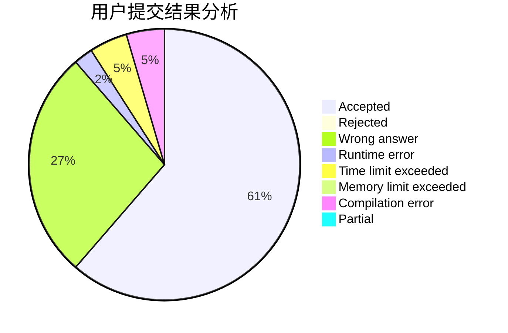
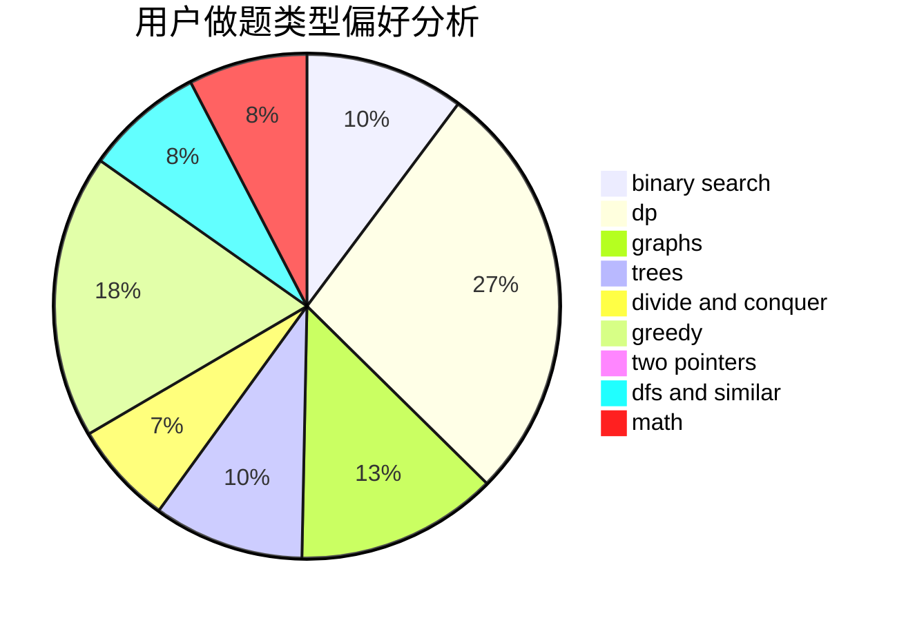

# Daidly

<!-- tabs:start -->

#### **用户提交结果分析**

#### **用户做题类型偏好分析**

<!-- tabs:end -->
# 推荐题目
[786D](https://codeforces.com/contest/786/problem/D)
[788B](https://codeforces.com/contest/788/problem/B)
[1380G](https://codeforces.com/contest/1380/problem/G)
[630J](https://codeforces.com/contest/630/problem/J)
[314C](https://codeforces.com/contest/314/problem/C)
[220E](https://codeforces.com/contest/220/problem/E)
[612A](https://codeforces.com/contest/612/problem/A)
[1238G](https://codeforces.com/contest/1238/problem/G)
[659G](https://codeforces.com/contest/659/problem/G)
[549C](https://codeforces.com/contest/549/problem/C)
