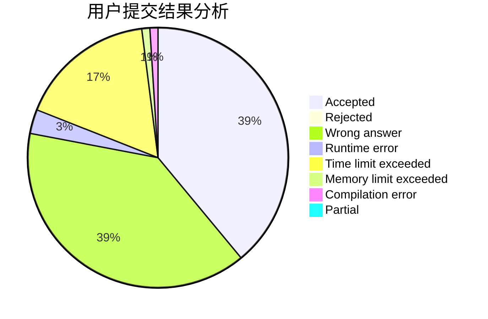
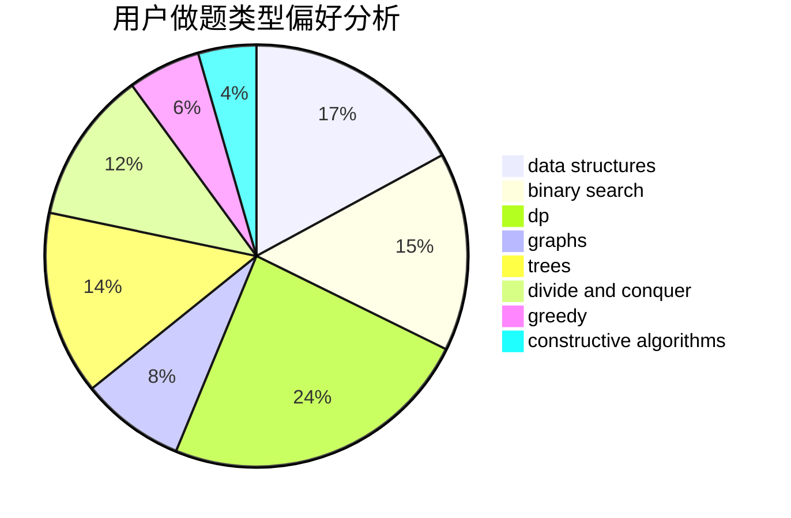
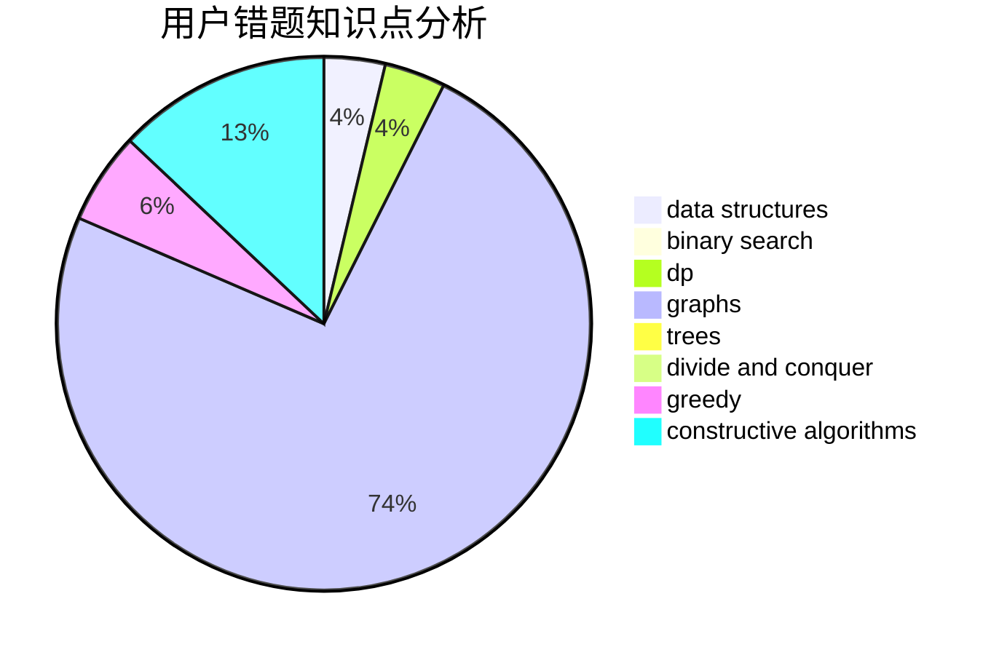

# Dallby

<!-- tabs:start -->

#### **用户提交结果分析**

#### **用户做题类型偏好分析**

#### **用户错题知识点分析**

<!-- tabs:end -->
# 推荐题目
[788D](https://codeforces.com/contest/788/problem/D)		constructive algorithms,
                        divide and conquer,
                        interactive		  
[1366B](https://codeforces.com/contest/1366/problem/B)		math,
                        two pointers		  
[721E](https://codeforces.com/contest/721/problem/E)		binary search,
                        dp		  
[1164F](https://codeforces.com/contest/1164/problem/F)		dsu,graphs,sortings,trees		  
[650B](https://codeforces.com/contest/650/problem/B)		binary search,
                        brute force,
                        dp,
                        two pointers		  
[1256F](https://codeforces.com/contest/1256/problem/F)		constructive algorithms,
                        sortings,
                        strings		  
[1147E](https://codeforces.com/contest/1147/problem/E)		interactive		  
[1253E](https://codeforces.com/contest/1253/problem/E)		data structures,
                        dp,
                        greedy,
                        sortings		  
[788C](https://codeforces.com/contest/788/problem/C)		dfs and similar,
                        graphs,
                        shortest paths		  
[325A](https://codeforces.com/contest/325/problem/A)		implementation		  
