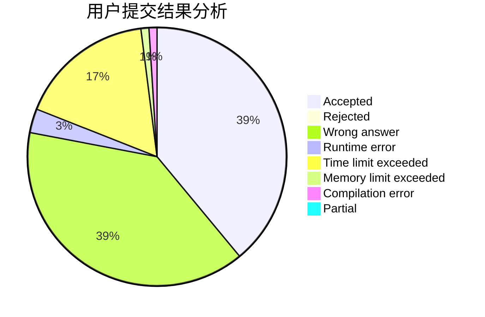
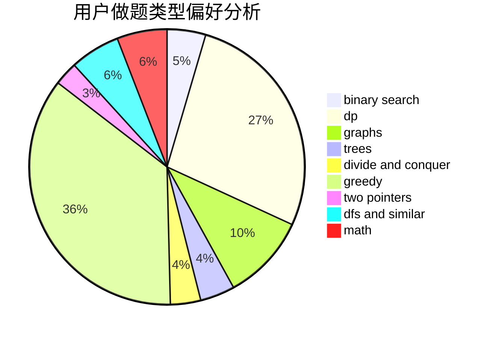

# Dallby

<!-- tabs:start -->

#### **用户提交结果分析**

#### **用户做题类型偏好分析**

<!-- tabs:end -->
# 推荐题目
[788D](https://codeforces.com/contest/788/problem/D)
[1366B](https://codeforces.com/contest/1366/problem/B)
[721E](https://codeforces.com/contest/721/problem/E)
[1164F](https://codeforces.com/contest/1164/problem/F)
[650B](https://codeforces.com/contest/650/problem/B)
[1256F](https://codeforces.com/contest/1256/problem/F)
[1147E](https://codeforces.com/contest/1147/problem/E)
[1253E](https://codeforces.com/contest/1253/problem/E)
[788C](https://codeforces.com/contest/788/problem/C)
[325A](https://codeforces.com/contest/325/problem/A)
