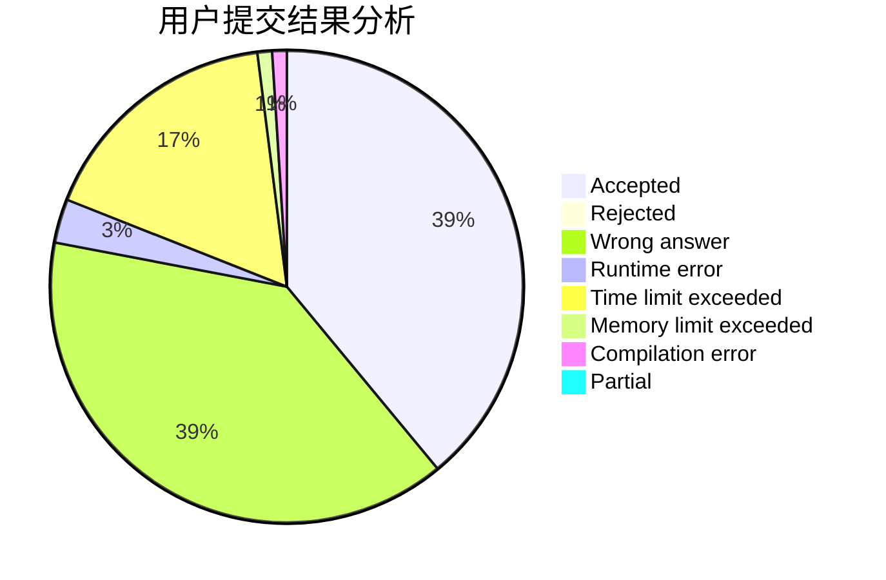
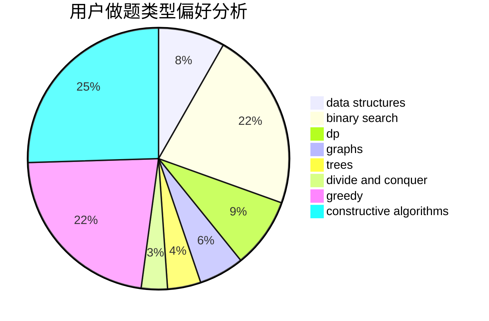
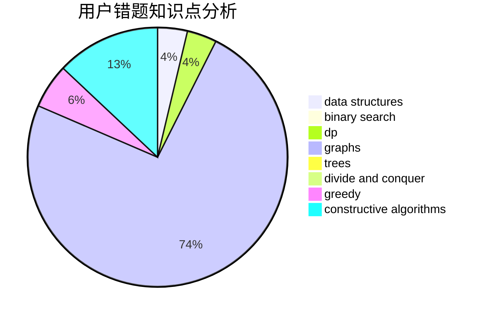

# Dallby

<!-- tabs:start -->

#### **用户提交结果分析**

#### **用户做题类型偏好分析**

#### **用户错题知识点分析**

<!-- tabs:end -->
# 推荐题目
[768E](https://codeforces.com/contest/768/problem/E)		bitmasks,
                        dp,
                        games		  
[1357E2](https://codeforces.com/contest/1357E/problem/2)		nan		  
[703A](https://codeforces.com/contest/703/problem/A)		implementation		  
[1161D](https://codeforces.com/contest/1161/problem/D)		dsu,graphs,sortings,trees		  
[622B](https://codeforces.com/contest/622/problem/B)		implementation		  
[1251E1](https://codeforces.com/contest/1251E/problem/1)		data structures,
                        dp,
                        greedy		  
[1145D](https://codeforces.com/contest/1145/problem/D)		implementation		  
[1249F](https://codeforces.com/contest/1249/problem/F)		dp,
                        trees		  
[768D](https://codeforces.com/contest/768/problem/D)		dp,
                        math,
                        probabilities		  
[304C](https://codeforces.com/contest/304/problem/C)		dsu,graphs,sortings,trees		  
