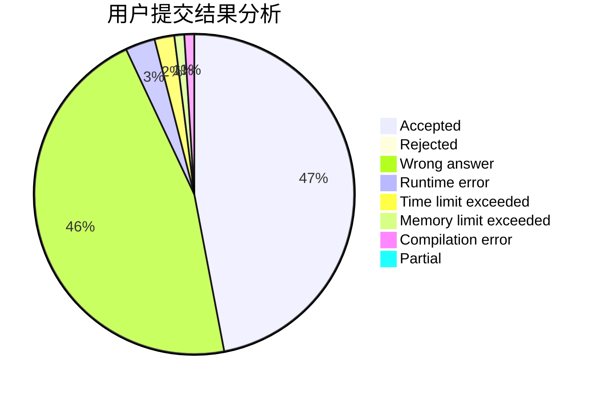
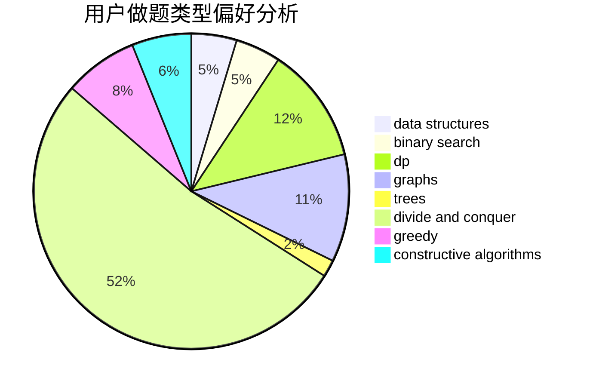
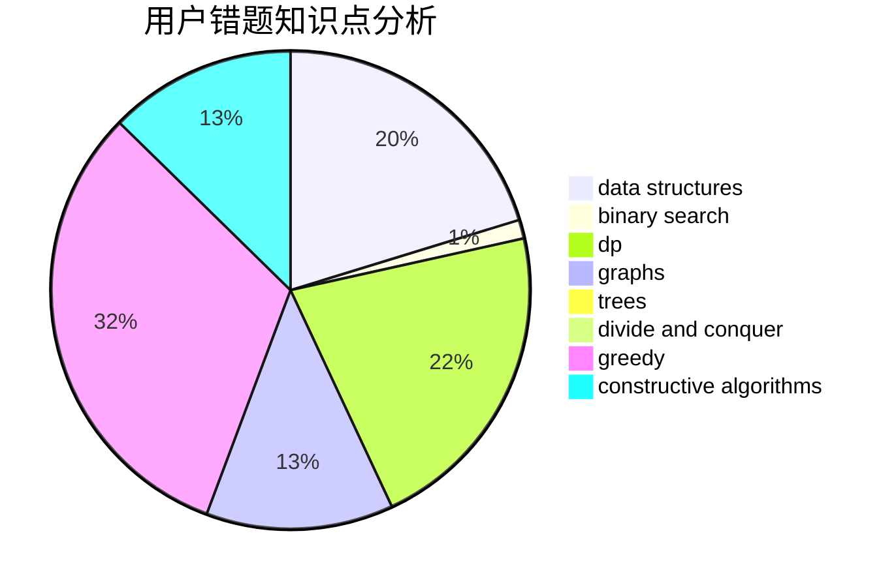

# Dancepted

<!-- tabs:start -->

#### **用户提交结果分析**

#### **用户做题类型偏好分析**

#### **用户错题知识点分析**

<!-- tabs:end -->
# 推荐题目
[786E](https://codeforces.com/contest/786/problem/E)		data structures,
                        flows,
                        graphs,
                        trees		  
[599B](https://codeforces.com/contest/599/problem/B)		implementation		  
[1261C](https://codeforces.com/contest/1261/problem/C)		dsu,graphs,sortings,trees		  
[1261E](https://codeforces.com/contest/1261/problem/E)		dsu,graphs,sortings,trees		  
[672D](https://codeforces.com/contest/672/problem/D)		dsu,graphs,sortings,trees		  
[553B](https://codeforces.com/contest/553/problem/B)		binary search,
                        combinatorics,
                        constructive algorithms,
                        greedy,
                        implementation,
                        math		  
[1262E](https://codeforces.com/contest/1262/problem/E)		dsu,graphs,sortings,trees		  
[1044B](https://codeforces.com/contest/1044/problem/B)		dfs and similar,
                        interactive,
                        trees		  
[788E](https://codeforces.com/contest/788/problem/E)		data structures		  
[789A](https://codeforces.com/contest/789/problem/A)		implementation,
                        math		  
