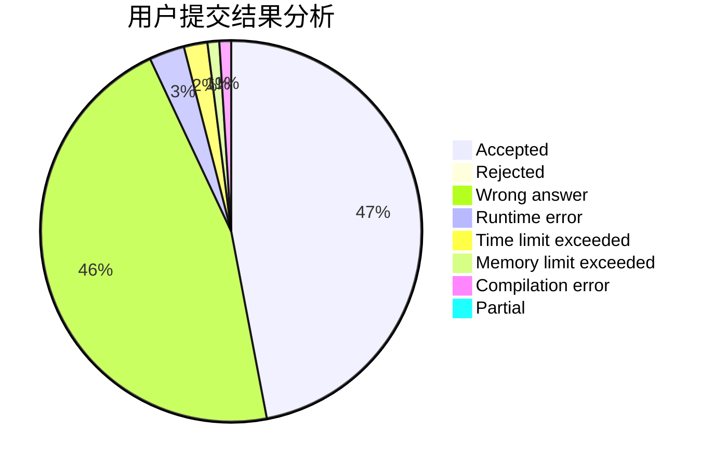
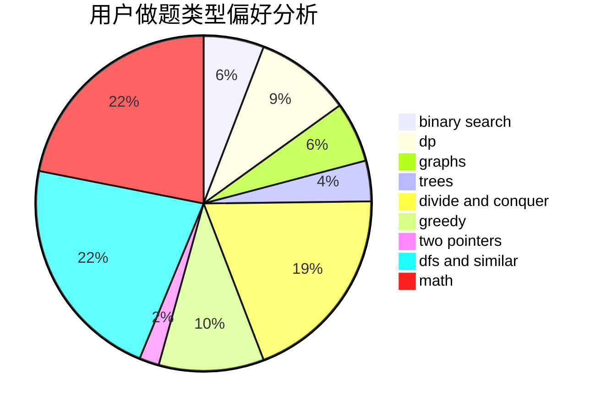

# Dancepted

<!-- tabs:start -->

#### **用户提交结果分析**

#### **用户做题类型偏好分析**

<!-- tabs:end -->
# 推荐题目
[786E](https://codeforces.com/contest/786/problem/E)
[599B](https://codeforces.com/contest/599/problem/B)
[1261C](https://codeforces.com/contest/1261/problem/C)
[1261E](https://codeforces.com/contest/1261/problem/E)
[672D](https://codeforces.com/contest/672/problem/D)
[553B](https://codeforces.com/contest/553/problem/B)
[1262E](https://codeforces.com/contest/1262/problem/E)
[1044B](https://codeforces.com/contest/1044/problem/B)
[788E](https://codeforces.com/contest/788/problem/E)
[789A](https://codeforces.com/contest/789/problem/A)
