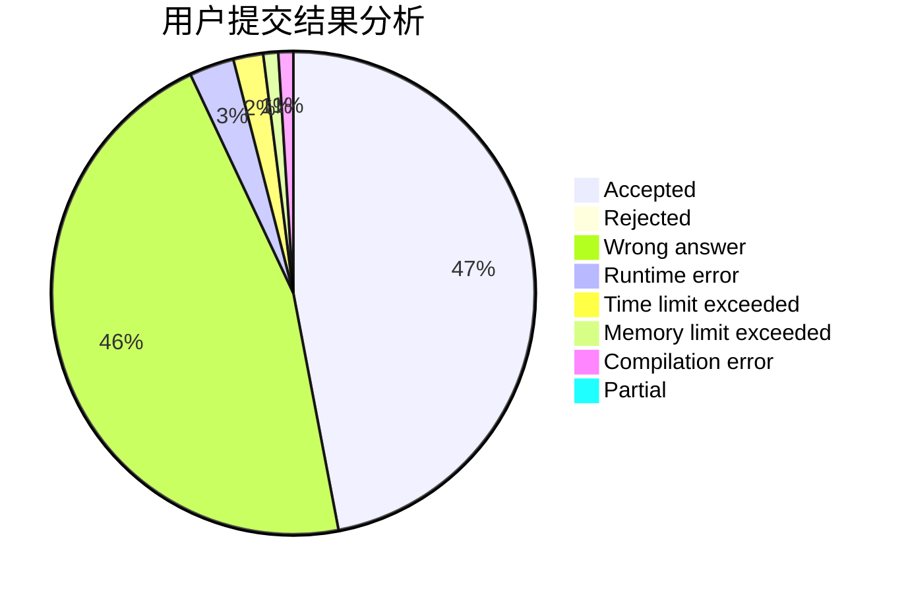
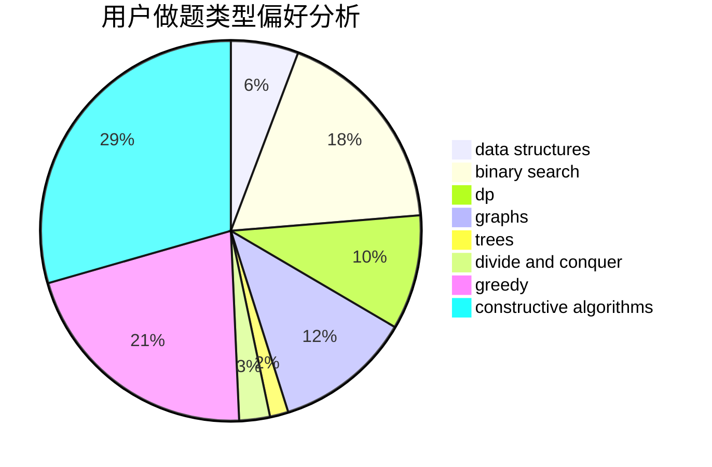
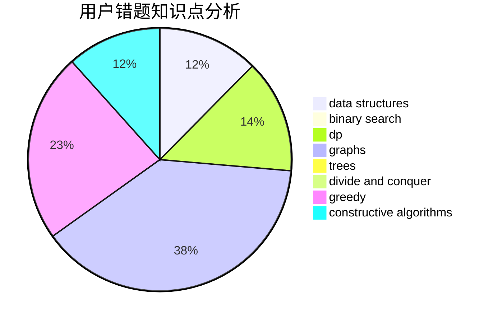

# Dancepted
<!-- tabs:start -->
#### **用户提交结果分析**

#### **用户做题类型偏好分析**

#### **用户错题知识点分析**

<!-- tabs:end -->
# 推荐题目
[Number of Binominal Coefficients](http://codeforces.com/problemset/problem/582/D)		dp,
                        math,
                        number theory		  
[Data Center Drama](http://codeforces.com/problemset/problem/527/E)		dfs and similar,
                        graphs		  
[Ivan and Powers of Two](http://codeforces.com/problemset/problem/305/C)		greedy,
                        implementation		  
[Points on Plane](https://codeforces.com/contest/577/problem/E)		constructive algorithms,
                        divide and conquer,
                        geometry,
                        greedy,
                        sortings		  
[Continued Fractions](http://codeforces.com/problemset/problem/305/B)		brute force,
                        implementation,
                        math		  
[Send Boxes to Alice (Easy Version)](http://codeforces.com/problemset/problem/1254/B1)		constructive algorithms,
                        greedy,
                        math,
                        number theory,
                        ternary search,
                        two pointers		  
[Diana and Liana](http://codeforces.com/problemset/problem/1120/A)		greedy,
                        implementation,
                        two pointers		  
[Year of University Entrance](http://codeforces.com/problemset/problem/769/A)		*special problem,
                        implementation,
                        sortings		  
[Lesson Timetable](http://codeforces.com/problemset/problem/37/D)		combinatorics,
                        dp,
                        math		  
[123-sequence](http://codeforces.com/problemset/problem/52/A)		implementation		  
<!-- tabs:start -->
#### **data structures**
[Number of Binominal Coefficients](http://codeforces.com/problemset/problem/768/G)		binary search,
                        data structures		  
[Data Center Drama](https://codeforces.com/contest/1434/problem/B)		data structures,
                        greedy,
                        implementation		  
[Ivan and Powers of Two](http://codeforces.com/problemset/problem/650/A)		data structures,
                        geometry,
                        math		  
[Points on Plane](https://codeforces.com/contest/1277/problem/F)		brute force,
                        combinatorics,
                        constructive algorithms,
                        data structures,
                        greedy,
                        math		  
[Continued Fractions](http://codeforces.com/problemset/problem/1251/E2)		binary search,
                        data structures,
                        greedy		  
[Send Boxes to Alice (Easy Version)](http://codeforces.com/problemset/problem/1198/B)		binary search,
                        brute force,
                        data structures,
                        sortings		  
[Diana and Liana](http://codeforces.com/problemset/problem/1492/C)		binary search,
                        data structures,
                        dp,
                        greedy,
                        two pointers		  
[Year of University Entrance](http://codeforces.com/problemset/problem/1490/G)		binary search,
                        data structures,
                        math		  
[Lesson Timetable](http://codeforces.com/problemset/problem/1479/D)		binary search,
                        bitmasks,
                        brute force,
                        data structures,
                        probabilities,
                        trees		  
[123-sequence](http://codeforces.com/problemset/problem/1497/A)		brute force,
                        data structures,
                        greedy,
                        sortings		  
#### **binary search**
[Number of Binominal Coefficients](http://codeforces.com/problemset/problem/768/G)		binary search,
                        data structures		  
[Data Center Drama](http://codeforces.com/problemset/problem/1251/E2)		binary search,
                        data structures,
                        greedy		  
[Ivan and Powers of Two](http://codeforces.com/problemset/problem/1198/B)		binary search,
                        brute force,
                        data structures,
                        sortings		  
[Points on Plane](http://codeforces.com/problemset/problem/1354/B)		binary search,
                        dp,
                        implementation,
                        two pointers		  
[Continued Fractions](http://codeforces.com/problemset/problem/1492/C)		binary search,
                        data structures,
                        dp,
                        greedy,
                        two pointers		  
[Send Boxes to Alice (Easy Version)](http://codeforces.com/problemset/problem/1463/D)		binary search,
                        constructive algorithms,
                        greedy,
                        two pointers		  
[Diana and Liana](http://codeforces.com/problemset/problem/1490/G)		binary search,
                        data structures,
                        math		  
[Year of University Entrance](http://codeforces.com/problemset/problem/1479/D)		binary search,
                        bitmasks,
                        brute force,
                        data structures,
                        probabilities,
                        trees		  
[Lesson Timetable](http://codeforces.com/problemset/problem/1436/E)		binary search,
                        data structures,
                        two pointers		  
[123-sequence](http://codeforces.com/problemset/problem/1461/D)		binary search,
                        brute force,
                        data structures,
                        divide and conquer,
                        implementation,
                        sortings		  
#### **dp**
[Number of Binominal Coefficients](http://codeforces.com/problemset/problem/582/D)		dp,
                        math,
                        number theory		  
[Data Center Drama](http://codeforces.com/problemset/problem/37/D)		combinatorics,
                        dp,
                        math		  
[Ivan and Powers of Two](http://codeforces.com/problemset/problem/295/D)		combinatorics,
                        dp		  
[Points on Plane](http://codeforces.com/problemset/problem/383/E)		combinatorics,
                        divide and conquer,
                        dp		  
[Continued Fractions](http://codeforces.com/problemset/problem/1043/F)		bitmasks,
                        combinatorics,
                        dp,
                        math,
                        number theory,
                        shortest paths		  
[Send Boxes to Alice (Easy Version)](http://codeforces.com/problemset/problem/1354/B)		binary search,
                        dp,
                        implementation,
                        two pointers		  
[Diana and Liana](http://codeforces.com/problemset/problem/1492/C)		binary search,
                        data structures,
                        dp,
                        greedy,
                        two pointers		  
[Year of University Entrance](https://codeforces.com/contest/1457/problem/C)		brute force,
                        dp,
                        implementation		  
[Lesson Timetable](http://codeforces.com/problemset/problem/1491/C)		brute force,
                        data structures,
                        dp,
                        greedy,
                        implementation		  
[123-sequence](http://codeforces.com/problemset/problem/1437/C)		dp,
                        flows,
                        graph matchings,
                        greedy,
                        math,
                        sortings		  
#### **graph**
[Number of Binominal Coefficients](http://codeforces.com/problemset/problem/527/E)		dfs and similar,
                        graphs		  
[Data Center Drama](http://codeforces.com/problemset/problem/1255/B)		graphs,
                        implementation		  
[Ivan and Powers of Two](http://codeforces.com/problemset/problem/767/C)		dfs and similar,
                        graphs,
                        greedy,
                        trees		  
[Points on Plane](http://codeforces.com/problemset/problem/76/A)		dsu,
                        graphs,
                        sortings,
                        trees		  
[Continued Fractions](http://codeforces.com/problemset/problem/1487/C)		brute force,
                        constructive algorithms,
                        dfs and similar,
                        graphs,
                        greedy,
                        implementation,
                        math		  
[Send Boxes to Alice (Easy Version)](http://codeforces.com/problemset/problem/1437/C)		dp,
                        flows,
                        graph matchings,
                        greedy,
                        math,
                        sortings		  
[Diana and Liana](http://codeforces.com/problemset/problem/1470/D)		constructive algorithms,
                        dfs and similar,
                        graph matchings,
                        graphs,
                        greedy		  
[Year of University Entrance](http://codeforces.com/problemset/problem/1476/C)		dp,
                        graphs,
                        greedy		  
[Lesson Timetable](http://codeforces.com/problemset/problem/1304/D)		constructive algorithms,
                        graphs,
                        greedy,
                        two pointers		  
[123-sequence](http://codeforces.com/problemset/problem/1475/C)		combinatorics,
                        graphs,
                        math		  
#### **trees**
[Number of Binominal Coefficients](http://codeforces.com/problemset/problem/767/C)		dfs and similar,
                        graphs,
                        greedy,
                        trees		  
[Data Center Drama](http://codeforces.com/problemset/problem/76/A)		dsu,
                        graphs,
                        sortings,
                        trees		  
[Ivan and Powers of Two](http://codeforces.com/problemset/problem/1479/D)		binary search,
                        bitmasks,
                        brute force,
                        data structures,
                        probabilities,
                        trees		  
[Points on Plane](http://codeforces.com/problemset/problem/1511/C)		brute force,
                        data structures,
                        implementation,
                        trees		  
[Continued Fractions](http://codeforces.com/problemset/problem/1499/F)		combinatorics,
                        dfs and similar,
                        dp,
                        trees		  
[Send Boxes to Alice (Easy Version)](http://codeforces.com/problemset/problem/1491/E)		brute force,
                        dfs and similar,
                        divide and conquer,
                        number theory,
                        trees		  
[Diana and Liana](http://codeforces.com/problemset/problem/1466/D)		data structures,
                        greedy,
                        sortings,
                        trees		  
[Year of University Entrance](http://codeforces.com/problemset/problem/1495/D)		combinatorics,
                        dfs and similar,
                        graphs,
                        math,
                        shortest paths,
                        trees		  
[Lesson Timetable](http://codeforces.com/problemset/problem/1303/G)		data structures,
                        divide and conquer,
                        geometry,
                        trees		  
[123-sequence](http://codeforces.com/problemset/problem/1454/E)		combinatorics,
                        dfs and similar,
                        graphs,
                        trees		  
#### **divide and conquer**
[Number of Binominal Coefficients](https://codeforces.com/contest/577/problem/E)		constructive algorithms,
                        divide and conquer,
                        geometry,
                        greedy,
                        sortings		  
[Data Center Drama](http://codeforces.com/problemset/problem/383/E)		combinatorics,
                        divide and conquer,
                        dp		  
[Ivan and Powers of Two](http://codeforces.com/problemset/problem/1461/D)		binary search,
                        brute force,
                        data structures,
                        divide and conquer,
                        implementation,
                        sortings		  
[Points on Plane](http://codeforces.com/problemset/problem/1466/G)		combinatorics,
                        divide and conquer,
                        hashing,
                        math,
                        string suffix structures,
                        strings		  
[Continued Fractions](http://codeforces.com/problemset/problem/1490/D)		dfs and similar,
                        divide and conquer,
                        implementation		  
[Send Boxes to Alice (Easy Version)](https://codeforces.com/contest/1483/problem/C)		data structures,
                        divide and conquer,
                        dp		  
[Diana and Liana](http://codeforces.com/problemset/problem/1491/E)		brute force,
                        dfs and similar,
                        divide and conquer,
                        number theory,
                        trees		  
[Year of University Entrance](http://codeforces.com/problemset/problem/1303/G)		data structures,
                        divide and conquer,
                        geometry,
                        trees		  
[Lesson Timetable](http://codeforces.com/problemset/problem/1494/D)		constructive algorithms,
                        data structures,
                        dfs and similar,
                        divide and conquer,
                        dsu,
                        greedy,
                        sortings,
                        trees		  
[123-sequence](http://codeforces.com/problemset/problem/1482/E)		data structures,
                        divide and conquer,
                        dp		  
#### **greedy**
[Number of Binominal Coefficients](http://codeforces.com/problemset/problem/305/C)		greedy,
                        implementation		  
[Data Center Drama](https://codeforces.com/contest/577/problem/E)		constructive algorithms,
                        divide and conquer,
                        geometry,
                        greedy,
                        sortings		  
[Ivan and Powers of Two](http://codeforces.com/problemset/problem/1254/B1)		constructive algorithms,
                        greedy,
                        math,
                        number theory,
                        ternary search,
                        two pointers		  
[Points on Plane](http://codeforces.com/problemset/problem/1120/A)		greedy,
                        implementation,
                        two pointers		  
[Continued Fractions](https://codeforces.com/contest/1434/problem/B)		data structures,
                        greedy,
                        implementation		  
[Send Boxes to Alice (Easy Version)](https://codeforces.com/contest/1277/problem/F)		brute force,
                        combinatorics,
                        constructive algorithms,
                        data structures,
                        greedy,
                        math		  
[Diana and Liana](http://codeforces.com/problemset/problem/1251/E2)		binary search,
                        data structures,
                        greedy		  
[Year of University Entrance](http://codeforces.com/problemset/problem/1252/E)		greedy,
                        two pointers		  
[Lesson Timetable](http://codeforces.com/problemset/problem/767/C)		dfs and similar,
                        graphs,
                        greedy,
                        trees		  
[123-sequence](http://codeforces.com/problemset/problem/1266/C)		constructive algorithms,
                        greedy,
                        math,
                        number theory		  
#### **constructive algorithms**
[Number of Binominal Coefficients](https://codeforces.com/contest/577/problem/E)		constructive algorithms,
                        divide and conquer,
                        geometry,
                        greedy,
                        sortings		  
[Data Center Drama](http://codeforces.com/problemset/problem/1254/B1)		constructive algorithms,
                        greedy,
                        math,
                        number theory,
                        ternary search,
                        two pointers		  
[Ivan and Powers of Two](https://codeforces.com/contest/1277/problem/F)		brute force,
                        combinatorics,
                        constructive algorithms,
                        data structures,
                        greedy,
                        math		  
[Points on Plane](http://codeforces.com/problemset/problem/1255/C)		constructive algorithms,
                        implementation		  
[Continued Fractions](http://codeforces.com/problemset/problem/1266/C)		constructive algorithms,
                        greedy,
                        math,
                        number theory		  
[Send Boxes to Alice (Easy Version)](http://codeforces.com/problemset/problem/1254/B2)		constructive algorithms,
                        greedy,
                        math,
                        number theory,
                        ternary search,
                        two pointers		  
[Diana and Liana](https://codeforces.com/contest/1255/problem/D)		constructive algorithms,
                        greedy,
                        implementation		  
[Year of University Entrance](http://codeforces.com/problemset/problem/1493/A)		constructive algorithms,
                        greedy		  
[Lesson Timetable](http://codeforces.com/problemset/problem/1463/D)		binary search,
                        constructive algorithms,
                        greedy,
                        two pointers		  
[123-sequence](https://codeforces.com/contest/1456/problem/B)		bitmasks,
                        brute force,
                        constructive algorithms		  
#### **sortings**
[Number of Binominal Coefficients](https://codeforces.com/contest/577/problem/E)		constructive algorithms,
                        divide and conquer,
                        geometry,
                        greedy,
                        sortings		  
[Data Center Drama](http://codeforces.com/problemset/problem/769/A)		*special problem,
                        implementation,
                        sortings		  
[Ivan and Powers of Two](http://codeforces.com/problemset/problem/1198/B)		binary search,
                        brute force,
                        data structures,
                        sortings		  
[Points on Plane](http://codeforces.com/problemset/problem/76/A)		dsu,
                        graphs,
                        sortings,
                        trees		  
[Continued Fractions](https://codeforces.com/contest/1496/problem/C)		geometry,
                        greedy,
                        math,
                        sortings		  
[Send Boxes to Alice (Easy Version)](http://codeforces.com/problemset/problem/1495/A)		geometry,
                        greedy,
                        math,
                        sortings		  
[Diana and Liana](http://codeforces.com/problemset/problem/1497/A)		brute force,
                        data structures,
                        greedy,
                        sortings		  
[Year of University Entrance](http://codeforces.com/problemset/problem/1427/A)		math,
                        sortings		  
[Lesson Timetable](http://codeforces.com/problemset/problem/1461/D)		binary search,
                        brute force,
                        data structures,
                        divide and conquer,
                        implementation,
                        sortings		  
[123-sequence](http://codeforces.com/problemset/problem/1437/C)		dp,
                        flows,
                        graph matchings,
                        greedy,
                        math,
                        sortings		  
<!-- tabs:end -->
