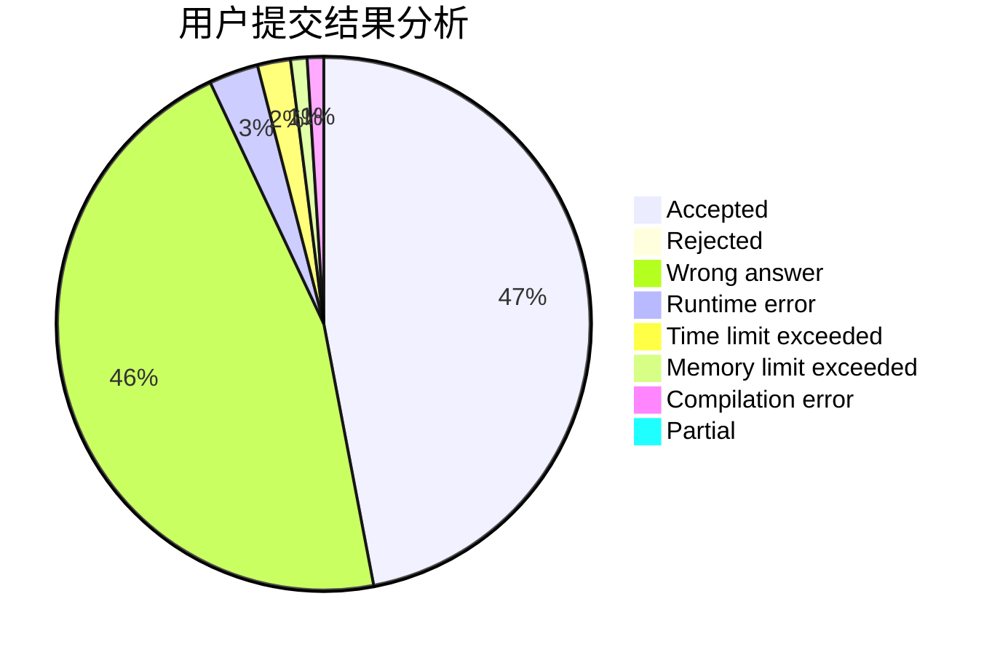
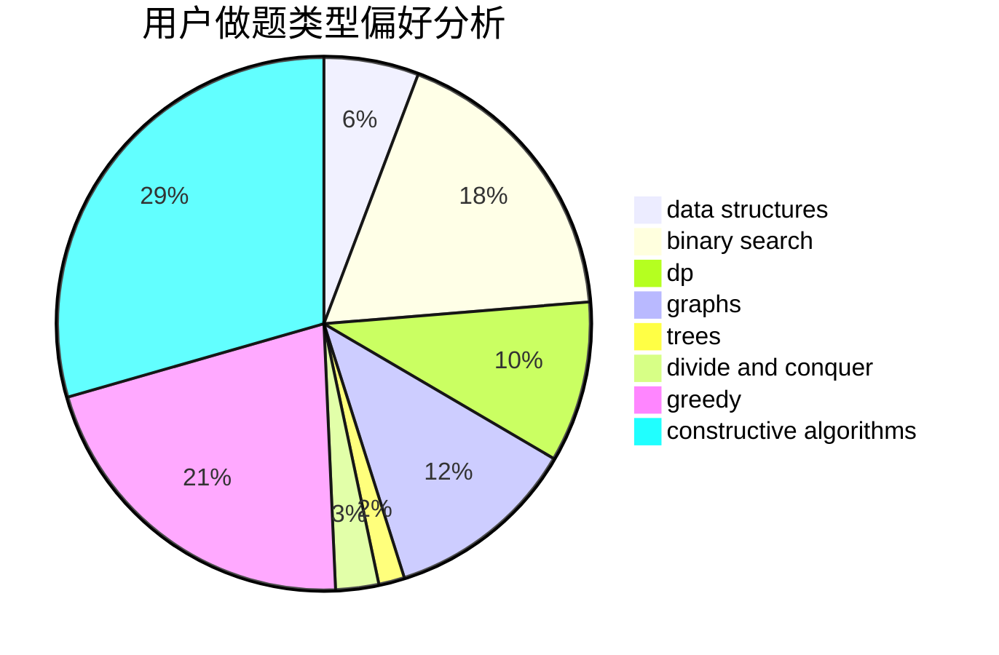
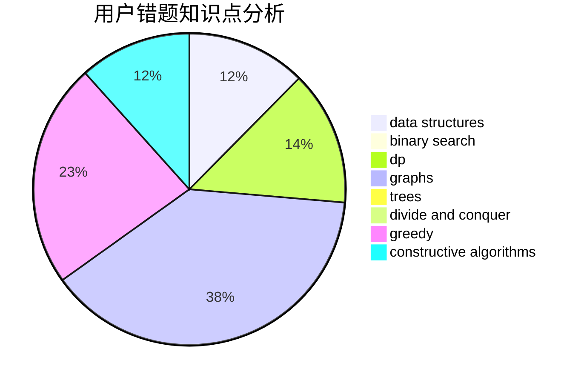

# Dancepted

<!-- tabs:start -->

#### **用户提交结果分析**

#### **用户做题类型偏好分析**

#### **用户错题知识点分析**

<!-- tabs:end -->
# 推荐题目
[767C](https://codeforces.com/contest/767/problem/C)		dfs and similar,
                        graphs,
                        greedy,
                        trees		  
[577E](https://codeforces.com/contest/577/problem/E)		dsu,graphs,sortings,trees		  
[1254B1](https://codeforces.com/contest/1254B/problem/1)		constructive algorithms,
                        greedy,
                        math,
                        number theory,
                        ternary search,
                        two pointers		  
[1254B2](https://codeforces.com/contest/1254B/problem/2)		constructive algorithms,
                        greedy,
                        math,
                        number theory,
                        ternary search,
                        two pointers		  
[650A](https://codeforces.com/contest/650/problem/A)		data structures,
                        geometry,
                        math		  
[52A](https://codeforces.com/contest/52/problem/A)		implementation		  
[1255D](https://codeforces.com/contest/1255/problem/D)		dsu,graphs,sortings,trees		  
[1043F](https://codeforces.com/contest/1043/problem/F)		bitmasks,
                        combinatorics,
                        dp,
                        math,
                        number theory,
                        shortest paths		  
[768G](https://codeforces.com/contest/768/problem/G)		binary search,
                        data structures		  
[769A](https://codeforces.com/contest/769/problem/A)		*special problem,
                        implementation,
                        sortings		  
