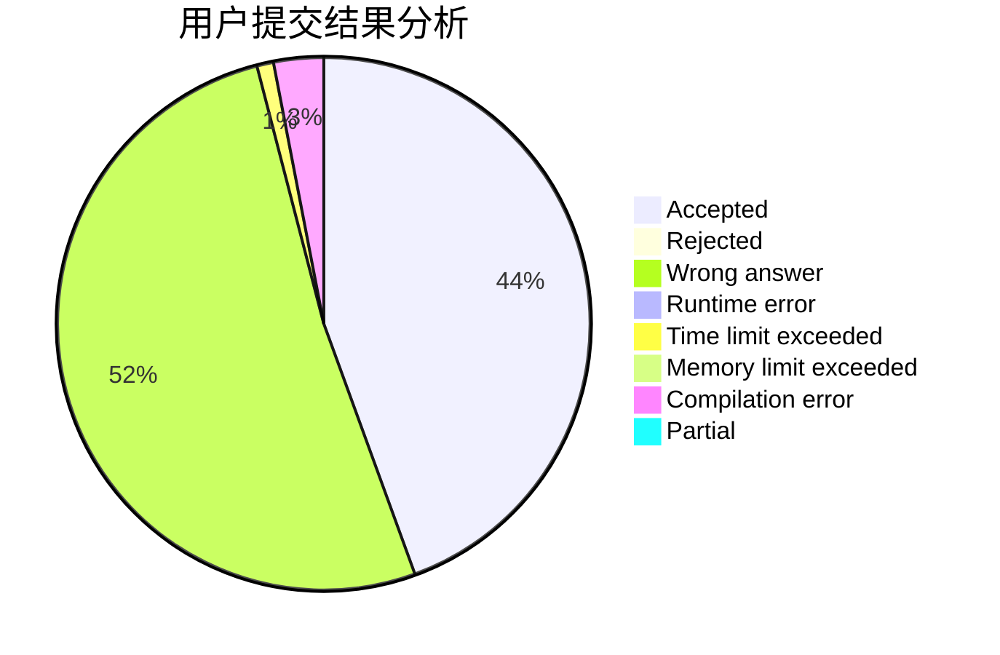
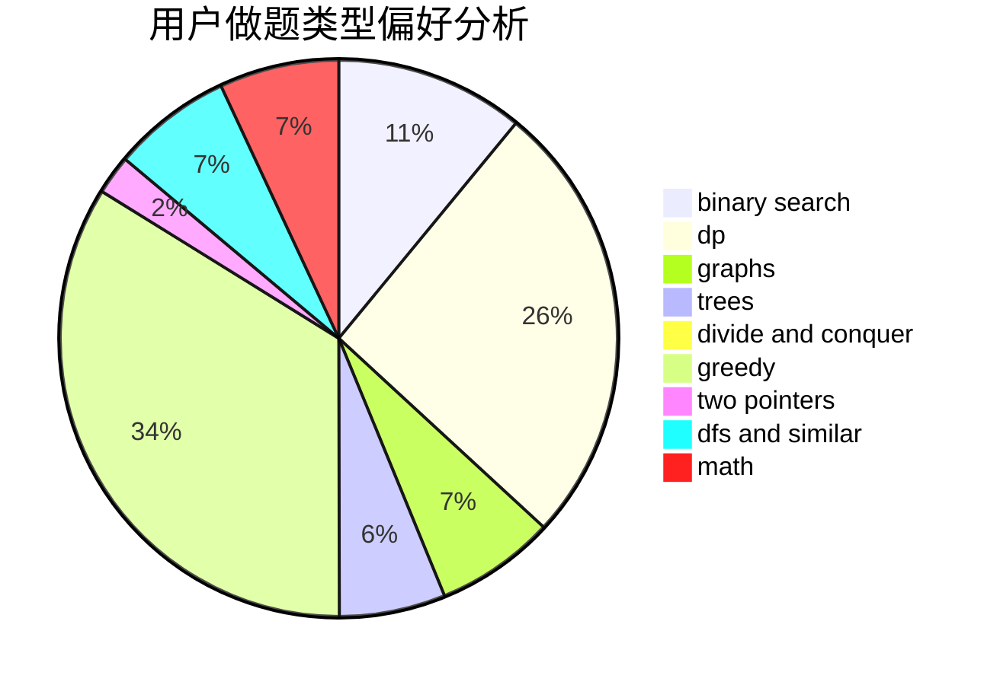

# Daniel-Y

<!-- tabs:start -->

#### **用户提交结果分析**

#### **用户做题类型偏好分析**

<!-- tabs:end -->
# 推荐题目
[1426C](https://codeforces.com/contest/1426/problem/C)
[789D](https://codeforces.com/contest/789/problem/D)
[494D](https://codeforces.com/contest/494/problem/D)
[650C](https://codeforces.com/contest/650/problem/C)
[333B](https://codeforces.com/contest/333/problem/B)
[459C](https://codeforces.com/contest/459/problem/C)
[516B](https://codeforces.com/contest/516/problem/B)
[1138F](https://codeforces.com/contest/1138/problem/F)
[1264C](https://codeforces.com/contest/1264/problem/C)
[1075A](https://codeforces.com/contest/1075/problem/A)
