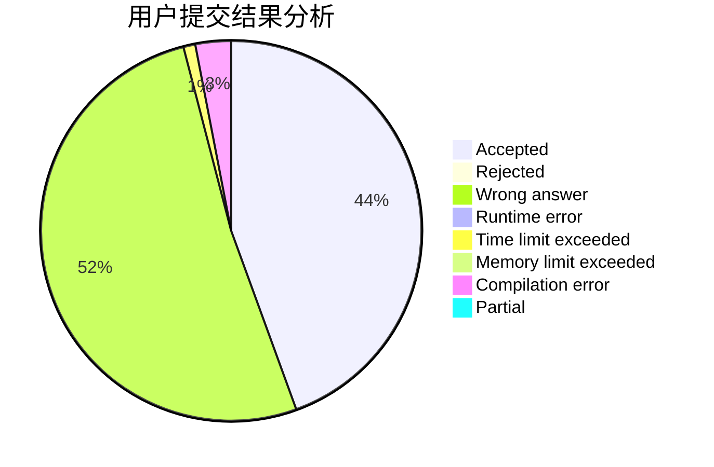
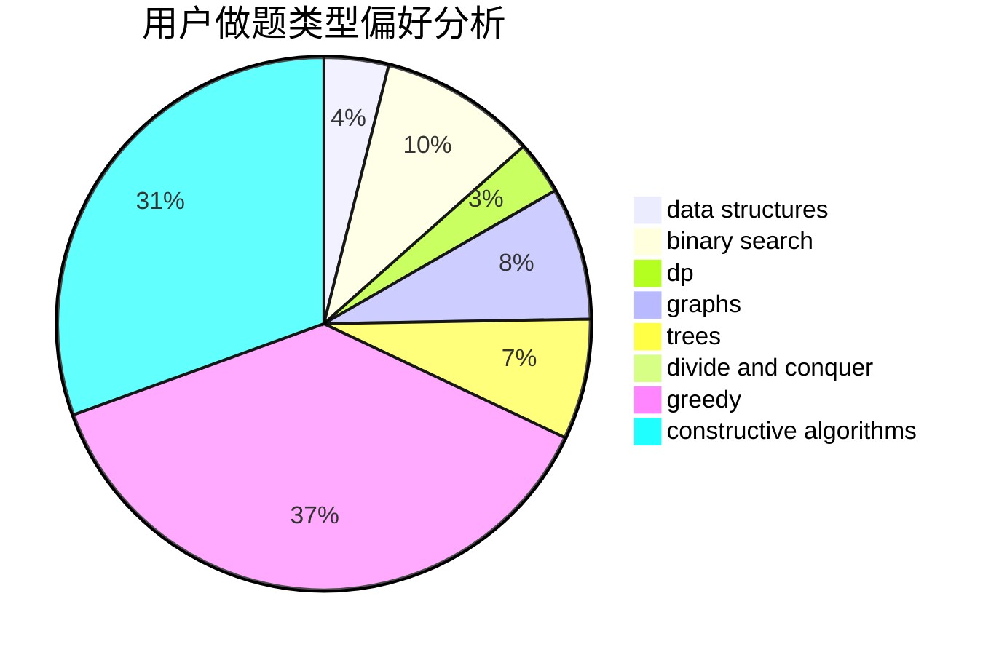
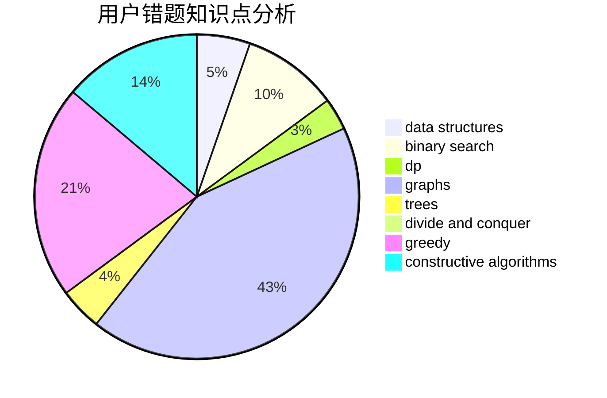

# Daniel-Y

<!-- tabs:start -->

#### **用户提交结果分析**

#### **用户做题类型偏好分析**

#### **用户错题知识点分析**

<!-- tabs:end -->
# 推荐题目
[1426C](https://codeforces.com/contest/1426/problem/C)		binary search,
                        constructive algorithms,
                        math		  
[789D](https://codeforces.com/contest/789/problem/D)		dsu,graphs,sortings,trees		  
[494D](https://codeforces.com/contest/494/problem/D)		data structures,
                        dfs and similar,
                        dp,
                        trees		  
[650C](https://codeforces.com/contest/650/problem/C)		dfs and similar,
                        dp,
                        dsu,
                        graphs,
                        greedy		  
[333B](https://codeforces.com/contest/333/problem/B)		greedy		  
[459C](https://codeforces.com/contest/459/problem/C)		combinatorics,
                        constructive algorithms,
                        math		  
[516B](https://codeforces.com/contest/516/problem/B)		dsu,graphs,sortings,trees		  
[1138F](https://codeforces.com/contest/1138/problem/F)		dsu,graphs,sortings,trees		  
[1264C](https://codeforces.com/contest/1264/problem/C)		data structures,
                        probabilities		  
[1075A](https://codeforces.com/contest/1075/problem/A)		implementation,
                        math		  
