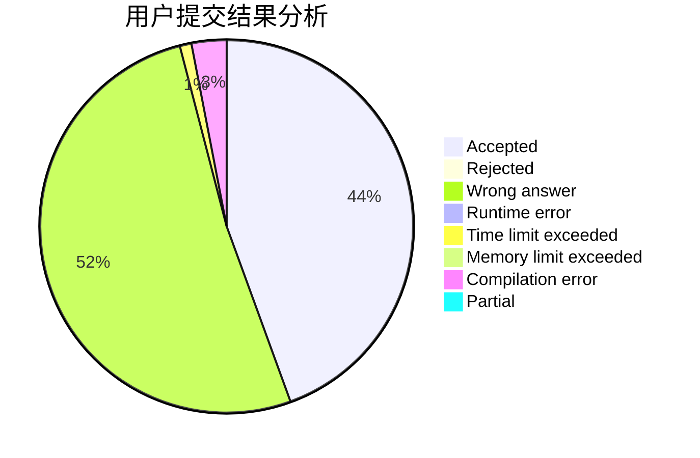
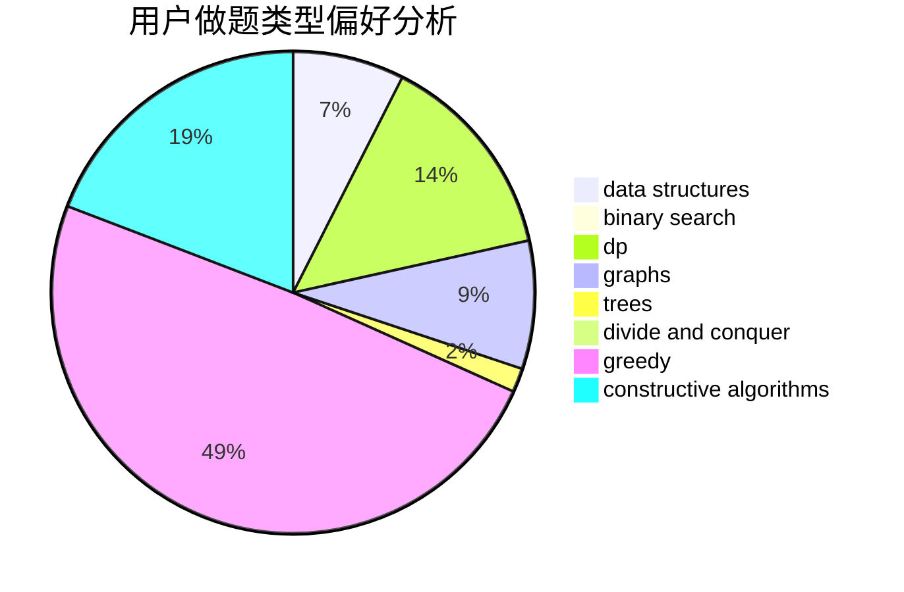
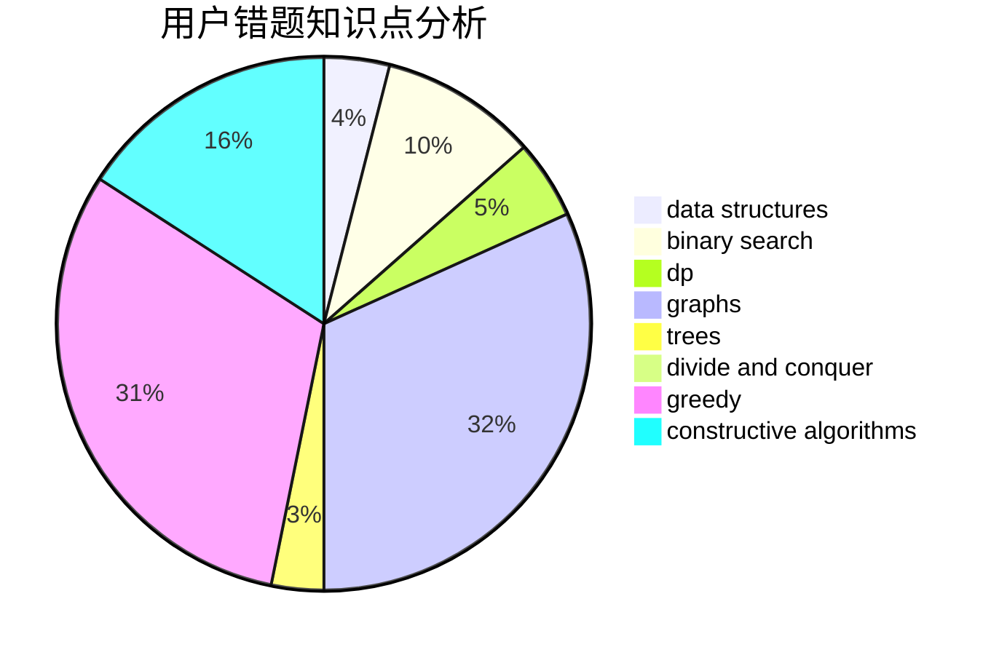

# Daniel-Y

<!-- tabs:start -->

#### **用户提交结果分析**

#### **用户做题类型偏好分析**

#### **用户错题知识点分析**

<!-- tabs:end -->
# 推荐题目
[1418F](https://codeforces.com/contest/1418/problem/F)		data structures,
                        math,
                        number theory,
                        two pointers		  
[76C](https://codeforces.com/contest/76/problem/C)		bitmasks,
                        dp,
                        math		  
[475F](https://codeforces.com/contest/475/problem/F)		data structures		  
[622C](https://codeforces.com/contest/622/problem/C)		data structures,
                        implementation		  
[30C](https://codeforces.com/contest/30/problem/C)		dp,
                        probabilities		  
[437A](https://codeforces.com/contest/437/problem/A)		implementation		  
[497A](https://codeforces.com/contest/497/problem/A)		dsu,graphs,sortings,trees		  
[1136D](https://codeforces.com/contest/1136/problem/D)		greedy		  
[1257C](https://codeforces.com/contest/1257/problem/C)		greedy,
                        implementation,
                        sortings,
                        strings,
                        two pointers		  
[1074A](https://codeforces.com/contest/1074/problem/A)		dsu,graphs,sortings,trees		  
