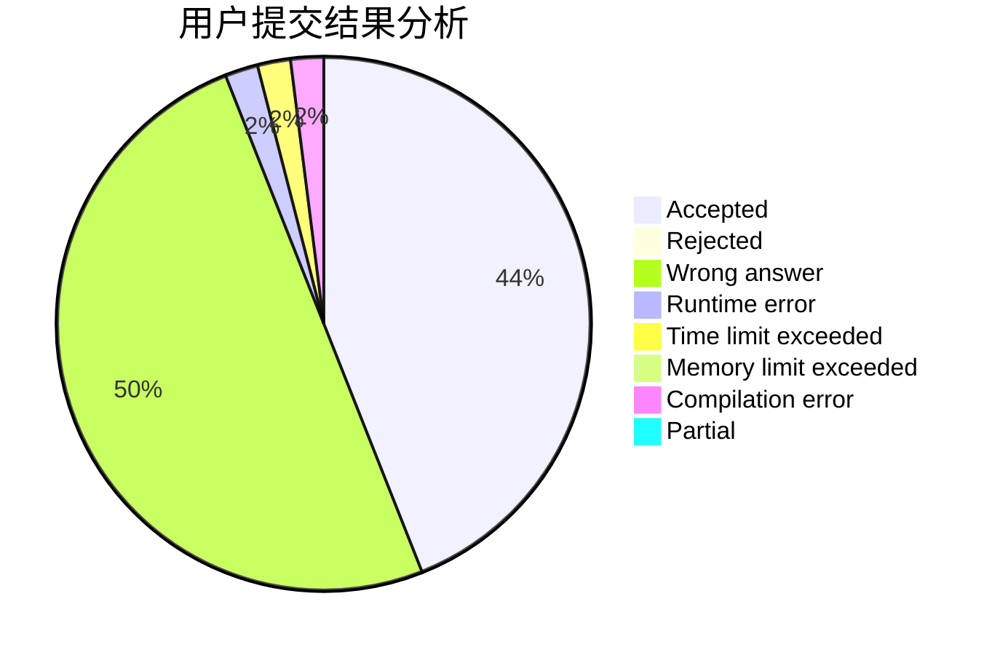
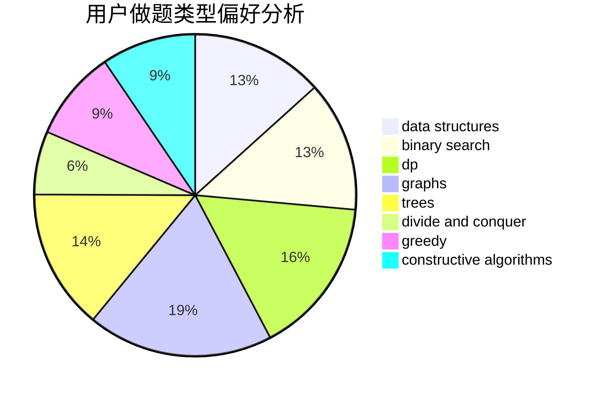

# Daniel22wiG

<!-- tabs:start -->

#### **用户提交结果分析**

#### **用户做题类型偏好分析**

#### **用户错题知识点分析**

<!-- tabs:end -->
# 推荐题目
[1479D](https://codeforces.com/contest/1479/problem/D)		binary search,
                        bitmasks,
                        brute force,
                        data structures,
                        probabilities,
                        trees		  
[18C](https://codeforces.com/contest/18/problem/C)		data structures,
                        implementation		  
[1447D](https://codeforces.com/contest/1447/problem/D)		dsu,graphs,sortings,trees		  
[11181](https://codeforces.com/contest/1118/problem/1)		dsu,graphs,sortings,trees		  
[791B](https://codeforces.com/contest/791/problem/B)		dsu,graphs,sortings,trees		  
[1051A](https://codeforces.com/contest/1051/problem/A)		greedy,
                        implementation,
                        strings		  
[624A](https://codeforces.com/contest/624/problem/A)		math		  
[678F](https://codeforces.com/contest/678/problem/F)		data structures,
                        divide and conquer,
                        geometry		  
[568A](https://codeforces.com/contest/568/problem/A)		brute force,
                        implementation,
                        math,
                        number theory		  
[790A](https://codeforces.com/contest/790/problem/A)		dsu,graphs,sortings,trees		  
