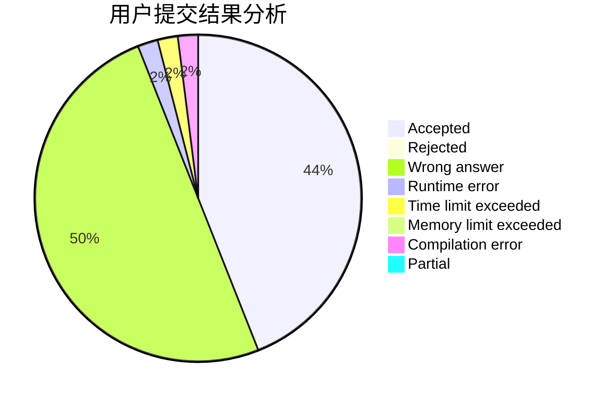
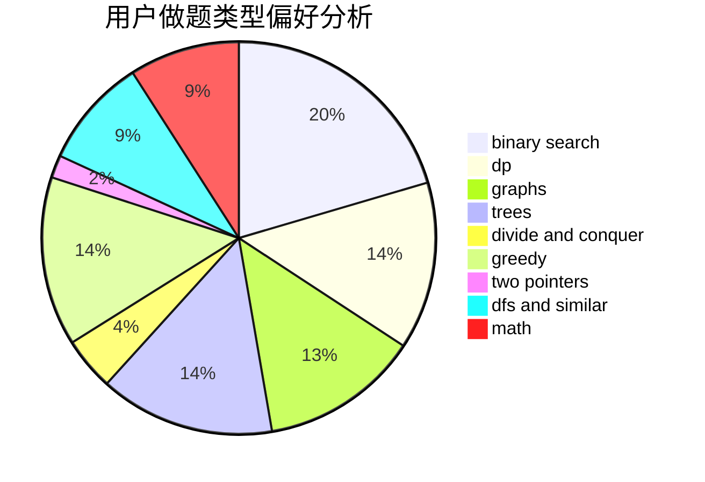

# Daniel22wiG

<!-- tabs:start -->

#### **用户提交结果分析**

#### **用户做题类型偏好分析**

<!-- tabs:end -->
# 推荐题目
[1479D](https://codeforces.com/contest/1479/problem/D)
[18C](https://codeforces.com/contest/18/problem/C)
[1447D](https://codeforces.com/contest/1447/problem/D)
[11181](https://codeforces.com/contest/1118/problem/1)
[791B](https://codeforces.com/contest/791/problem/B)
[1051A](https://codeforces.com/contest/1051/problem/A)
[624A](https://codeforces.com/contest/624/problem/A)
[678F](https://codeforces.com/contest/678/problem/F)
[568A](https://codeforces.com/contest/568/problem/A)
[790A](https://codeforces.com/contest/790/problem/A)
