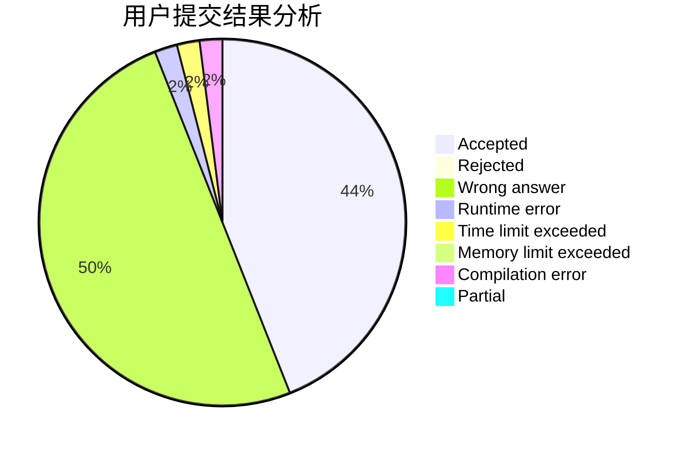
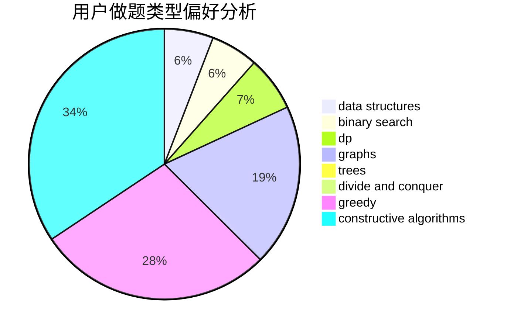

# Daniel22wiG

<!-- tabs:start -->

#### **用户提交结果分析**

#### **用户做题类型偏好分析**

#### **用户错题知识点分析**

<!-- tabs:end -->
# 推荐题目
[1471B](https://codeforces.com/contest/1471/problem/B)		brute force,
                        greedy,
                        implementation,
                        math		  
[165A](https://codeforces.com/contest/165/problem/A)		implementation		  
[1437G](https://codeforces.com/contest/1437/problem/G)		data structures,
                        string suffix structures,
                        strings,
                        trees		  
[1116C2](https://codeforces.com/contest/1116C/problem/2)		nan		  
[771C](https://codeforces.com/contest/771/problem/C)		dfs and similar,
                        dp,
                        trees		  
[1047B](https://codeforces.com/contest/1047/problem/B)		geometry,
                        math		  
[606A](https://codeforces.com/contest/606/problem/A)		implementation		  
[656F](https://codeforces.com/contest/656/problem/F)		*special problem		  
[543E](https://codeforces.com/contest/543/problem/E)		constructive algorithms,
                        data structures		  
[770B](https://codeforces.com/contest/770/problem/B)		*special problem,
                        implementation,
                        math		  
