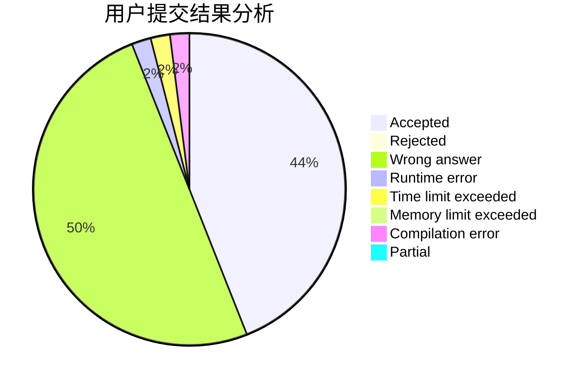
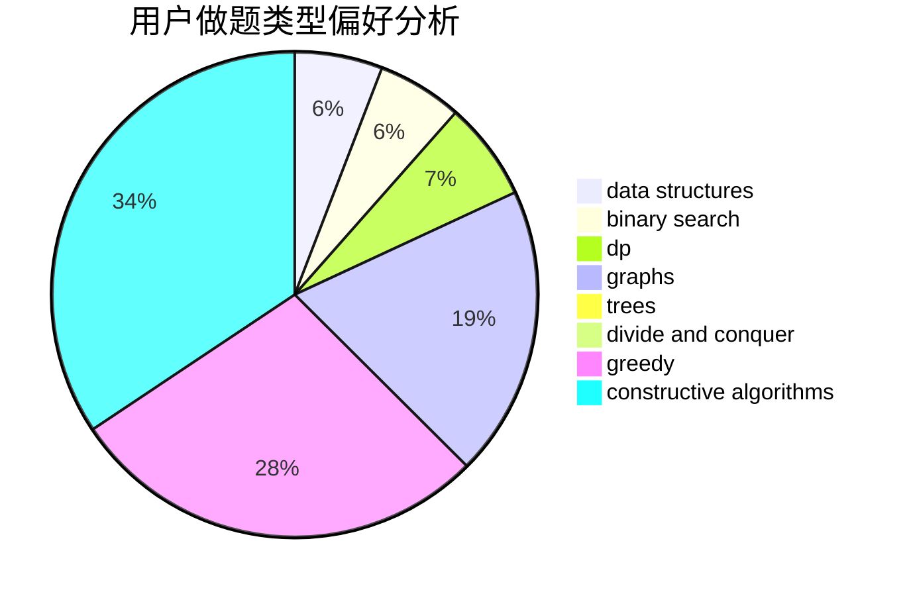

# Daniel22wiG
<!-- tabs:start -->
#### **用户提交结果分析**

#### **用户做题类型偏好分析**

#### **用户错题知识点分析**

<!-- tabs:end -->
# 推荐题目
[Strange List](http://codeforces.com/problemset/problem/1471/B)		brute force,
                        greedy,
                        implementation,
                        math		  
[The Great Hero](http://codeforces.com/problemset/problem/1480/B)		greedy,
                        implementation,
                        sortings		  
[Supercentral Point](http://codeforces.com/problemset/problem/165/A)		implementation		  
[Death DBMS](http://codeforces.com/problemset/problem/1437/G)		data structures,
                        string suffix structures,
                        strings,
                        trees		  
[Ace It!](http://codeforces.com/problemset/problem/656/F)		*special problem		  
[Magic Spheres](http://codeforces.com/problemset/problem/606/A)		implementation		  
[``Is the bit string periodic?'' oracle](http://codeforces.com/problemset/problem/1116/C2)		nan		  
[Plus and xor](http://codeforces.com/problemset/problem/76/D)		dp,
                        greedy,
                        math		  
[Listening to Music](http://codeforces.com/problemset/problem/543/E)		constructive algorithms,
                        data structures		  
[Rock-paper-scissors](http://codeforces.com/problemset/problem/48/A)		implementation,
                        schedules		  
<!-- tabs:start -->
#### **data structures**
[Death DBMS](http://codeforces.com/problemset/problem/1437/G)		data structures,
                        string suffix structures,
                        strings,
                        trees		  
[Listening to Music](http://codeforces.com/problemset/problem/543/E)		constructive algorithms,
                        data structures		  
[Acyclic Organic Compounds](http://codeforces.com/problemset/problem/601/D)		data structures,
                        dfs and similar,
                        dsu,
                        hashing,
                        strings,
                        trees		  
[Money Transfers](http://codeforces.com/problemset/problem/675/C)		constructive algorithms,
                        data structures,
                        greedy,
                        sortings		  
[Network Coverage](http://codeforces.com/problemset/problem/1373/F)		binary search,
                        constructive algorithms,
                        data structures,
                        greedy		  
[Modulo Sum](http://codeforces.com/problemset/problem/577/B)		combinatorics,
                        data structures,
                        dp,
                        two pointers		  
[Optimal Subsequences (Easy Version)](https://codeforces.com/contest/1262/problem/D1)		data structures,
                        greedy		  
[Editor](http://codeforces.com/problemset/problem/1263/E)		data structures,
                        implementation		  
[Copy or Prefix Sum](http://codeforces.com/problemset/problem/1485/F)		combinatorics,
                        data structures,
                        dp,
                        sortings		  
[Painting the Array I](https://codeforces.com/contest/1480/problem/D1)		constructive algorithms,
                        data structures,
                        dp,
                        greedy,
                        implementation		  
#### **binary search**
[Network Coverage](http://codeforces.com/problemset/problem/1373/F)		binary search,
                        constructive algorithms,
                        data structures,
                        greedy		  
[Fedya the Potter](http://codeforces.com/problemset/problem/1098/E)		binary search,
                        implementation,
                        math,
                        number theory		  
[Card Constructions](http://codeforces.com/problemset/problem/1345/B)		binary search,
                        brute force,
                        dp,
                        math		  
[Arson In Berland Forest](https://codeforces.com/contest/1262/problem/E)		binary search,
                        graphs,
                        graphs,
                        shortest paths		  
[Fly](http://codeforces.com/problemset/problem/1010/A)		binary search,
                        math		  
[Bulmart](http://codeforces.com/problemset/problem/730/C)		binary search,
                        dfs and similar		  
[Maximum width](http://codeforces.com/problemset/problem/1492/C)		binary search,
                        data structures,
                        dp,
                        greedy,
                        two pointers		  
[Pairs](http://codeforces.com/problemset/problem/1463/D)		binary search,
                        constructive algorithms,
                        greedy,
                        two pointers		  
[Old Floppy Drive](http://codeforces.com/problemset/problem/1490/G)		binary search,
                        data structures,
                        math		  
[Odd Mineral Resource](http://codeforces.com/problemset/problem/1479/D)		binary search,
                        bitmasks,
                        brute force,
                        data structures,
                        probabilities,
                        trees		  
#### **dp**
[Plus and xor](http://codeforces.com/problemset/problem/76/D)		dp,
                        greedy,
                        math		  
[Wrong Answer on test 233 (Easy Version)](https://codeforces.com/contest/1262/problem/F1)		dp		  
[Bear and Tree Jumps](http://codeforces.com/problemset/problem/771/C)		dfs and similar,
                        dp,
                        trees		  
[Card Constructions](http://codeforces.com/problemset/problem/1345/B)		binary search,
                        brute force,
                        dp,
                        math		  
[Bracket Substring](http://codeforces.com/problemset/problem/1015/F)		dp,
                        strings		  
[Modulo Sum](http://codeforces.com/problemset/problem/577/B)		combinatorics,
                        data structures,
                        dp,
                        two pointers		  
[Tournament](http://codeforces.com/problemset/problem/1260/E)		brute force,
                        dp,
                        greedy		  
[Copy or Prefix Sum](http://codeforces.com/problemset/problem/1485/F)		combinatorics,
                        data structures,
                        dp,
                        sortings		  
[Painting the Array I](https://codeforces.com/contest/1480/problem/D1)		constructive algorithms,
                        data structures,
                        dp,
                        greedy,
                        implementation		  
[Vladislav and a Great Legend](http://codeforces.com/problemset/problem/1097/G)		combinatorics,
                        dp,
                        trees		  
#### **graph**
[Online Courses In BSU](http://codeforces.com/problemset/problem/770/C)		*special problem,
                        dfs and similar,
                        graphs,
                        implementation		  
[Arson In Berland Forest](https://codeforces.com/contest/1262/problem/E)		binary search,
                        graphs,
                        graphs,
                        shortest paths		  
[Minimum Ties](http://codeforces.com/problemset/problem/1487/C)		brute force,
                        constructive algorithms,
                        dfs and similar,
                        graphs,
                        greedy,
                        implementation,
                        math		  
[Chef Monocarp](http://codeforces.com/problemset/problem/1437/C)		dp,
                        flows,
                        graph matchings,
                        greedy,
                        math,
                        sortings		  
[Strange Housing](http://codeforces.com/problemset/problem/1470/D)		constructive algorithms,
                        dfs and similar,
                        graph matchings,
                        graphs,
                        greedy		  
[Longest Simple Cycle](http://codeforces.com/problemset/problem/1476/C)		dp,
                        graphs,
                        greedy		  
[Shortest and Longest LIS](http://codeforces.com/problemset/problem/1304/D)		constructive algorithms,
                        graphs,
                        greedy,
                        two pointers		  
[Ball in Berland](http://codeforces.com/problemset/problem/1475/C)		combinatorics,
                        graphs,
                        math		  
[Kyoya and Train](http://codeforces.com/problemset/problem/553/E)		dp,
                        fft,
                        graphs,
                        math,
                        probabilities		  
[Garden of the Sun](http://codeforces.com/problemset/problem/1495/C)		constructive algorithms,
                        graphs		  
#### **trees**
[Death DBMS](http://codeforces.com/problemset/problem/1437/G)		data structures,
                        string suffix structures,
                        strings,
                        trees		  
[Bear and Tree Jumps](http://codeforces.com/problemset/problem/771/C)		dfs and similar,
                        dp,
                        trees		  
[Acyclic Organic Compounds](http://codeforces.com/problemset/problem/601/D)		data structures,
                        dfs and similar,
                        dsu,
                        hashing,
                        strings,
                        trees		  
[Xor-tree](https://codeforces.com/contest/430/problem/C)		dfs and similar,
                        trees		  
[Vladislav and a Great Legend](http://codeforces.com/problemset/problem/1097/G)		combinatorics,
                        dp,
                        trees		  
[Odd Mineral Resource](http://codeforces.com/problemset/problem/1479/D)		binary search,
                        bitmasks,
                        brute force,
                        data structures,
                        probabilities,
                        trees		  
[Yet Another Card Deck](http://codeforces.com/problemset/problem/1511/C)		brute force,
                        data structures,
                        implementation,
                        trees		  
[Diameter Cuts](http://codeforces.com/problemset/problem/1499/F)		combinatorics,
                        dfs and similar,
                        dp,
                        trees		  
[Fib-tree](http://codeforces.com/problemset/problem/1491/E)		brute force,
                        dfs and similar,
                        divide and conquer,
                        number theory,
                        trees		  
[13th Labour of Heracles](http://codeforces.com/problemset/problem/1466/D)		data structures,
                        greedy,
                        sortings,
                        trees		  
#### **divide and conquer**
[Divide and Summarize](http://codeforces.com/problemset/problem/1461/D)		binary search,
                        brute force,
                        data structures,
                        divide and conquer,
                        implementation,
                        sortings		  
[Song of the Sirens](http://codeforces.com/problemset/problem/1466/G)		combinatorics,
                        divide and conquer,
                        hashing,
                        math,
                        string suffix structures,
                        strings		  
[Permutation Transformation](http://codeforces.com/problemset/problem/1490/D)		dfs and similar,
                        divide and conquer,
                        implementation		  
[Skyline Photo](https://codeforces.com/contest/1483/problem/C)		data structures,
                        divide and conquer,
                        dp		  
[Fib-tree](http://codeforces.com/problemset/problem/1491/E)		brute force,
                        dfs and similar,
                        divide and conquer,
                        number theory,
                        trees		  
[Sum of Prefix Sums](http://codeforces.com/problemset/problem/1303/G)		data structures,
                        divide and conquer,
                        geometry,
                        trees		  
[Dogeforces](http://codeforces.com/problemset/problem/1494/D)		constructive algorithms,
                        data structures,
                        dfs and similar,
                        divide and conquer,
                        dsu,
                        greedy,
                        sortings,
                        trees		  
[Logistical Questions](http://codeforces.com/problemset/problem/566/C)		dfs and similar,
                        divide and conquer,
                        trees		  
[Fruit Sequences](http://codeforces.com/problemset/problem/1428/F)		binary search,
                        data structures,
                        divide and conquer,
                        dp,
                        two pointers		  
[Dr. Evil Underscores](http://codeforces.com/problemset/problem/1285/D)		bitmasks,
                        brute force,
                        dfs and similar,
                        divide and conquer,
                        dp,
                        greedy,
                        strings,
                        trees		  
#### **greedy**
[Strange List](http://codeforces.com/problemset/problem/1471/B)		brute force,
                        greedy,
                        implementation,
                        math		  
[The Great Hero](http://codeforces.com/problemset/problem/1480/B)		greedy,
                        implementation,
                        sortings		  
[Plus and xor](http://codeforces.com/problemset/problem/76/D)		dp,
                        greedy,
                        math		  
[Money Transfers](http://codeforces.com/problemset/problem/675/C)		constructive algorithms,
                        data structures,
                        greedy,
                        sortings		  
[Network Coverage](http://codeforces.com/problemset/problem/1373/F)		binary search,
                        constructive algorithms,
                        data structures,
                        greedy		  
[Elections](http://codeforces.com/problemset/problem/1019/A)		brute force,
                        greedy		  
[Optimal Subsequences (Easy Version)](https://codeforces.com/contest/1262/problem/D1)		data structures,
                        greedy		  
[Yet Another Bookshelf](http://codeforces.com/problemset/problem/1433/B)		greedy,
                        implementation		  
[Tournament](http://codeforces.com/problemset/problem/1260/E)		brute force,
                        dp,
                        greedy		  
[Beautiful String](http://codeforces.com/problemset/problem/1265/A)		constructive algorithms,
                        greedy		  
#### **constructive algorithms**
[Listening to Music](http://codeforces.com/problemset/problem/543/E)		constructive algorithms,
                        data structures		  
[Money Transfers](http://codeforces.com/problemset/problem/675/C)		constructive algorithms,
                        data structures,
                        greedy,
                        sortings		  
[Network Coverage](http://codeforces.com/problemset/problem/1373/F)		binary search,
                        constructive algorithms,
                        data structures,
                        greedy		  
[Messy](https://codeforces.com/contest/1261/problem/A)		constructive algorithms		  
[Lexicography](http://codeforces.com/problemset/problem/1267/L)		constructive algorithms,
                        strings		  
[Beautiful String](http://codeforces.com/problemset/problem/1265/A)		constructive algorithms,
                        greedy		  
[Painting the Array I](https://codeforces.com/contest/1480/problem/D1)		constructive algorithms,
                        data structures,
                        dp,
                        greedy,
                        implementation		  
[Putting Bricks in the Wall](http://codeforces.com/problemset/problem/1421/B)		constructive algorithms,
                        implementation		  
[Anti-knapsack](http://codeforces.com/problemset/problem/1493/A)		constructive algorithms,
                        greedy		  
[Pairs](http://codeforces.com/problemset/problem/1463/D)		binary search,
                        constructive algorithms,
                        greedy,
                        two pointers		  
#### **sortings**
[The Great Hero](http://codeforces.com/problemset/problem/1480/B)		greedy,
                        implementation,
                        sortings		  
[Money Transfers](http://codeforces.com/problemset/problem/675/C)		constructive algorithms,
                        data structures,
                        greedy,
                        sortings		  
[Copy or Prefix Sum](http://codeforces.com/problemset/problem/1485/F)		combinatorics,
                        data structures,
                        dp,
                        sortings		  
[Diamond Miner](https://codeforces.com/contest/1496/problem/C)		geometry,
                        greedy,
                        math,
                        sortings		  
[Meximization](http://codeforces.com/problemset/problem/1497/A)		brute force,
                        data structures,
                        greedy,
                        sortings		  
[Avoiding Zero](http://codeforces.com/problemset/problem/1427/A)		math,
                        sortings		  
[Divide and Summarize](http://codeforces.com/problemset/problem/1461/D)		binary search,
                        brute force,
                        data structures,
                        divide and conquer,
                        implementation,
                        sortings		  
[Chef Monocarp](http://codeforces.com/problemset/problem/1437/C)		dp,
                        flows,
                        graph matchings,
                        greedy,
                        math,
                        sortings		  
[Replacing Elements](http://codeforces.com/problemset/problem/1473/A)		greedy,
                        implementation,
                        math,
                        sortings		  
[Eastern Exhibition](http://codeforces.com/problemset/problem/1486/B)		binary search,
                        geometry,
                        shortest paths,
                        sortings		  
<!-- tabs:end -->
