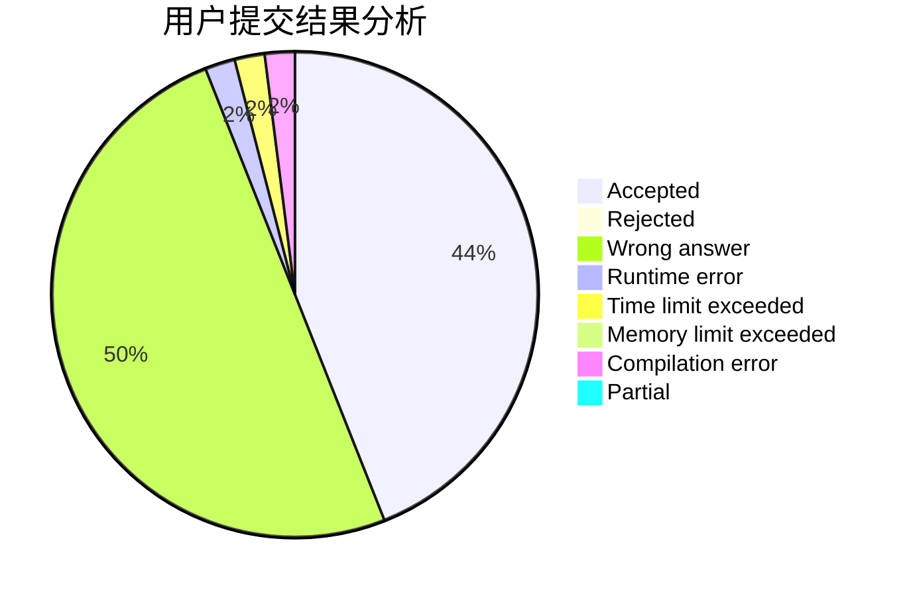
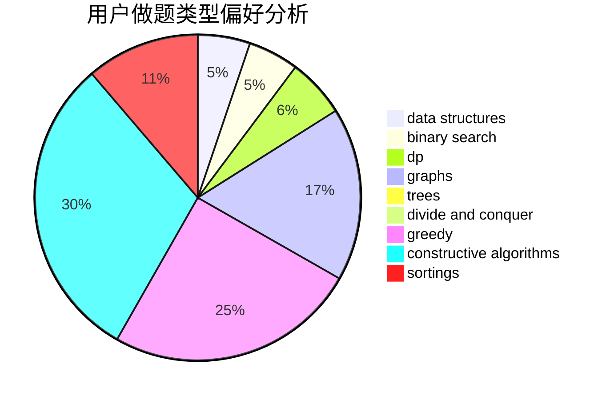

# Daniel22wiG
<!-- tabs:start -->
#### **用户提交结果分析**

#### **用户做题类型偏好分析**

#### **用户错题知识点分析**

<!-- tabs:end -->
# 推荐题目
[1471B](http://codeforces.com/problemset/problem/1471/B)		brute force,
                        greedy,
                        implementation,
                        math		  
[1480B](http://codeforces.com/problemset/problem/1480/B)		greedy,
                        implementation,
                        sortings		  
[165A](http://codeforces.com/problemset/problem/165/A)		implementation		  
[1437G](http://codeforces.com/problemset/problem/1437/G)		data structures,
                        string suffix structures,
                        strings,
                        trees		  
[656F](http://codeforces.com/problemset/problem/656/F)		*special problem		  
[606A](http://codeforces.com/problemset/problem/606/A)		implementation		  
[1116C2](http://codeforces.com/problemset/problem/1116/C2)		nan		  
[76D](http://codeforces.com/problemset/problem/76/D)		dp,
                        greedy,
                        math		  
[543E](http://codeforces.com/problemset/problem/543/E)		constructive algorithms,
                        data structures		  
[48A](http://codeforces.com/problemset/problem/48/A)		implementation,
                        schedules		  
<!-- tabs:start -->
#### **data structures**
[1437G](http://codeforces.com/problemset/problem/1437/G)		data structures,
                        string suffix structures,
                        strings,
                        trees		  
[543E](http://codeforces.com/problemset/problem/543/E)		constructive algorithms,
                        data structures		  
[601D](http://codeforces.com/problemset/problem/601/D)		data structures,
                        dfs and similar,
                        dsu,
                        hashing,
                        strings,
                        trees		  
[675C](http://codeforces.com/problemset/problem/675/C)		constructive algorithms,
                        data structures,
                        greedy,
                        sortings		  
[1373F](http://codeforces.com/problemset/problem/1373/F)		binary search,
                        constructive algorithms,
                        data structures,
                        greedy		  
[577B](http://codeforces.com/problemset/problem/577/B)		combinatorics,
                        data structures,
                        dp,
                        two pointers		  
[1262D1](https://codeforces.com/contest/1262/problem/D1)		data structures,
                        greedy		  
[1263E](http://codeforces.com/problemset/problem/1263/E)		data structures,
                        implementation		  
[1485F](http://codeforces.com/problemset/problem/1485/F)		combinatorics,
                        data structures,
                        dp,
                        sortings		  
[1480D1](https://codeforces.com/contest/1480/problem/D1)		constructive algorithms,
                        data structures,
                        dp,
                        greedy,
                        implementation		  
#### **binary search**
[1373F](http://codeforces.com/problemset/problem/1373/F)		binary search,
                        constructive algorithms,
                        data structures,
                        greedy		  
[1098E](http://codeforces.com/problemset/problem/1098/E)		binary search,
                        implementation,
                        math,
                        number theory		  
[1345B](http://codeforces.com/problemset/problem/1345/B)		binary search,
                        brute force,
                        dp,
                        math		  
[1262E](https://codeforces.com/contest/1262/problem/E)		binary search,
                        graphs,
                        graphs,
                        shortest paths		  
[1010A](http://codeforces.com/problemset/problem/1010/A)		binary search,
                        math		  
[730C](http://codeforces.com/problemset/problem/730/C)		binary search,
                        dfs and similar		  
[1492C](http://codeforces.com/problemset/problem/1492/C)		binary search,
                        data structures,
                        dp,
                        greedy,
                        two pointers		  
[1463D](http://codeforces.com/problemset/problem/1463/D)		binary search,
                        constructive algorithms,
                        greedy,
                        two pointers		  
[1490G](http://codeforces.com/problemset/problem/1490/G)		binary search,
                        data structures,
                        math		  
[1479D](http://codeforces.com/problemset/problem/1479/D)		binary search,
                        bitmasks,
                        brute force,
                        data structures,
                        probabilities,
                        trees		  
#### **dp**
[76D](http://codeforces.com/problemset/problem/76/D)		dp,
                        greedy,
                        math		  
[1262F1](https://codeforces.com/contest/1262/problem/F1)		dp		  
[771C](http://codeforces.com/problemset/problem/771/C)		dfs and similar,
                        dp,
                        trees		  
[1345B](http://codeforces.com/problemset/problem/1345/B)		binary search,
                        brute force,
                        dp,
                        math		  
[1015F](http://codeforces.com/problemset/problem/1015/F)		dp,
                        strings		  
[577B](http://codeforces.com/problemset/problem/577/B)		combinatorics,
                        data structures,
                        dp,
                        two pointers		  
[1260E](http://codeforces.com/problemset/problem/1260/E)		brute force,
                        dp,
                        greedy		  
[1485F](http://codeforces.com/problemset/problem/1485/F)		combinatorics,
                        data structures,
                        dp,
                        sortings		  
[1480D1](https://codeforces.com/contest/1480/problem/D1)		constructive algorithms,
                        data structures,
                        dp,
                        greedy,
                        implementation		  
[1097G](http://codeforces.com/problemset/problem/1097/G)		combinatorics,
                        dp,
                        trees		  
#### **graph**
[770C](http://codeforces.com/problemset/problem/770/C)		*special problem,
                        dfs and similar,
                        graphs,
                        implementation		  
[1262E](https://codeforces.com/contest/1262/problem/E)		binary search,
                        graphs,
                        graphs,
                        shortest paths		  
[1487C](http://codeforces.com/problemset/problem/1487/C)		brute force,
                        constructive algorithms,
                        dfs and similar,
                        graphs,
                        greedy,
                        implementation,
                        math		  
[1437C](http://codeforces.com/problemset/problem/1437/C)		dp,
                        flows,
                        graph matchings,
                        greedy,
                        math,
                        sortings		  
[1470D](http://codeforces.com/problemset/problem/1470/D)		constructive algorithms,
                        dfs and similar,
                        graph matchings,
                        graphs,
                        greedy		  
[1476C](http://codeforces.com/problemset/problem/1476/C)		dp,
                        graphs,
                        greedy		  
[1304D](http://codeforces.com/problemset/problem/1304/D)		constructive algorithms,
                        graphs,
                        greedy,
                        two pointers		  
[1475C](http://codeforces.com/problemset/problem/1475/C)		combinatorics,
                        graphs,
                        math		  
[553E](http://codeforces.com/problemset/problem/553/E)		dp,
                        fft,
                        graphs,
                        math,
                        probabilities		  
[1495C](http://codeforces.com/problemset/problem/1495/C)		constructive algorithms,
                        graphs		  
#### **trees**
[1437G](http://codeforces.com/problemset/problem/1437/G)		data structures,
                        string suffix structures,
                        strings,
                        trees		  
[771C](http://codeforces.com/problemset/problem/771/C)		dfs and similar,
                        dp,
                        trees		  
[601D](http://codeforces.com/problemset/problem/601/D)		data structures,
                        dfs and similar,
                        dsu,
                        hashing,
                        strings,
                        trees		  
[430C](https://codeforces.com/contest/430/problem/C)		dfs and similar,
                        trees		  
[1097G](http://codeforces.com/problemset/problem/1097/G)		combinatorics,
                        dp,
                        trees		  
[1479D](http://codeforces.com/problemset/problem/1479/D)		binary search,
                        bitmasks,
                        brute force,
                        data structures,
                        probabilities,
                        trees		  
[1511C](http://codeforces.com/problemset/problem/1511/C)		brute force,
                        data structures,
                        implementation,
                        trees		  
[1499F](http://codeforces.com/problemset/problem/1499/F)		combinatorics,
                        dfs and similar,
                        dp,
                        trees		  
[1491E](http://codeforces.com/problemset/problem/1491/E)		brute force,
                        dfs and similar,
                        divide and conquer,
                        number theory,
                        trees		  
[1466D](http://codeforces.com/problemset/problem/1466/D)		data structures,
                        greedy,
                        sortings,
                        trees		  
#### **divide and conquer**
[1461D](http://codeforces.com/problemset/problem/1461/D)		binary search,
                        brute force,
                        data structures,
                        divide and conquer,
                        implementation,
                        sortings		  
[1466G](http://codeforces.com/problemset/problem/1466/G)		combinatorics,
                        divide and conquer,
                        hashing,
                        math,
                        string suffix structures,
                        strings		  
[1490D](http://codeforces.com/problemset/problem/1490/D)		dfs and similar,
                        divide and conquer,
                        implementation		  
[1483C](https://codeforces.com/contest/1483/problem/C)		data structures,
                        divide and conquer,
                        dp		  
[1491E](http://codeforces.com/problemset/problem/1491/E)		brute force,
                        dfs and similar,
                        divide and conquer,
                        number theory,
                        trees		  
[1303G](http://codeforces.com/problemset/problem/1303/G)		data structures,
                        divide and conquer,
                        geometry,
                        trees		  
[1494D](http://codeforces.com/problemset/problem/1494/D)		constructive algorithms,
                        data structures,
                        dfs and similar,
                        divide and conquer,
                        dsu,
                        greedy,
                        sortings,
                        trees		  
[1482E](http://codeforces.com/problemset/problem/1482/E)		data structures,
                        divide and conquer,
                        dp		  
[566C](http://codeforces.com/problemset/problem/566/C)		dfs and similar,
                        divide and conquer,
                        trees		  
[1428F](http://codeforces.com/problemset/problem/1428/F)		binary search,
                        data structures,
                        divide and conquer,
                        dp,
                        two pointers		  
#### **greedy**
[1471B](http://codeforces.com/problemset/problem/1471/B)		brute force,
                        greedy,
                        implementation,
                        math		  
[1480B](http://codeforces.com/problemset/problem/1480/B)		greedy,
                        implementation,
                        sortings		  
[76D](http://codeforces.com/problemset/problem/76/D)		dp,
                        greedy,
                        math		  
[675C](http://codeforces.com/problemset/problem/675/C)		constructive algorithms,
                        data structures,
                        greedy,
                        sortings		  
[1373F](http://codeforces.com/problemset/problem/1373/F)		binary search,
                        constructive algorithms,
                        data structures,
                        greedy		  
[1019A](http://codeforces.com/problemset/problem/1019/A)		brute force,
                        greedy		  
[1262D1](https://codeforces.com/contest/1262/problem/D1)		data structures,
                        greedy		  
[1433B](http://codeforces.com/problemset/problem/1433/B)		greedy,
                        implementation		  
[1260E](http://codeforces.com/problemset/problem/1260/E)		brute force,
                        dp,
                        greedy		  
[1265A](http://codeforces.com/problemset/problem/1265/A)		constructive algorithms,
                        greedy		  
#### **constructive algorithms**
[543E](http://codeforces.com/problemset/problem/543/E)		constructive algorithms,
                        data structures		  
[675C](http://codeforces.com/problemset/problem/675/C)		constructive algorithms,
                        data structures,
                        greedy,
                        sortings		  
[1373F](http://codeforces.com/problemset/problem/1373/F)		binary search,
                        constructive algorithms,
                        data structures,
                        greedy		  
[1261A](https://codeforces.com/contest/1261/problem/A)		constructive algorithms		  
[1267L](http://codeforces.com/problemset/problem/1267/L)		constructive algorithms,
                        strings		  
[1265A](http://codeforces.com/problemset/problem/1265/A)		constructive algorithms,
                        greedy		  
[1480D1](https://codeforces.com/contest/1480/problem/D1)		constructive algorithms,
                        data structures,
                        dp,
                        greedy,
                        implementation		  
[1421B](http://codeforces.com/problemset/problem/1421/B)		constructive algorithms,
                        implementation		  
[1493A](http://codeforces.com/problemset/problem/1493/A)		constructive algorithms,
                        greedy		  
[1463D](http://codeforces.com/problemset/problem/1463/D)		binary search,
                        constructive algorithms,
                        greedy,
                        two pointers		  
#### **sortings**
[1480B](http://codeforces.com/problemset/problem/1480/B)		greedy,
                        implementation,
                        sortings		  
[675C](http://codeforces.com/problemset/problem/675/C)		constructive algorithms,
                        data structures,
                        greedy,
                        sortings		  
[1485F](http://codeforces.com/problemset/problem/1485/F)		combinatorics,
                        data structures,
                        dp,
                        sortings		  
[1496C](https://codeforces.com/contest/1496/problem/C)		geometry,
                        greedy,
                        math,
                        sortings		  
[1495A](http://codeforces.com/problemset/problem/1495/A)		geometry,
                        greedy,
                        math,
                        sortings		  
[1497A](http://codeforces.com/problemset/problem/1497/A)		brute force,
                        data structures,
                        greedy,
                        sortings		  
[1427A](http://codeforces.com/problemset/problem/1427/A)		math,
                        sortings		  
[1461D](http://codeforces.com/problemset/problem/1461/D)		binary search,
                        brute force,
                        data structures,
                        divide and conquer,
                        implementation,
                        sortings		  
[1437C](http://codeforces.com/problemset/problem/1437/C)		dp,
                        flows,
                        graph matchings,
                        greedy,
                        math,
                        sortings		  
[1473A](http://codeforces.com/problemset/problem/1473/A)		greedy,
                        implementation,
                        math,
                        sortings		  
<!-- tabs:end -->
