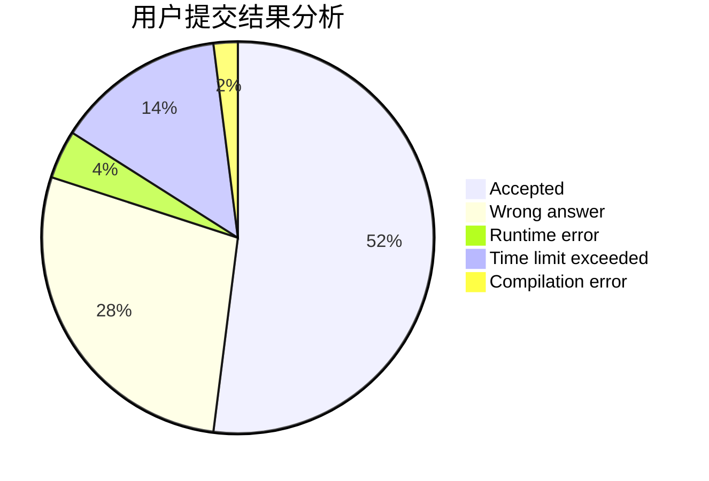
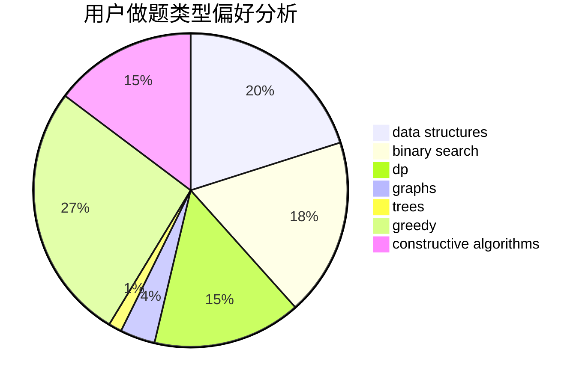

# Daniel_Jiang
<!-- tabs:start -->
#### **用户提交结果分析**

#### **用户做题类型偏好分析**

#### **用户错题知识点分析**

<!-- tabs:end -->
# 推荐题目
[Ski Accidents](http://codeforces.com/problemset/problem/1368/E)		constructive algorithms,
                        graphs,
                        greedy		  
[Showing Off](http://codeforces.com/problemset/problem/1416/F)		flows,
                        graph matchings,
                        greedy,
                        implementation		  
[Verifying Kingdom](http://codeforces.com/problemset/problem/772/E)		binary search,
                        divide and conquer,
                        interactive,
                        trees		  
[New Year Cards](http://codeforces.com/problemset/problem/140/B)		brute force,
                        greedy,
                        implementation		  
[Definite Game](http://codeforces.com/problemset/problem/1081/A)		constructive algorithms,
                        math		  
[A Trivial Problem](http://codeforces.com/problemset/problem/633/B)		brute force,
                        constructive algorithms,
                        math,
                        number theory		  
[Guess two numbers](http://codeforces.com/problemset/problem/1007/C)		binary search,
                        interactive		  
[Strange town](http://codeforces.com/problemset/problem/42/D)		constructive algorithms,
                        math		  
[Bear and Rectangle Strips](http://codeforces.com/problemset/problem/771/E)		dp,
                        greedy		  
[Wet Shark and Flowers](http://codeforces.com/problemset/problem/621/C)		combinatorics,
                        math,
                        number theory,
                        probabilities		  
<!-- tabs:start -->
#### **data structures**
[Dogecoin](http://codeforces.com/problemset/problem/1488/F)		*special problem,
                        *special problem,
                        binary search,
                        data structures		  
[Tiles for Bathroom](http://codeforces.com/problemset/problem/1500/D)		data structures,
                        sortings,
                        two pointers		  
[Maximum width](http://codeforces.com/problemset/problem/1492/C)		binary search,
                        data structures,
                        dp,
                        greedy,
                        two pointers		  
[Old Floppy Drive](http://codeforces.com/problemset/problem/1490/G)		binary search,
                        data structures,
                        math		  
[Odd Mineral Resource](http://codeforces.com/problemset/problem/1479/D)		binary search,
                        bitmasks,
                        brute force,
                        data structures,
                        probabilities,
                        trees		  
[Meximization](http://codeforces.com/problemset/problem/1497/A)		brute force,
                        data structures,
                        greedy,
                        sortings		  
[Pekora and Trampoline](http://codeforces.com/problemset/problem/1491/C)		brute force,
                        data structures,
                        dp,
                        greedy,
                        implementation		  
[Card Deck](http://codeforces.com/problemset/problem/1492/B)		data structures,
                        greedy,
                        math		  
[Complicated Computations](http://codeforces.com/problemset/problem/1436/E)		binary search,
                        data structures,
                        two pointers		  
[Divide and Summarize](http://codeforces.com/problemset/problem/1461/D)		binary search,
                        brute force,
                        data structures,
                        divide and conquer,
                        implementation,
                        sortings		  
#### **binary search**
[Verifying Kingdom](http://codeforces.com/problemset/problem/772/E)		binary search,
                        divide and conquer,
                        interactive,
                        trees		  
[Guess two numbers](http://codeforces.com/problemset/problem/1007/C)		binary search,
                        interactive		  
[Voltage Keepsake](http://codeforces.com/problemset/problem/772/A)		binary search,
                        math		  
[Dogecoin](http://codeforces.com/problemset/problem/1488/F)		*special problem,
                        *special problem,
                        binary search,
                        data structures		  
[Maximum width](http://codeforces.com/problemset/problem/1492/C)		binary search,
                        data structures,
                        dp,
                        greedy,
                        two pointers		  
[Pairs](http://codeforces.com/problemset/problem/1463/D)		binary search,
                        constructive algorithms,
                        greedy,
                        two pointers		  
[Old Floppy Drive](http://codeforces.com/problemset/problem/1490/G)		binary search,
                        data structures,
                        math		  
[Odd Mineral Resource](http://codeforces.com/problemset/problem/1479/D)		binary search,
                        bitmasks,
                        brute force,
                        data structures,
                        probabilities,
                        trees		  
[Complicated Computations](http://codeforces.com/problemset/problem/1436/E)		binary search,
                        data structures,
                        two pointers		  
[Divide and Summarize](http://codeforces.com/problemset/problem/1461/D)		binary search,
                        brute force,
                        data structures,
                        divide and conquer,
                        implementation,
                        sortings		  
#### **dp**
[Bear and Rectangle Strips](http://codeforces.com/problemset/problem/771/E)		dp,
                        greedy		  
[Chocolate Bar](http://codeforces.com/problemset/problem/598/E)		brute force,
                        dp		  
[Bear and Company](http://codeforces.com/problemset/problem/771/D)		dp		  
[Happy Cactus](http://codeforces.com/problemset/problem/1268/E)		dp		  
[Vulnerable Kerbals](http://codeforces.com/problemset/problem/772/C)		constructive algorithms,
                        dp,
                        graphs,
                        math,
                        number theory		  
[Compress String](http://codeforces.com/problemset/problem/1120/C)		dp,
                        strings		  
[Varying Kibibits](http://codeforces.com/problemset/problem/772/D)		bitmasks,
                        dp		  
[Maximum width](http://codeforces.com/problemset/problem/1492/C)		binary search,
                        data structures,
                        dp,
                        greedy,
                        two pointers		  
[Bouncing Ball](https://codeforces.com/contest/1457/problem/C)		brute force,
                        dp,
                        implementation		  
[Pekora and Trampoline](http://codeforces.com/problemset/problem/1491/C)		brute force,
                        data structures,
                        dp,
                        greedy,
                        implementation		  
#### **graph**
[Ski Accidents](http://codeforces.com/problemset/problem/1368/E)		constructive algorithms,
                        graphs,
                        greedy		  
[Showing Off](http://codeforces.com/problemset/problem/1416/F)		flows,
                        graph matchings,
                        greedy,
                        implementation		  
[Invertation in Tournament](http://codeforces.com/problemset/problem/1268/D)		brute force,
                        divide and conquer,
                        graphs,
                        math		  
[Secret Passwords](http://codeforces.com/problemset/problem/1263/D)		dfs and similar,
                        dsu,
                        graphs		  
[Vulnerable Kerbals](http://codeforces.com/problemset/problem/772/C)		constructive algorithms,
                        dp,
                        graphs,
                        math,
                        number theory		  
[Foolprüf Security](http://codeforces.com/problemset/problem/1267/F)		graphs		  
[King's Task](http://codeforces.com/problemset/problem/1510/K)		brute force,
                        graphs,
                        implementation		  
[Minimum Ties](http://codeforces.com/problemset/problem/1487/C)		brute force,
                        constructive algorithms,
                        dfs and similar,
                        graphs,
                        greedy,
                        implementation,
                        math		  
[Chef Monocarp](http://codeforces.com/problemset/problem/1437/C)		dp,
                        flows,
                        graph matchings,
                        greedy,
                        math,
                        sortings		  
[Strange Housing](http://codeforces.com/problemset/problem/1470/D)		constructive algorithms,
                        dfs and similar,
                        graph matchings,
                        graphs,
                        greedy		  
#### **trees**
[Verifying Kingdom](http://codeforces.com/problemset/problem/772/E)		binary search,
                        divide and conquer,
                        interactive,
                        trees		  
[Odd Mineral Resource](http://codeforces.com/problemset/problem/1479/D)		binary search,
                        bitmasks,
                        brute force,
                        data structures,
                        probabilities,
                        trees		  
[Yet Another Card Deck](http://codeforces.com/problemset/problem/1511/C)		brute force,
                        data structures,
                        implementation,
                        trees		  
[Diameter Cuts](http://codeforces.com/problemset/problem/1499/F)		combinatorics,
                        dfs and similar,
                        dp,
                        trees		  
[Fib-tree](http://codeforces.com/problemset/problem/1491/E)		brute force,
                        dfs and similar,
                        divide and conquer,
                        number theory,
                        trees		  
[13th Labour of Heracles](http://codeforces.com/problemset/problem/1466/D)		data structures,
                        greedy,
                        sortings,
                        trees		  
[BFS Trees](http://codeforces.com/problemset/problem/1495/D)		combinatorics,
                        dfs and similar,
                        graphs,
                        math,
                        shortest paths,
                        trees		  
[Sum of Prefix Sums](http://codeforces.com/problemset/problem/1303/G)		data structures,
                        divide and conquer,
                        geometry,
                        trees		  
[Number of Simple Paths](http://codeforces.com/problemset/problem/1454/E)		combinatorics,
                        dfs and similar,
                        graphs,
                        trees		  
[Dogeforces](http://codeforces.com/problemset/problem/1494/D)		constructive algorithms,
                        data structures,
                        dfs and similar,
                        divide and conquer,
                        dsu,
                        greedy,
                        sortings,
                        trees		  
#### **divide and conquer**
[Verifying Kingdom](http://codeforces.com/problemset/problem/772/E)		binary search,
                        divide and conquer,
                        interactive,
                        trees		  
[Invertation in Tournament](http://codeforces.com/problemset/problem/1268/D)		brute force,
                        divide and conquer,
                        graphs,
                        math		  
[Divide and Summarize](http://codeforces.com/problemset/problem/1461/D)		binary search,
                        brute force,
                        data structures,
                        divide and conquer,
                        implementation,
                        sortings		  
[Song of the Sirens](http://codeforces.com/problemset/problem/1466/G)		combinatorics,
                        divide and conquer,
                        hashing,
                        math,
                        string suffix structures,
                        strings		  
[Permutation Transformation](http://codeforces.com/problemset/problem/1490/D)		dfs and similar,
                        divide and conquer,
                        implementation		  
[Skyline Photo](https://codeforces.com/contest/1483/problem/C)		data structures,
                        divide and conquer,
                        dp		  
[Fib-tree](http://codeforces.com/problemset/problem/1491/E)		brute force,
                        dfs and similar,
                        divide and conquer,
                        number theory,
                        trees		  
[Sum of Prefix Sums](http://codeforces.com/problemset/problem/1303/G)		data structures,
                        divide and conquer,
                        geometry,
                        trees		  
[Dogeforces](http://codeforces.com/problemset/problem/1494/D)		constructive algorithms,
                        data structures,
                        dfs and similar,
                        divide and conquer,
                        dsu,
                        greedy,
                        sortings,
                        trees		  
[Logistical Questions](http://codeforces.com/problemset/problem/566/C)		dfs and similar,
                        divide and conquer,
                        trees		  
#### **greedy**
[Ski Accidents](http://codeforces.com/problemset/problem/1368/E)		constructive algorithms,
                        graphs,
                        greedy		  
[Showing Off](http://codeforces.com/problemset/problem/1416/F)		flows,
                        graph matchings,
                        greedy,
                        implementation		  
[New Year Cards](http://codeforces.com/problemset/problem/140/B)		brute force,
                        greedy,
                        implementation		  
[Bear and Rectangle Strips](http://codeforces.com/problemset/problem/771/E)		dp,
                        greedy		  
[Diana and Liana](http://codeforces.com/problemset/problem/1120/A)		greedy,
                        implementation,
                        two pointers		  
[Array Product](http://codeforces.com/problemset/problem/1042/C)		constructive algorithms,
                        greedy,
                        math		  
[Arrays Sum](http://codeforces.com/problemset/problem/1408/B)		constructive algorithms,
                        greedy,
                        math		  
[Diverse Permutation](http://codeforces.com/problemset/problem/482/A)		constructive algorithms,
                        greedy		  
[Elections](http://codeforces.com/problemset/problem/1267/E)		greedy		  
[DZY Loves Strings](http://codeforces.com/problemset/problem/447/B)		greedy,
                        implementation		  
#### **constructive algorithms**
[Ski Accidents](http://codeforces.com/problemset/problem/1368/E)		constructive algorithms,
                        graphs,
                        greedy		  
[Definite Game](http://codeforces.com/problemset/problem/1081/A)		constructive algorithms,
                        math		  
[A Trivial Problem](http://codeforces.com/problemset/problem/633/B)		brute force,
                        constructive algorithms,
                        math,
                        number theory		  
[Strange town](http://codeforces.com/problemset/problem/42/D)		constructive algorithms,
                        math		  
[Plus and Square Root](https://codeforces.com/contest/716/problem/C)		constructive algorithms,
                        math		  
[Array Product](http://codeforces.com/problemset/problem/1042/C)		constructive algorithms,
                        greedy,
                        math		  
[Vulnerable Kerbals](http://codeforces.com/problemset/problem/772/C)		constructive algorithms,
                        dp,
                        graphs,
                        math,
                        number theory		  
[Arrays Sum](http://codeforces.com/problemset/problem/1408/B)		constructive algorithms,
                        greedy,
                        math		  
[Cactus Revenge](http://codeforces.com/problemset/problem/1267/C)		constructive algorithms		  
[Secure Password](http://codeforces.com/problemset/problem/1365/G)		bitmasks,
                        combinatorics,
                        constructive algorithms,
                        interactive,
                        math		  
#### **sortings**
[Modulo Equality](http://codeforces.com/problemset/problem/1269/B)		brute force,
                        sortings		  
[Tiles for Bathroom](http://codeforces.com/problemset/problem/1500/D)		data structures,
                        sortings,
                        two pointers		  
[Petya and Exam](http://codeforces.com/problemset/problem/1282/C)		greedy,
                        sortings,
                        two pointers		  
[Diamond Miner](https://codeforces.com/contest/1496/problem/C)		geometry,
                        greedy,
                        math,
                        sortings		  
[Meximization](http://codeforces.com/problemset/problem/1497/A)		brute force,
                        data structures,
                        greedy,
                        sortings		  
[Avoiding Zero](http://codeforces.com/problemset/problem/1427/A)		math,
                        sortings		  
[Divide and Summarize](http://codeforces.com/problemset/problem/1461/D)		binary search,
                        brute force,
                        data structures,
                        divide and conquer,
                        implementation,
                        sortings		  
[Chef Monocarp](http://codeforces.com/problemset/problem/1437/C)		dp,
                        flows,
                        graph matchings,
                        greedy,
                        math,
                        sortings		  
[Replacing Elements](http://codeforces.com/problemset/problem/1473/A)		greedy,
                        implementation,
                        math,
                        sortings		  
[Eastern Exhibition](http://codeforces.com/problemset/problem/1486/B)		binary search,
                        geometry,
                        shortest paths,
                        sortings		  
<!-- tabs:end -->
