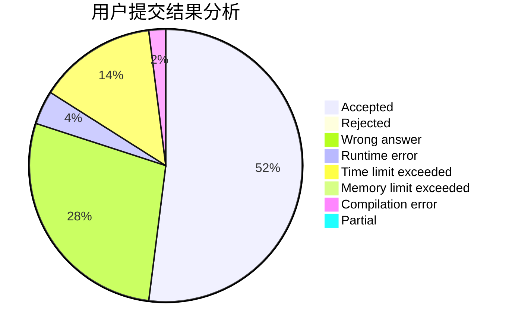
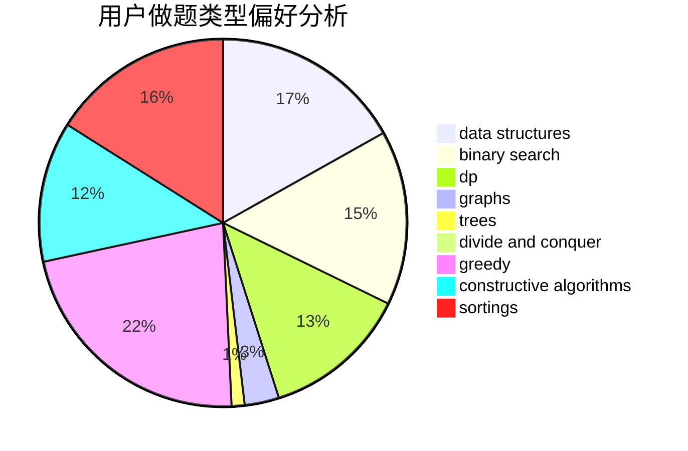

# Daniel_Jiang
<!-- tabs:start -->
#### **用户提交结果分析**

#### **用户做题类型偏好分析**

#### **用户错题知识点分析**

<!-- tabs:end -->
# 推荐题目
[1368E](http://codeforces.com/problemset/problem/1368/E)		constructive algorithms,
                        graphs,
                        greedy		  
[1416F](http://codeforces.com/problemset/problem/1416/F)		flows,
                        graph matchings,
                        greedy,
                        implementation		  
[772E](http://codeforces.com/problemset/problem/772/E)		binary search,
                        divide and conquer,
                        interactive,
                        trees		  
[140B](http://codeforces.com/problemset/problem/140/B)		brute force,
                        greedy,
                        implementation		  
[1081A](http://codeforces.com/problemset/problem/1081/A)		constructive algorithms,
                        math		  
[633B](http://codeforces.com/problemset/problem/633/B)		brute force,
                        constructive algorithms,
                        math,
                        number theory		  
[1007C](http://codeforces.com/problemset/problem/1007/C)		binary search,
                        interactive		  
[42D](http://codeforces.com/problemset/problem/42/D)		constructive algorithms,
                        math		  
[771E](http://codeforces.com/problemset/problem/771/E)		dp,
                        greedy		  
[621C](http://codeforces.com/problemset/problem/621/C)		combinatorics,
                        math,
                        number theory,
                        probabilities		  
<!-- tabs:start -->
#### **data structures**
[1488F](http://codeforces.com/problemset/problem/1488/F)		*special problem,
                        *special problem,
                        binary search,
                        data structures		  
[1500D](http://codeforces.com/problemset/problem/1500/D)		data structures,
                        sortings,
                        two pointers		  
[1492C](http://codeforces.com/problemset/problem/1492/C)		binary search,
                        data structures,
                        dp,
                        greedy,
                        two pointers		  
[1490G](http://codeforces.com/problemset/problem/1490/G)		binary search,
                        data structures,
                        math		  
[1479D](http://codeforces.com/problemset/problem/1479/D)		binary search,
                        bitmasks,
                        brute force,
                        data structures,
                        probabilities,
                        trees		  
[1497A](http://codeforces.com/problemset/problem/1497/A)		brute force,
                        data structures,
                        greedy,
                        sortings		  
[1491C](http://codeforces.com/problemset/problem/1491/C)		brute force,
                        data structures,
                        dp,
                        greedy,
                        implementation		  
[1492B](http://codeforces.com/problemset/problem/1492/B)		data structures,
                        greedy,
                        math		  
[1436E](http://codeforces.com/problemset/problem/1436/E)		binary search,
                        data structures,
                        two pointers		  
[1461D](http://codeforces.com/problemset/problem/1461/D)		binary search,
                        brute force,
                        data structures,
                        divide and conquer,
                        implementation,
                        sortings		  
#### **binary search**
[772E](http://codeforces.com/problemset/problem/772/E)		binary search,
                        divide and conquer,
                        interactive,
                        trees		  
[1007C](http://codeforces.com/problemset/problem/1007/C)		binary search,
                        interactive		  
[772A](http://codeforces.com/problemset/problem/772/A)		binary search,
                        math		  
[1488F](http://codeforces.com/problemset/problem/1488/F)		*special problem,
                        *special problem,
                        binary search,
                        data structures		  
[1492C](http://codeforces.com/problemset/problem/1492/C)		binary search,
                        data structures,
                        dp,
                        greedy,
                        two pointers		  
[1463D](http://codeforces.com/problemset/problem/1463/D)		binary search,
                        constructive algorithms,
                        greedy,
                        two pointers		  
[1490G](http://codeforces.com/problemset/problem/1490/G)		binary search,
                        data structures,
                        math		  
[1479D](http://codeforces.com/problemset/problem/1479/D)		binary search,
                        bitmasks,
                        brute force,
                        data structures,
                        probabilities,
                        trees		  
[1436E](http://codeforces.com/problemset/problem/1436/E)		binary search,
                        data structures,
                        two pointers		  
[1461D](http://codeforces.com/problemset/problem/1461/D)		binary search,
                        brute force,
                        data structures,
                        divide and conquer,
                        implementation,
                        sortings		  
#### **dp**
[771E](http://codeforces.com/problemset/problem/771/E)		dp,
                        greedy		  
[598E](http://codeforces.com/problemset/problem/598/E)		brute force,
                        dp		  
[771D](http://codeforces.com/problemset/problem/771/D)		dp		  
[1268E](http://codeforces.com/problemset/problem/1268/E)		dp		  
[772C](http://codeforces.com/problemset/problem/772/C)		constructive algorithms,
                        dp,
                        graphs,
                        math,
                        number theory		  
[1120C](http://codeforces.com/problemset/problem/1120/C)		dp,
                        strings		  
[772D](http://codeforces.com/problemset/problem/772/D)		bitmasks,
                        dp		  
[1492C](http://codeforces.com/problemset/problem/1492/C)		binary search,
                        data structures,
                        dp,
                        greedy,
                        two pointers		  
[1457C](https://codeforces.com/contest/1457/problem/C)		brute force,
                        dp,
                        implementation		  
[1491C](http://codeforces.com/problemset/problem/1491/C)		brute force,
                        data structures,
                        dp,
                        greedy,
                        implementation		  
#### **graph**
[1368E](http://codeforces.com/problemset/problem/1368/E)		constructive algorithms,
                        graphs,
                        greedy		  
[1416F](http://codeforces.com/problemset/problem/1416/F)		flows,
                        graph matchings,
                        greedy,
                        implementation		  
[1268D](http://codeforces.com/problemset/problem/1268/D)		brute force,
                        divide and conquer,
                        graphs,
                        math		  
[1263D](http://codeforces.com/problemset/problem/1263/D)		dfs and similar,
                        dsu,
                        graphs		  
[772C](http://codeforces.com/problemset/problem/772/C)		constructive algorithms,
                        dp,
                        graphs,
                        math,
                        number theory		  
[1267F](http://codeforces.com/problemset/problem/1267/F)		graphs		  
[1510K](http://codeforces.com/problemset/problem/1510/K)		brute force,
                        graphs,
                        implementation		  
[1487C](http://codeforces.com/problemset/problem/1487/C)		brute force,
                        constructive algorithms,
                        dfs and similar,
                        graphs,
                        greedy,
                        implementation,
                        math		  
[1437C](http://codeforces.com/problemset/problem/1437/C)		dp,
                        flows,
                        graph matchings,
                        greedy,
                        math,
                        sortings		  
[1470D](http://codeforces.com/problemset/problem/1470/D)		constructive algorithms,
                        dfs and similar,
                        graph matchings,
                        graphs,
                        greedy		  
#### **trees**
[772E](http://codeforces.com/problemset/problem/772/E)		binary search,
                        divide and conquer,
                        interactive,
                        trees		  
[1479D](http://codeforces.com/problemset/problem/1479/D)		binary search,
                        bitmasks,
                        brute force,
                        data structures,
                        probabilities,
                        trees		  
[1511C](http://codeforces.com/problemset/problem/1511/C)		brute force,
                        data structures,
                        implementation,
                        trees		  
[1499F](http://codeforces.com/problemset/problem/1499/F)		combinatorics,
                        dfs and similar,
                        dp,
                        trees		  
[1491E](http://codeforces.com/problemset/problem/1491/E)		brute force,
                        dfs and similar,
                        divide and conquer,
                        number theory,
                        trees		  
[1466D](http://codeforces.com/problemset/problem/1466/D)		data structures,
                        greedy,
                        sortings,
                        trees		  
[1495D](http://codeforces.com/problemset/problem/1495/D)		combinatorics,
                        dfs and similar,
                        graphs,
                        math,
                        shortest paths,
                        trees		  
[1303G](http://codeforces.com/problemset/problem/1303/G)		data structures,
                        divide and conquer,
                        geometry,
                        trees		  
[1454E](http://codeforces.com/problemset/problem/1454/E)		combinatorics,
                        dfs and similar,
                        graphs,
                        trees		  
[1494D](http://codeforces.com/problemset/problem/1494/D)		constructive algorithms,
                        data structures,
                        dfs and similar,
                        divide and conquer,
                        dsu,
                        greedy,
                        sortings,
                        trees		  
#### **divide and conquer**
[772E](http://codeforces.com/problemset/problem/772/E)		binary search,
                        divide and conquer,
                        interactive,
                        trees		  
[1268D](http://codeforces.com/problemset/problem/1268/D)		brute force,
                        divide and conquer,
                        graphs,
                        math		  
[1461D](http://codeforces.com/problemset/problem/1461/D)		binary search,
                        brute force,
                        data structures,
                        divide and conquer,
                        implementation,
                        sortings		  
[1466G](http://codeforces.com/problemset/problem/1466/G)		combinatorics,
                        divide and conquer,
                        hashing,
                        math,
                        string suffix structures,
                        strings		  
[1490D](http://codeforces.com/problemset/problem/1490/D)		dfs and similar,
                        divide and conquer,
                        implementation		  
[1483C](https://codeforces.com/contest/1483/problem/C)		data structures,
                        divide and conquer,
                        dp		  
[1491E](http://codeforces.com/problemset/problem/1491/E)		brute force,
                        dfs and similar,
                        divide and conquer,
                        number theory,
                        trees		  
[1303G](http://codeforces.com/problemset/problem/1303/G)		data structures,
                        divide and conquer,
                        geometry,
                        trees		  
[1494D](http://codeforces.com/problemset/problem/1494/D)		constructive algorithms,
                        data structures,
                        dfs and similar,
                        divide and conquer,
                        dsu,
                        greedy,
                        sortings,
                        trees		  
[1482E](http://codeforces.com/problemset/problem/1482/E)		data structures,
                        divide and conquer,
                        dp		  
#### **greedy**
[1368E](http://codeforces.com/problemset/problem/1368/E)		constructive algorithms,
                        graphs,
                        greedy		  
[1416F](http://codeforces.com/problemset/problem/1416/F)		flows,
                        graph matchings,
                        greedy,
                        implementation		  
[140B](http://codeforces.com/problemset/problem/140/B)		brute force,
                        greedy,
                        implementation		  
[771E](http://codeforces.com/problemset/problem/771/E)		dp,
                        greedy		  
[1120A](http://codeforces.com/problemset/problem/1120/A)		greedy,
                        implementation,
                        two pointers		  
[1042C](http://codeforces.com/problemset/problem/1042/C)		constructive algorithms,
                        greedy,
                        math		  
[1408B](http://codeforces.com/problemset/problem/1408/B)		constructive algorithms,
                        greedy,
                        math		  
[482A](http://codeforces.com/problemset/problem/482/A)		constructive algorithms,
                        greedy		  
[1267E](http://codeforces.com/problemset/problem/1267/E)		greedy		  
[447B](http://codeforces.com/problemset/problem/447/B)		greedy,
                        implementation		  
#### **constructive algorithms**
[1368E](http://codeforces.com/problemset/problem/1368/E)		constructive algorithms,
                        graphs,
                        greedy		  
[1081A](http://codeforces.com/problemset/problem/1081/A)		constructive algorithms,
                        math		  
[633B](http://codeforces.com/problemset/problem/633/B)		brute force,
                        constructive algorithms,
                        math,
                        number theory		  
[42D](http://codeforces.com/problemset/problem/42/D)		constructive algorithms,
                        math		  
[716C](https://codeforces.com/contest/716/problem/C)		constructive algorithms,
                        math		  
[1042C](http://codeforces.com/problemset/problem/1042/C)		constructive algorithms,
                        greedy,
                        math		  
[772C](http://codeforces.com/problemset/problem/772/C)		constructive algorithms,
                        dp,
                        graphs,
                        math,
                        number theory		  
[1408B](http://codeforces.com/problemset/problem/1408/B)		constructive algorithms,
                        greedy,
                        math		  
[1267C](http://codeforces.com/problemset/problem/1267/C)		constructive algorithms		  
[1365G](http://codeforces.com/problemset/problem/1365/G)		bitmasks,
                        combinatorics,
                        constructive algorithms,
                        interactive,
                        math		  
#### **sortings**
[1269B](http://codeforces.com/problemset/problem/1269/B)		brute force,
                        sortings		  
[1500D](http://codeforces.com/problemset/problem/1500/D)		data structures,
                        sortings,
                        two pointers		  
[1282C](http://codeforces.com/problemset/problem/1282/C)		greedy,
                        sortings,
                        two pointers		  
[1496C](https://codeforces.com/contest/1496/problem/C)		geometry,
                        greedy,
                        math,
                        sortings		  
[1495A](http://codeforces.com/problemset/problem/1495/A)		geometry,
                        greedy,
                        math,
                        sortings		  
[1497A](http://codeforces.com/problemset/problem/1497/A)		brute force,
                        data structures,
                        greedy,
                        sortings		  
[1427A](http://codeforces.com/problemset/problem/1427/A)		math,
                        sortings		  
[1461D](http://codeforces.com/problemset/problem/1461/D)		binary search,
                        brute force,
                        data structures,
                        divide and conquer,
                        implementation,
                        sortings		  
[1437C](http://codeforces.com/problemset/problem/1437/C)		dp,
                        flows,
                        graph matchings,
                        greedy,
                        math,
                        sortings		  
[1473A](http://codeforces.com/problemset/problem/1473/A)		greedy,
                        implementation,
                        math,
                        sortings		  
<!-- tabs:end -->
